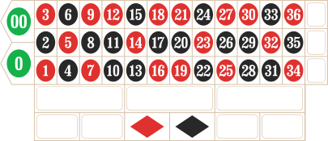
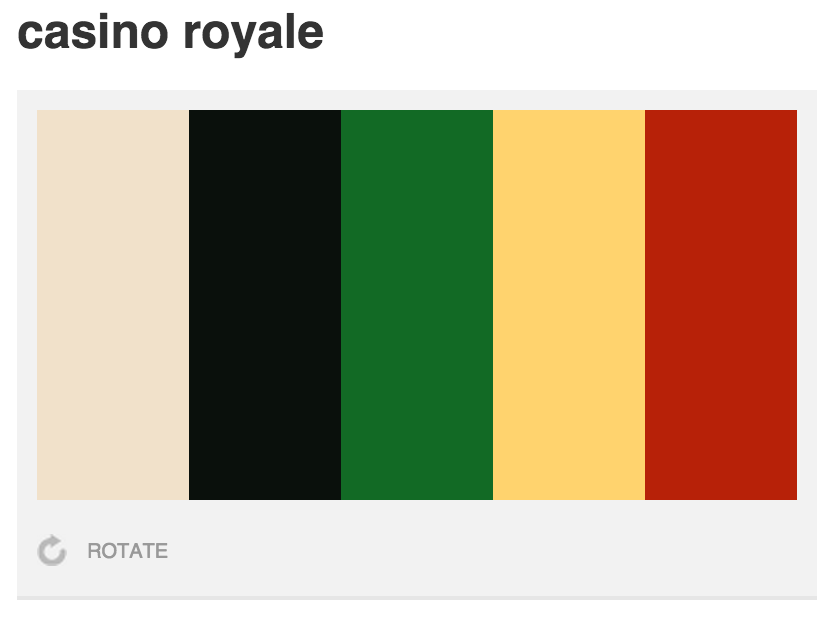
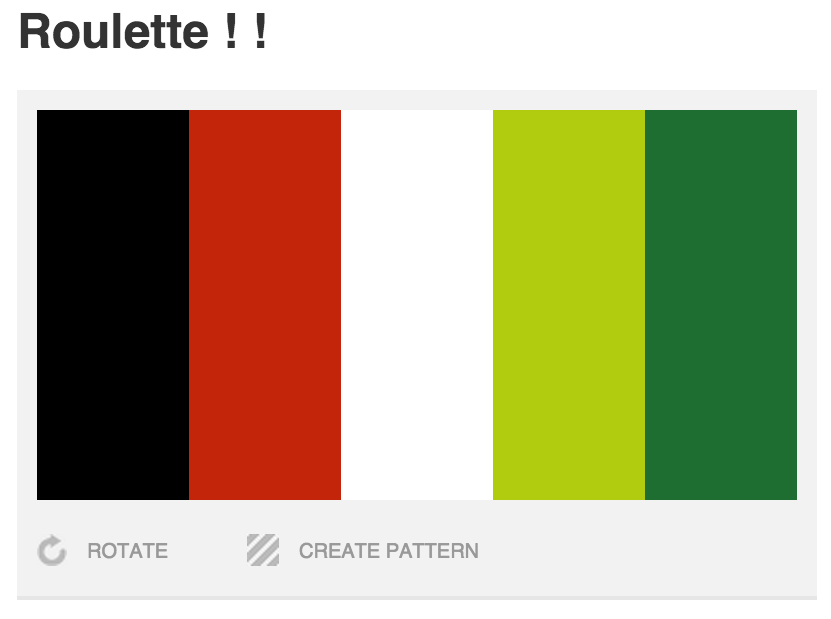
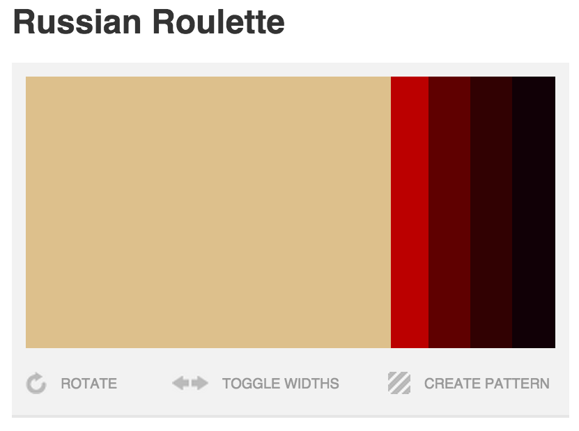
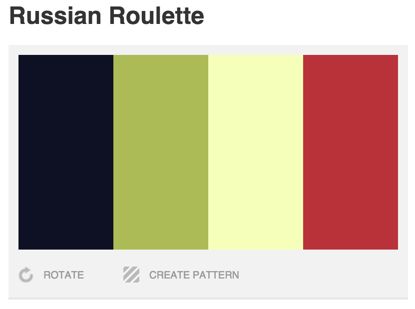
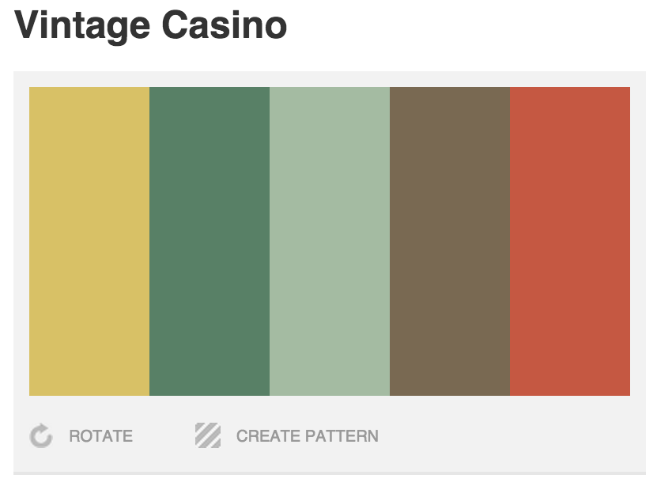
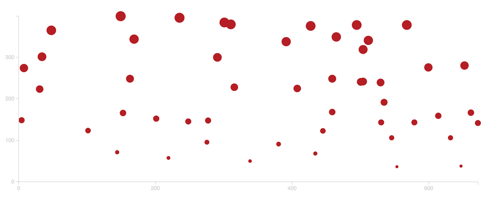
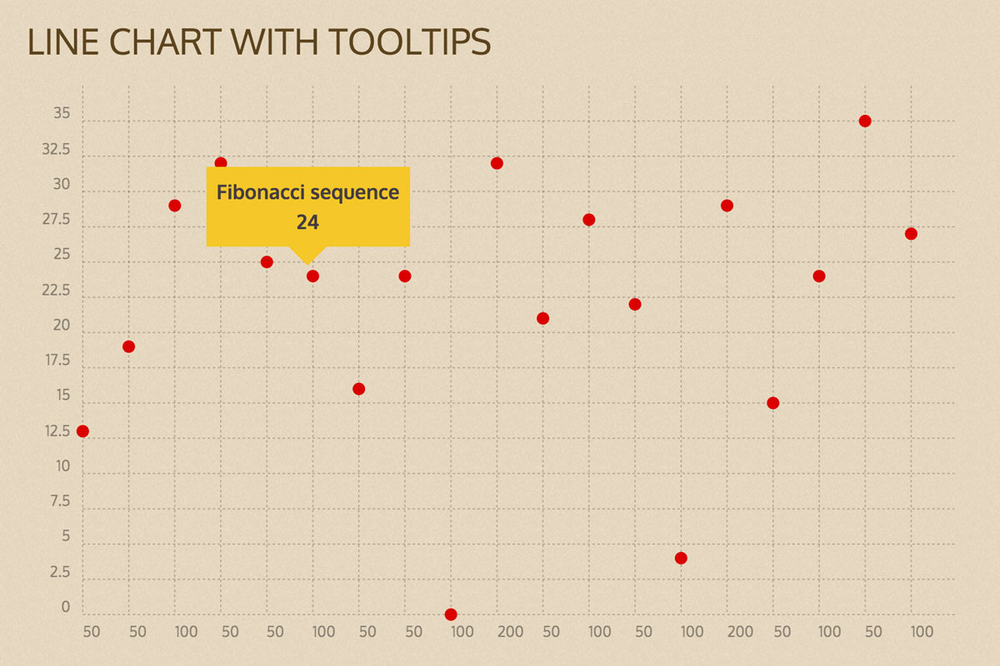

# Roulettingale

A data project observing the performance of the Martingale betting system in Roulette. [Details](#details)

This one is retired, [v2](/tinkerings/roulettingale-v2) is in action.

Notes: Roulette 3d iOS, Single bet

</aside>
<section class="session-stats">
<h3 class="mtf tac">Spins</h3>
<table class="spins js-spins">
<thead>
<tr><th>Bet</th>
<th>Amount</th>
<th>Result</th>
<th>Number</th>
<th>Red</th>
<th>Black</th>
<th>Even</th>
<th>Odd</th>
<th>1-18</th>
<th>19-36</th>
</tr></thead>
<tbody><tr>
<td class="ttc">black</td>
<td>
$
50
</td>
<td class="session-stats-result">

$
50

</td>
<td class="tac">36</td>
<td class="tss js-n-red">

✓

</td>
<td class="tss js-n-black">

✘

</td>
<td class="tss js-n-even">

✓

</td>
<td class="tss js-n-odd">

✘

</td>
<td class="tss js-n-118">

✘

</td>
<td class="tss js-n-1936">

✓

</td>
</tr>
<tr>
<td class="ttc">black</td>
<td>
$
100
</td>
<td class="session-stats-result">

$
100

</td>
<td class="tac">0</td>
<td class="tss js-n-red">

✘

</td>
<td class="tss js-n-black">

✘

</td>
<td class="tss js-n-even">

✘

</td>
<td class="tss js-n-odd">

✘

</td>
<td class="tss js-n-118">

✘

</td>
<td class="tss js-n-1936">

✘

</td>
</tr>
<tr>
<td class="ttc">black</td>
<td>
$
200
</td>
<td class="session-stats-result">

$
200

</td>
<td class="tac">6</td>
<td class="tss js-n-red">

✘

</td>
<td class="tss js-n-black">

✓

</td>
<td class="tss js-n-even">

✓

</td>
<td class="tss js-n-odd">

✘

</td>
<td class="tss js-n-118">

✓

</td>
<td class="tss js-n-1936">

✘

</td>
</tr>
<tr>
<td class="ttc">black</td>
<td>
$
50
</td>
<td class="session-stats-result">

$
50

</td>
<td class="tac">11</td>
<td class="tss js-n-red">

✘

</td>
<td class="tss js-n-black">

✓

</td>
<td class="tss js-n-even">

✘

</td>
<td class="tss js-n-odd">

✓

</td>
<td class="tss js-n-118">

✓

</td>
<td class="tss js-n-1936">

✘

</td>
</tr>
<tr>
<td class="ttc">black</td>
<td>
$
50
</td>
<td class="session-stats-result">

$
50

</td>
<td class="tac">17</td>
<td class="tss js-n-red">

✘

</td>
<td class="tss js-n-black">

✓

</td>
<td class="tss js-n-even">

✘

</td>
<td class="tss js-n-odd">

✓

</td>
<td class="tss js-n-118">

✓

</td>
<td class="tss js-n-1936">

✘

</td>
</tr>
<tr>
<td class="ttc">black</td>
<td>
$
50
</td>
<td class="session-stats-result">

$
50

</td>
<td class="tac">26</td>
<td class="tss js-n-red">

✘

</td>
<td class="tss js-n-black">

✓

</td>
<td class="tss js-n-even">

✓

</td>
<td class="tss js-n-odd">

✘

</td>
<td class="tss js-n-118">

✘

</td>
<td class="tss js-n-1936">

✓

</td>
</tr>
<tr>
<td class="ttc">black</td>
<td>
$
50
</td>
<td class="session-stats-result">

$
50

</td>
<td class="tac">0</td>
<td class="tss js-n-red">

✘

</td>
<td class="tss js-n-black">

✘

</td>
<td class="tss js-n-even">

✘

</td>
<td class="tss js-n-odd">

✘

</td>
<td class="tss js-n-118">

✘

</td>
<td class="tss js-n-1936">

✘

</td>
</tr>
<tr>
<td class="ttc">black</td>
<td>
$
100
</td>
<td class="session-stats-result">

$
100

</td>
<td class="tac">9</td>
<td class="tss js-n-red">

✓

</td>
<td class="tss js-n-black">

✘

</td>
<td class="tss js-n-even">

✘

</td>
<td class="tss js-n-odd">

✓

</td>
<td class="tss js-n-118">

✓

</td>
<td class="tss js-n-1936">

✘

</td>
</tr>
<tr>
<td class="ttc">black</td>
<td>
$
200
</td>
<td class="session-stats-result">

$
200

</td>
<td class="tac">17</td>
<td class="tss js-n-red">

✘

</td>
<td class="tss js-n-black">

✓

</td>
<td class="tss js-n-even">

✘

</td>
<td class="tss js-n-odd">

✓

</td>
<td class="tss js-n-118">

✓

</td>
<td class="tss js-n-1936">

✘

</td>
</tr>
<tr>
<td class="ttc">black</td>
<td>
$
50
</td>
<td class="session-stats-result">

$
50

</td>
<td class="tac">14</td>
<td class="tss js-n-red">

✓

</td>
<td class="tss js-n-black">

✘

</td>
<td class="tss js-n-even">

✓

</td>
<td class="tss js-n-odd">

✘

</td>
<td class="tss js-n-118">

✓

</td>
<td class="tss js-n-1936">

✘

</td>
</tr>
<tr>
<td class="ttc">black</td>
<td>
$
50
</td>
<td class="session-stats-result">

$
50

</td>
<td class="tac">33</td>
<td class="tss js-n-red">

✘

</td>
<td class="tss js-n-black">

✓

</td>
<td class="tss js-n-even">

✘

</td>
<td class="tss js-n-odd">

✓

</td>
<td class="tss js-n-118">

✘

</td>
<td class="tss js-n-1936">

✓

</td>
</tr>
<tr>
<td class="ttc">black</td>
<td>
$
50
</td>
<td class="session-stats-result">

$
50

</td>
<td class="tac">27</td>
<td class="tss js-n-red">

✓

</td>
<td class="tss js-n-black">

✘

</td>
<td class="tss js-n-even">

✘

</td>
<td class="tss js-n-odd">

✓

</td>
<td class="tss js-n-118">

✘

</td>
<td class="tss js-n-1936">

✓

</td>
</tr>
<tr>
<td class="ttc">black</td>
<td>
$
100
</td>
<td class="session-stats-result">

$
100

</td>
<td class="tac">1</td>
<td class="tss js-n-red">

✓

</td>
<td class="tss js-n-black">

✘

</td>
<td class="tss js-n-even">

✘

</td>
<td class="tss js-n-odd">

✓

</td>
<td class="tss js-n-118">

✓

</td>
<td class="tss js-n-1936">

✘

</td>
</tr>
<tr>
<td class="ttc">black</td>
<td>
$
200
</td>
<td class="session-stats-result">

$
200

</td>
<td class="tac">8</td>
<td class="tss js-n-red">

✘

</td>
<td class="tss js-n-black">

✓

</td>
<td class="tss js-n-even">

✓

</td>
<td class="tss js-n-odd">

✘

</td>
<td class="tss js-n-118">

✓

</td>
<td class="tss js-n-1936">

✘

</td>
</tr>
<tr>
<td class="ttc">black</td>
<td>
$
50
</td>
<td class="session-stats-result">

$
50

</td>
<td class="tac">0</td>
<td class="tss js-n-red">

✘

</td>
<td class="tss js-n-black">

✘

</td>
<td class="tss js-n-even">

✘

</td>
<td class="tss js-n-odd">

✘

</td>
<td class="tss js-n-118">

✘

</td>
<td class="tss js-n-1936">

✘

</td>
</tr>
<tr>
<td class="ttc">black</td>
<td>
$
100
</td>
<td class="session-stats-result">

$
100

</td>
<td class="tac">19</td>
<td class="tss js-n-red">

✓

</td>
<td class="tss js-n-black">

✘

</td>
<td class="tss js-n-even">

✘

</td>
<td class="tss js-n-odd">

✓

</td>
<td class="tss js-n-118">

✘

</td>
<td class="tss js-n-1936">

✓

</td>
</tr>
<tr>
<td class="ttc">black</td>
<td>
$
200
</td>
<td class="session-stats-result">

$
200

</td>
<td class="tac">14</td>
<td class="tss js-n-red">

✓

</td>
<td class="tss js-n-black">

✘

</td>
<td class="tss js-n-even">

✓

</td>
<td class="tss js-n-odd">

✘

</td>
<td class="tss js-n-118">

✓

</td>
<td class="tss js-n-1936">

✘

</td>
</tr>
<tr>
<td class="ttc">black</td>
<td>
$
400
</td>
<td class="session-stats-result">

$
400

</td>
<td class="tac">18</td>
<td class="tss js-n-red">

✓

</td>
<td class="tss js-n-black">

✘

</td>
<td class="tss js-n-even">

✓

</td>
<td class="tss js-n-odd">

✘

</td>
<td class="tss js-n-118">

✓

</td>
<td class="tss js-n-1936">

✘

</td>
</tr>
<tr>
<td class="ttc">black</td>
<td>
$
800
</td>
<td class="session-stats-result">

$
800

</td>
<td class="tac">17</td>
<td class="tss js-n-red">

✘

</td>
<td class="tss js-n-black">

✓

</td>
<td class="tss js-n-even">

✘

</td>
<td class="tss js-n-odd">

✓

</td>
<td class="tss js-n-118">

✓

</td>
<td class="tss js-n-1936">

✘

</td>
</tr>
<tr>
<td class="ttc">black</td>
<td>
$
50
</td>
<td class="session-stats-result">

$
50

</td>
<td class="tac">0</td>
<td class="tss js-n-red">

✘

</td>
<td class="tss js-n-black">

✘

</td>
<td class="tss js-n-even">

✘

</td>
<td class="tss js-n-odd">

✘

</td>
<td class="tss js-n-118">

✘

</td>
<td class="tss js-n-1936">

✘

</td>
</tr>
<tr>
<td class="ttc">black</td>
<td>
$
100
</td>
<td class="session-stats-result">

$
100

</td>
<td class="tac">22</td>
<td class="tss js-n-red">

✘

</td>
<td class="tss js-n-black">

✓

</td>
<td class="tss js-n-even">

✓

</td>
<td class="tss js-n-odd">

✘

</td>
<td class="tss js-n-118">

✘

</td>
<td class="tss js-n-1936">

✓

</td>
</tr>
<tr>
<td class="ttc">black</td>
<td>
$
50
</td>
<td class="session-stats-result">

$
50

</td>
<td class="tac">18</td>
<td class="tss js-n-red">

✓

</td>
<td class="tss js-n-black">

✘

</td>
<td class="tss js-n-even">

✓

</td>
<td class="tss js-n-odd">

✘

</td>
<td class="tss js-n-118">

✓

</td>
<td class="tss js-n-1936">

✘

</td>
</tr>
<tr>
<td class="ttc">black</td>
<td>
$
100
</td>
<td class="session-stats-result">

$
100

</td>
<td class="tac">36</td>
<td class="tss js-n-red">

✓

</td>
<td class="tss js-n-black">

✘

</td>
<td class="tss js-n-even">

✓

</td>
<td class="tss js-n-odd">

✘

</td>
<td class="tss js-n-118">

✘

</td>
<td class="tss js-n-1936">

✓

</td>
</tr>
<tr>
<td class="ttc">black</td>
<td>
$
200
</td>
<td class="session-stats-result">

$
200

</td>
<td class="tac">13</td>
<td class="tss js-n-red">

✘

</td>
<td class="tss js-n-black">

✓

</td>
<td class="tss js-n-even">

✘

</td>
<td class="tss js-n-odd">

✓

</td>
<td class="tss js-n-118">

✓

</td>
<td class="tss js-n-1936">

✘

</td>
</tr>
<tr>
<td class="ttc">black</td>
<td>
$
50
</td>
<td class="session-stats-result">

$
50

</td>
<td class="tac">23</td>
<td class="tss js-n-red">

✓

</td>
<td class="tss js-n-black">

✘

</td>
<td class="tss js-n-even">

✘

</td>
<td class="tss js-n-odd">

✓

</td>
<td class="tss js-n-118">

✘

</td>
<td class="tss js-n-1936">

✓

</td>
</tr>
<tr>
<td class="ttc">black</td>
<td>
$
100
</td>
<td class="session-stats-result">

$
100

</td>
<td class="tac">21</td>
<td class="tss js-n-red">

✓

</td>
<td class="tss js-n-black">

✘

</td>
<td class="tss js-n-even">

✘

</td>
<td class="tss js-n-odd">

✓

</td>
<td class="tss js-n-118">

✘

</td>
<td class="tss js-n-1936">

✓

</td>
</tr>
<tr>
<td class="ttc">black</td>
<td>
$
200
</td>
<td class="session-stats-result">

$
200

</td>
<td class="tac">33</td>
<td class="tss js-n-red">

✘

</td>
<td class="tss js-n-black">

✓

</td>
<td class="tss js-n-even">

✘

</td>
<td class="tss js-n-odd">

✓

</td>
<td class="tss js-n-118">

✘

</td>
<td class="tss js-n-1936">

✓

</td>
</tr>
<tr>
<td class="ttc">black</td>
<td>
$
50
</td>
<td class="session-stats-result">

$
50

</td>
<td class="tac">18</td>
<td class="tss js-n-red">

✓

</td>
<td class="tss js-n-black">

✘

</td>
<td class="tss js-n-even">

✓

</td>
<td class="tss js-n-odd">

✘

</td>
<td class="tss js-n-118">

✓

</td>
<td class="tss js-n-1936">

✘

</td>
</tr>
<tr>
<td class="ttc">black</td>
<td>
$
100
</td>
<td class="session-stats-result">

$
100

</td>
<td class="tac">13</td>
<td class="tss js-n-red">

✘

</td>
<td class="tss js-n-black">

✓

</td>
<td class="tss js-n-even">

✘

</td>
<td class="tss js-n-odd">

✓

</td>
<td class="tss js-n-118">

✓

</td>
<td class="tss js-n-1936">

✘

</td>
</tr>
<tr>
<td class="ttc">black</td>
<td>
$
50
</td>
<td class="session-stats-result">

$
50

</td>
<td class="tac">8</td>
<td class="tss js-n-red">

✘

</td>
<td class="tss js-n-black">

✓

</td>
<td class="tss js-n-even">

✓

</td>
<td class="tss js-n-odd">

✘

</td>
<td class="tss js-n-118">

✓

</td>
<td class="tss js-n-1936">

✘

</td>
</tr>
<tr>
<td class="ttc">black</td>
<td>
$
50
</td>
<td class="session-stats-result">

$
50

</td>
<td class="tac">31</td>
<td class="tss js-n-red">

✘

</td>
<td class="tss js-n-black">

✓

</td>
<td class="tss js-n-even">

✘

</td>
<td class="tss js-n-odd">

✓

</td>
<td class="tss js-n-118">

✘

</td>
<td class="tss js-n-1936">

✓

</td>
</tr>
<tr>
<td class="ttc">black</td>
<td>
$
50
</td>
<td class="session-stats-result">

$
50

</td>
<td class="tac">13</td>
<td class="tss js-n-red">

✘

</td>
<td class="tss js-n-black">

✓

</td>
<td class="tss js-n-even">

✘

</td>
<td class="tss js-n-odd">

✓

</td>
<td class="tss js-n-118">

✓

</td>
<td class="tss js-n-1936">

✘

</td>
</tr>
</tbody></table>
<ul class="spins-percentages">
<li>

13

46.43%

<h5>
Red
</h5>
</li>
<li>

15

53.57%

<h5>
Black
</h5>
</li>
<li>

12

42.86%

<h5>
Even
</h5>
</li>
<li>

16

57.14%

<h5>
Odd
</h5>
</li>
<li>

17

60.71%

<h5>
1-18
</h5>
</li>
<li>

11

39.29%

<h5>
19-36
</h5>
</li>
</ul>
</section>
</article>
<article class="js-id019 session">
<aside class="session-meta">

019

<ul class="session-meta-list">
<li>

29

<h5>Spins</h5>
</li>
<li>

750

<h5>Profit</h5>
</li>
<li>

50

<h5>Min Bet</h5>
</li>
<li>

400

<h5>Max Bet</h5>
</li>
<li>

750

<h5>Min Bankroll</h5>
</li>
</ul>
<table class="proof">
<tbody><tr>
<td class="h5">
Mirage - ($25 - $20,000)
</td>
<td class="session-meta-proof js-checkMirage" data-maxbet="8">
✓
</td>
</tr>
<tr>
<td class="h5">
MGM - ($25 - $10,000)
</td>
<td class="session-meta-proof js-checkMGM" data-maxbet="8">
✓
</td>
</tr>
<tr>
<td class="h5">
Beau Rivage - ($10 - $15,000)
</td>
<td class="session-meta-proof js-checkBeau" data-maxbet="8">
✓
</td>
</tr>
</tbody></table>

Notes: Roulette 3d iOS, Bet rotation every bet

</aside>
<section class="session-stats">
<h3 class="mtf tac">Spins</h3>
<table class="spins js-spins">
<thead>
<tr><th>Bet</th>
<th>Amount</th>
<th>Result</th>
<th>Number</th>
<th>Red</th>
<th>Black</th>
<th>Even</th>
<th>Odd</th>
<th>1-18</th>
<th>19-36</th>
</tr></thead>
<tbody><tr>
<td class="ttc">1-18</td>
<td>
$
50
</td>
<td class="session-stats-result">

$
50

</td>
<td class="tac">16</td>
<td class="tss js-n-red">

✓

</td>
<td class="tss js-n-black">

✘

</td>
<td class="tss js-n-even">

✓

</td>
<td class="tss js-n-odd">

✘

</td>
<td class="tss js-n-118">

✓

</td>
<td class="tss js-n-1936">

✘

</td>
</tr>
<tr>
<td class="ttc">even</td>
<td>
$
50
</td>
<td class="session-stats-result">

$
50

</td>
<td class="tac">17</td>
<td class="tss js-n-red">

✘

</td>
<td class="tss js-n-black">

✓

</td>
<td class="tss js-n-even">

✘

</td>
<td class="tss js-n-odd">

✓

</td>
<td class="tss js-n-118">

✓

</td>
<td class="tss js-n-1936">

✘

</td>
</tr>
<tr>
<td class="ttc">red</td>
<td>
$
100
</td>
<td class="session-stats-result">

$
100

</td>
<td class="tac">14</td>
<td class="tss js-n-red">

✓

</td>
<td class="tss js-n-black">

✘

</td>
<td class="tss js-n-even">

✓

</td>
<td class="tss js-n-odd">

✘

</td>
<td class="tss js-n-118">

✓

</td>
<td class="tss js-n-1936">

✘

</td>
</tr>
<tr>
<td class="ttc">black</td>
<td>
$
50
</td>
<td class="session-stats-result">

$
50

</td>
<td class="tac">23</td>
<td class="tss js-n-red">

✓

</td>
<td class="tss js-n-black">

✘

</td>
<td class="tss js-n-even">

✘

</td>
<td class="tss js-n-odd">

✓

</td>
<td class="tss js-n-118">

✘

</td>
<td class="tss js-n-1936">

✓

</td>
</tr>
<tr>
<td class="ttc">odd</td>
<td>
$
100
</td>
<td class="session-stats-result">

$
100

</td>
<td class="tac">17</td>
<td class="tss js-n-red">

✘

</td>
<td class="tss js-n-black">

✓

</td>
<td class="tss js-n-even">

✘

</td>
<td class="tss js-n-odd">

✓

</td>
<td class="tss js-n-118">

✓

</td>
<td class="tss js-n-1936">

✘

</td>
</tr>
<tr>
<td class="ttc">19-36</td>
<td>
$
50
</td>
<td class="session-stats-result">

$
50

</td>
<td class="tac">6</td>
<td class="tss js-n-red">

✘

</td>
<td class="tss js-n-black">

✓

</td>
<td class="tss js-n-even">

✓

</td>
<td class="tss js-n-odd">

✘

</td>
<td class="tss js-n-118">

✓

</td>
<td class="tss js-n-1936">

✘

</td>
</tr>
<tr>
<td class="ttc">1-18</td>
<td>
$
100
</td>
<td class="session-stats-result">

$
100

</td>
<td class="tac">25</td>
<td class="tss js-n-red">

✓

</td>
<td class="tss js-n-black">

✘

</td>
<td class="tss js-n-even">

✘

</td>
<td class="tss js-n-odd">

✓

</td>
<td class="tss js-n-118">

✘

</td>
<td class="tss js-n-1936">

✓

</td>
</tr>
<tr>
<td class="ttc">even</td>
<td>
$
200
</td>
<td class="session-stats-result">

$
200

</td>
<td class="tac">34</td>
<td class="tss js-n-red">

✓

</td>
<td class="tss js-n-black">

✘

</td>
<td class="tss js-n-even">

✓

</td>
<td class="tss js-n-odd">

✘

</td>
<td class="tss js-n-118">

✘

</td>
<td class="tss js-n-1936">

✓

</td>
</tr>
<tr>
<td class="ttc">red</td>
<td>
$
50
</td>
<td class="session-stats-result">

$
50

</td>
<td class="tac">31</td>
<td class="tss js-n-red">

✘

</td>
<td class="tss js-n-black">

✓

</td>
<td class="tss js-n-even">

✘

</td>
<td class="tss js-n-odd">

✓

</td>
<td class="tss js-n-118">

✘

</td>
<td class="tss js-n-1936">

✓

</td>
</tr>
<tr>
<td class="ttc">black</td>
<td>
$
100
</td>
<td class="session-stats-result">

$
100

</td>
<td class="tac">0</td>
<td class="tss js-n-red">

✘

</td>
<td class="tss js-n-black">

✘

</td>
<td class="tss js-n-even">

✘

</td>
<td class="tss js-n-odd">

✘

</td>
<td class="tss js-n-118">

✘

</td>
<td class="tss js-n-1936">

✘

</td>
</tr>
<tr>
<td class="ttc">odd</td>
<td>
$
200
</td>
<td class="session-stats-result">

$
200

</td>
<td class="tac">35</td>
<td class="tss js-n-red">

✘

</td>
<td class="tss js-n-black">

✓

</td>
<td class="tss js-n-even">

✘

</td>
<td class="tss js-n-odd">

✓

</td>
<td class="tss js-n-118">

✘

</td>
<td class="tss js-n-1936">

✓

</td>
</tr>
<tr>
<td class="ttc">19-36</td>
<td>
$
50
</td>
<td class="session-stats-result">

$
50

</td>
<td class="tac">9</td>
<td class="tss js-n-red">

✓

</td>
<td class="tss js-n-black">

✘

</td>
<td class="tss js-n-even">

✘

</td>
<td class="tss js-n-odd">

✓

</td>
<td class="tss js-n-118">

✓

</td>
<td class="tss js-n-1936">

✘

</td>
</tr>
<tr>
<td class="ttc">1-18</td>
<td>
$
100
</td>
<td class="session-stats-result">

$
100

</td>
<td class="tac">21</td>
<td class="tss js-n-red">

✓

</td>
<td class="tss js-n-black">

✘

</td>
<td class="tss js-n-even">

✘

</td>
<td class="tss js-n-odd">

✓

</td>
<td class="tss js-n-118">

✘

</td>
<td class="tss js-n-1936">

✓

</td>
</tr>
<tr>
<td class="ttc">even</td>
<td>
$
200
</td>
<td class="session-stats-result">

$
200

</td>
<td class="tac">23</td>
<td class="tss js-n-red">

✓

</td>
<td class="tss js-n-black">

✘

</td>
<td class="tss js-n-even">

✘

</td>
<td class="tss js-n-odd">

✓

</td>
<td class="tss js-n-118">

✘

</td>
<td class="tss js-n-1936">

✓

</td>
</tr>
<tr>
<td class="ttc">red</td>
<td>
$
400
</td>
<td class="session-stats-result">

$
400

</td>
<td class="tac">9</td>
<td class="tss js-n-red">

✓

</td>
<td class="tss js-n-black">

✘

</td>
<td class="tss js-n-even">

✘

</td>
<td class="tss js-n-odd">

✓

</td>
<td class="tss js-n-118">

✓

</td>
<td class="tss js-n-1936">

✘

</td>
</tr>
<tr>
<td class="ttc">black</td>
<td>
$
50
</td>
<td class="session-stats-result">

$
50

</td>
<td class="tac">15</td>
<td class="tss js-n-red">

✘

</td>
<td class="tss js-n-black">

✓

</td>
<td class="tss js-n-even">

✘

</td>
<td class="tss js-n-odd">

✓

</td>
<td class="tss js-n-118">

✓

</td>
<td class="tss js-n-1936">

✘

</td>
</tr>
<tr>
<td class="ttc">odd</td>
<td>
$
50
</td>
<td class="session-stats-result">

$
50

</td>
<td class="tac">31</td>
<td class="tss js-n-red">

✘

</td>
<td class="tss js-n-black">

✓

</td>
<td class="tss js-n-even">

✘

</td>
<td class="tss js-n-odd">

✓

</td>
<td class="tss js-n-118">

✘

</td>
<td class="tss js-n-1936">

✓

</td>
</tr>
<tr>
<td class="ttc">19-36</td>
<td>
$
50
</td>
<td class="session-stats-result">

$
50

</td>
<td class="tac">34</td>
<td class="tss js-n-red">

✓

</td>
<td class="tss js-n-black">

✘

</td>
<td class="tss js-n-even">

✓

</td>
<td class="tss js-n-odd">

✘

</td>
<td class="tss js-n-118">

✘

</td>
<td class="tss js-n-1936">

✓

</td>
</tr>
<tr>
<td class="ttc">1-18</td>
<td>
$
50
</td>
<td class="session-stats-result">

$
50

</td>
<td class="tac">16</td>
<td class="tss js-n-red">

✓

</td>
<td class="tss js-n-black">

✘

</td>
<td class="tss js-n-even">

✓

</td>
<td class="tss js-n-odd">

✘

</td>
<td class="tss js-n-118">

✓

</td>
<td class="tss js-n-1936">

✘

</td>
</tr>
<tr>
<td class="ttc">even</td>
<td>
$
50
</td>
<td class="session-stats-result">

$
50

</td>
<td class="tac">5</td>
<td class="tss js-n-red">

✓

</td>
<td class="tss js-n-black">

✘

</td>
<td class="tss js-n-even">

✘

</td>
<td class="tss js-n-odd">

✓

</td>
<td class="tss js-n-118">

✓

</td>
<td class="tss js-n-1936">

✘

</td>
</tr>
<tr>
<td class="ttc">red</td>
<td>
$
100
</td>
<td class="session-stats-result">

$
100

</td>
<td class="tac">32</td>
<td class="tss js-n-red">

✓

</td>
<td class="tss js-n-black">

✘

</td>
<td class="tss js-n-even">

✓

</td>
<td class="tss js-n-odd">

✘

</td>
<td class="tss js-n-118">

✘

</td>
<td class="tss js-n-1936">

✓

</td>
</tr>
<tr>
<td class="ttc">black</td>
<td>
$
50
</td>
<td class="session-stats-result">

$
50

</td>
<td class="tac">29</td>
<td class="tss js-n-red">

✘

</td>
<td class="tss js-n-black">

✓

</td>
<td class="tss js-n-even">

✘

</td>
<td class="tss js-n-odd">

✓

</td>
<td class="tss js-n-118">

✘

</td>
<td class="tss js-n-1936">

✓

</td>
</tr>
<tr>
<td class="ttc">odd</td>
<td>
$
50
</td>
<td class="session-stats-result">

$
50

</td>
<td class="tac">22</td>
<td class="tss js-n-red">

✘

</td>
<td class="tss js-n-black">

✓

</td>
<td class="tss js-n-even">

✓

</td>
<td class="tss js-n-odd">

✘

</td>
<td class="tss js-n-118">

✘

</td>
<td class="tss js-n-1936">

✓

</td>
</tr>
<tr>
<td class="ttc">19-36</td>
<td>
$
100
</td>
<td class="session-stats-result">

$
100

</td>
<td class="tac">22</td>
<td class="tss js-n-red">

✘

</td>
<td class="tss js-n-black">

✓

</td>
<td class="tss js-n-even">

✓

</td>
<td class="tss js-n-odd">

✘

</td>
<td class="tss js-n-118">

✘

</td>
<td class="tss js-n-1936">

✓

</td>
</tr>
<tr>
<td class="ttc">1-18</td>
<td>
$
50
</td>
<td class="session-stats-result">

$
50

</td>
<td class="tac">25</td>
<td class="tss js-n-red">

✓

</td>
<td class="tss js-n-black">

✘

</td>
<td class="tss js-n-even">

✘

</td>
<td class="tss js-n-odd">

✓

</td>
<td class="tss js-n-118">

✘

</td>
<td class="tss js-n-1936">

✓

</td>
</tr>
<tr>
<td class="ttc">even</td>
<td>
$
100
</td>
<td class="session-stats-result">

$
100

</td>
<td class="tac">6</td>
<td class="tss js-n-red">

✘

</td>
<td class="tss js-n-black">

✓

</td>
<td class="tss js-n-even">

✓

</td>
<td class="tss js-n-odd">

✘

</td>
<td class="tss js-n-118">

✓

</td>
<td class="tss js-n-1936">

✘

</td>
</tr>
<tr>
<td class="ttc">red</td>
<td>
$
50
</td>
<td class="session-stats-result">

$
50

</td>
<td class="tac">2</td>
<td class="tss js-n-red">

✘

</td>
<td class="tss js-n-black">

✓

</td>
<td class="tss js-n-even">

✓

</td>
<td class="tss js-n-odd">

✘

</td>
<td class="tss js-n-118">

✓

</td>
<td class="tss js-n-1936">

✘

</td>
</tr>
<tr>
<td class="ttc">black</td>
<td>
$
100
</td>
<td class="session-stats-result">

$
100

</td>
<td class="tac">34</td>
<td class="tss js-n-red">

✓

</td>
<td class="tss js-n-black">

✘

</td>
<td class="tss js-n-even">

✓

</td>
<td class="tss js-n-odd">

✘

</td>
<td class="tss js-n-118">

✘

</td>
<td class="tss js-n-1936">

✓

</td>
</tr>
<tr>
<td class="ttc">odd</td>
<td>
$
200
</td>
<td class="session-stats-result">

$
200

</td>
<td class="tac">33</td>
<td class="tss js-n-red">

✘

</td>
<td class="tss js-n-black">

✓

</td>
<td class="tss js-n-even">

✘

</td>
<td class="tss js-n-odd">

✓

</td>
<td class="tss js-n-118">

✘

</td>
<td class="tss js-n-1936">

✓

</td>
</tr>
</tbody></table>
<ul class="spins-percentages">
<li>

15

53.57%

<h5>
Red
</h5>
</li>
<li>

13

46.43%

<h5>
Black
</h5>
</li>
<li>

12

42.86%

<h5>
Even
</h5>
</li>
<li>

16

57.14%

<h5>
Odd
</h5>
</li>
<li>

12

42.86%

<h5>
1-18
</h5>
</li>
<li>

16

57.14%

<h5>
19-36
</h5>
</li>
</ul>
</section>
</article>
<article class="js-id018 session">
<aside class="session-meta">

018

<ul class="session-meta-list">
<li>

24

<h5>Spins</h5>
</li>
<li>

750

<h5>Profit</h5>
</li>
<li>

50

<h5>Min Bet</h5>
</li>
<li>

400

<h5>Max Bet</h5>
</li>
<li>

750

<h5>Min Bankroll</h5>
</li>
</ul>
<table class="proof">
<tbody><tr>
<td class="h5">
Mirage - ($25 - $20,000)
</td>
<td class="session-meta-proof js-checkMirage" data-maxbet="8">
✓
</td>
</tr>
<tr>
<td class="h5">
MGM - ($25 - $10,000)
</td>
<td class="session-meta-proof js-checkMGM" data-maxbet="8">
✓
</td>
</tr>
<tr>
<td class="h5">
Beau Rivage - ($10 - $15,000)
</td>
<td class="session-meta-proof js-checkBeau" data-maxbet="8">
✓
</td>
</tr>
</tbody></table>

Notes: Roulette 3d iOS, Bet rotation every win, Opposite after 3 losses

</aside>
<section class="session-stats">
<h3 class="mtf tac">Spins</h3>
<table class="spins js-spins">
<thead>
<tr><th>Bet</th>
<th>Amount</th>
<th>Result</th>
<th>Number</th>
<th>Red</th>
<th>Black</th>
<th>Even</th>
<th>Odd</th>
<th>1-18</th>
<th>19-36</th>
</tr></thead>
<tbody><tr>
<td class="ttc">1-18</td>
<td>
$
50
</td>
<td class="session-stats-result">

$
50

</td>
<td class="tac">13</td>
<td class="tss js-n-red">

✘

</td>
<td class="tss js-n-black">

✓

</td>
<td class="tss js-n-even">

✘

</td>
<td class="tss js-n-odd">

✓

</td>
<td class="tss js-n-118">

✓

</td>
<td class="tss js-n-1936">

✘

</td>
</tr>
<tr>
<td class="ttc">even</td>
<td>
$
50
</td>
<td class="session-stats-result">

$
50

</td>
<td class="tac">34</td>
<td class="tss js-n-red">

✓

</td>
<td class="tss js-n-black">

✘

</td>
<td class="tss js-n-even">

✓

</td>
<td class="tss js-n-odd">

✘

</td>
<td class="tss js-n-118">

✘

</td>
<td class="tss js-n-1936">

✓

</td>
</tr>
<tr>
<td class="ttc">red</td>
<td>
$
50
</td>
<td class="session-stats-result">

$
50

</td>
<td class="tac">7</td>
<td class="tss js-n-red">

✓

</td>
<td class="tss js-n-black">

✘

</td>
<td class="tss js-n-even">

✘

</td>
<td class="tss js-n-odd">

✓

</td>
<td class="tss js-n-118">

✓

</td>
<td class="tss js-n-1936">

✘

</td>
</tr>
<tr>
<td class="ttc">black</td>
<td>
$
50
</td>
<td class="session-stats-result">

$
50

</td>
<td class="tac">15</td>
<td class="tss js-n-red">

✘

</td>
<td class="tss js-n-black">

✓

</td>
<td class="tss js-n-even">

✘

</td>
<td class="tss js-n-odd">

✓

</td>
<td class="tss js-n-118">

✓

</td>
<td class="tss js-n-1936">

✘

</td>
</tr>
<tr>
<td class="ttc">odd</td>
<td>
$
50
</td>
<td class="session-stats-result">

$
50

</td>
<td class="tac">11</td>
<td class="tss js-n-red">

✘

</td>
<td class="tss js-n-black">

✓

</td>
<td class="tss js-n-even">

✘

</td>
<td class="tss js-n-odd">

✓

</td>
<td class="tss js-n-118">

✓

</td>
<td class="tss js-n-1936">

✘

</td>
</tr>
<tr>
<td class="ttc">19-36</td>
<td>
$
50
</td>
<td class="session-stats-result">

$
50

</td>
<td class="tac">7</td>
<td class="tss js-n-red">

✓

</td>
<td class="tss js-n-black">

✘

</td>
<td class="tss js-n-even">

✘

</td>
<td class="tss js-n-odd">

✓

</td>
<td class="tss js-n-118">

✓

</td>
<td class="tss js-n-1936">

✘

</td>
</tr>
<tr>
<td class="ttc">19-36</td>
<td>
$
100
</td>
<td class="session-stats-result">

$
100

</td>
<td class="tac">20</td>
<td class="tss js-n-red">

✘

</td>
<td class="tss js-n-black">

✓

</td>
<td class="tss js-n-even">

✓

</td>
<td class="tss js-n-odd">

✘

</td>
<td class="tss js-n-118">

✘

</td>
<td class="tss js-n-1936">

✓

</td>
</tr>
<tr>
<td class="ttc">1-18</td>
<td>
$
50
</td>
<td class="session-stats-result">

$
50

</td>
<td class="tac">36</td>
<td class="tss js-n-red">

✓

</td>
<td class="tss js-n-black">

✘

</td>
<td class="tss js-n-even">

✓

</td>
<td class="tss js-n-odd">

✘

</td>
<td class="tss js-n-118">

✘

</td>
<td class="tss js-n-1936">

✓

</td>
</tr>
<tr>
<td class="ttc">1-18</td>
<td>
$
100
</td>
<td class="session-stats-result">

$
100

</td>
<td class="tac">4</td>
<td class="tss js-n-red">

✘

</td>
<td class="tss js-n-black">

✓

</td>
<td class="tss js-n-even">

✓

</td>
<td class="tss js-n-odd">

✘

</td>
<td class="tss js-n-118">

✓

</td>
<td class="tss js-n-1936">

✘

</td>
</tr>
<tr>
<td class="ttc">red</td>
<td>
$
50
</td>
<td class="session-stats-result">

$
50

</td>
<td class="tac">0</td>
<td class="tss js-n-red">

✘

</td>
<td class="tss js-n-black">

✘

</td>
<td class="tss js-n-even">

✘

</td>
<td class="tss js-n-odd">

✘

</td>
<td class="tss js-n-118">

✘

</td>
<td class="tss js-n-1936">

✘

</td>
</tr>
<tr>
<td class="ttc">red</td>
<td>
$
100
</td>
<td class="session-stats-result">

$
100

</td>
<td class="tac">19</td>
<td class="tss js-n-red">

✓

</td>
<td class="tss js-n-black">

✘

</td>
<td class="tss js-n-even">

✘

</td>
<td class="tss js-n-odd">

✓

</td>
<td class="tss js-n-118">

✘

</td>
<td class="tss js-n-1936">

✓

</td>
</tr>
<tr>
<td class="ttc">black</td>
<td>
$
50
</td>
<td class="session-stats-result">

$
50

</td>
<td class="tac">21</td>
<td class="tss js-n-red">

✓

</td>
<td class="tss js-n-black">

✘

</td>
<td class="tss js-n-even">

✘

</td>
<td class="tss js-n-odd">

✓

</td>
<td class="tss js-n-118">

✘

</td>
<td class="tss js-n-1936">

✓

</td>
</tr>
<tr>
<td class="ttc">black</td>
<td>
$
100
</td>
<td class="session-stats-result">

$
100

</td>
<td class="tac">21</td>
<td class="tss js-n-red">

✓

</td>
<td class="tss js-n-black">

✘

</td>
<td class="tss js-n-even">

✘

</td>
<td class="tss js-n-odd">

✓

</td>
<td class="tss js-n-118">

✘

</td>
<td class="tss js-n-1936">

✓

</td>
</tr>
<tr>
<td class="ttc">black</td>
<td>
$
200
</td>
<td class="session-stats-result">

$
200

</td>
<td class="tac">9</td>
<td class="tss js-n-red">

✓

</td>
<td class="tss js-n-black">

✘

</td>
<td class="tss js-n-even">

✘

</td>
<td class="tss js-n-odd">

✓

</td>
<td class="tss js-n-118">

✓

</td>
<td class="tss js-n-1936">

✘

</td>
</tr>
<tr>
<td class="ttc">even</td>
<td>
$
400
</td>
<td class="session-stats-result">

$
400

</td>
<td class="tac">16</td>
<td class="tss js-n-red">

✓

</td>
<td class="tss js-n-black">

✘

</td>
<td class="tss js-n-even">

✓

</td>
<td class="tss js-n-odd">

✘

</td>
<td class="tss js-n-118">

✓

</td>
<td class="tss js-n-1936">

✘

</td>
</tr>
<tr>
<td class="ttc">black</td>
<td>
$
50
</td>
<td class="session-stats-result">

$
50

</td>
<td class="tac">15</td>
<td class="tss js-n-red">

✘

</td>
<td class="tss js-n-black">

✓

</td>
<td class="tss js-n-even">

✘

</td>
<td class="tss js-n-odd">

✓

</td>
<td class="tss js-n-118">

✓

</td>
<td class="tss js-n-1936">

✘

</td>
</tr>
<tr>
<td class="ttc">odd</td>
<td>
$
50
</td>
<td class="session-stats-result">

$
50

</td>
<td class="tac">31</td>
<td class="tss js-n-red">

✘

</td>
<td class="tss js-n-black">

✓

</td>
<td class="tss js-n-even">

✘

</td>
<td class="tss js-n-odd">

✓

</td>
<td class="tss js-n-118">

✘

</td>
<td class="tss js-n-1936">

✓

</td>
</tr>
<tr>
<td class="ttc">19-36</td>
<td>
$
50
</td>
<td class="session-stats-result">

$
50

</td>
<td class="tac">4</td>
<td class="tss js-n-red">

✘

</td>
<td class="tss js-n-black">

✓

</td>
<td class="tss js-n-even">

✓

</td>
<td class="tss js-n-odd">

✘

</td>
<td class="tss js-n-118">

✓

</td>
<td class="tss js-n-1936">

✘

</td>
</tr>
<tr>
<td class="ttc">19-36</td>
<td>
$
100
</td>
<td class="session-stats-result">

$
100

</td>
<td class="tac">4</td>
<td class="tss js-n-red">

✘

</td>
<td class="tss js-n-black">

✓

</td>
<td class="tss js-n-even">

✓

</td>
<td class="tss js-n-odd">

✘

</td>
<td class="tss js-n-118">

✓

</td>
<td class="tss js-n-1936">

✘

</td>
</tr>
<tr>
<td class="ttc">19-36</td>
<td>
$
200
</td>
<td class="session-stats-result">

$
200

</td>
<td class="tac">23</td>
<td class="tss js-n-red">

✓

</td>
<td class="tss js-n-black">

✘

</td>
<td class="tss js-n-even">

✘

</td>
<td class="tss js-n-odd">

✓

</td>
<td class="tss js-n-118">

✘

</td>
<td class="tss js-n-1936">

✓

</td>
</tr>
<tr>
<td class="ttc">1-18</td>
<td>
$
50
</td>
<td class="session-stats-result">

$
50

</td>
<td class="tac">32</td>
<td class="tss js-n-red">

✓

</td>
<td class="tss js-n-black">

✘

</td>
<td class="tss js-n-even">

✓

</td>
<td class="tss js-n-odd">

✘

</td>
<td class="tss js-n-118">

✘

</td>
<td class="tss js-n-1936">

✓

</td>
</tr>
<tr>
<td class="ttc">1-18</td>
<td>
$
100
</td>
<td class="session-stats-result">

$
100

</td>
<td class="tac">10</td>
<td class="tss js-n-red">

✘

</td>
<td class="tss js-n-black">

✓

</td>
<td class="tss js-n-even">

✓

</td>
<td class="tss js-n-odd">

✘

</td>
<td class="tss js-n-118">

✓

</td>
<td class="tss js-n-1936">

✘

</td>
</tr>
<tr>
<td class="ttc">even</td>
<td>
$
50
</td>
<td class="session-stats-result">

$
50

</td>
<td class="tac">12</td>
<td class="tss js-n-red">

✓

</td>
<td class="tss js-n-black">

✘

</td>
<td class="tss js-n-even">

✓

</td>
<td class="tss js-n-odd">

✘

</td>
<td class="tss js-n-118">

✓

</td>
<td class="tss js-n-1936">

✘

</td>
</tr>
<tr>
<td class="ttc">red</td>
<td>
$
50
</td>
<td class="session-stats-result">

$
50

</td>
<td class="tac">25</td>
<td class="tss js-n-red">

✓

</td>
<td class="tss js-n-black">

✘

</td>
<td class="tss js-n-even">

✘

</td>
<td class="tss js-n-odd">

✓

</td>
<td class="tss js-n-118">

✘

</td>
<td class="tss js-n-1936">

✓

</td>
</tr>
</tbody></table>
<ul class="spins-percentages">
<li>

13

56.52%

<h5>
Red
</h5>
</li>
<li>

10

43.48%

<h5>
Black
</h5>
</li>
<li>

10

43.48%

<h5>
Even
</h5>
</li>
<li>

13

56.52%

<h5>
Odd
</h5>
</li>
<li>

13

56.52%

<h5>
1-18
</h5>
</li>
<li>

10

43.48%

<h5>
19-36
</h5>
</li>
</ul>
</section>
</article>
<article class="js-id017 session">
<aside class="session-meta">

017

<ul class="session-meta-list">
<li>

28

<h5>Spins</h5>
</li>
<li>

750

<h5>Profit</h5>
</li>
<li>

50

<h5>Min Bet</h5>
</li>
<li>

800

<h5>Max Bet</h5>
</li>
<li>

1550

<h5>Min Bankroll</h5>
</li>
</ul>
<table class="proof">
<tbody><tr>
<td class="h5">
Mirage - ($25 - $20,000)
</td>
<td class="session-meta-proof js-checkMirage" data-maxbet="16">
✓
</td>
</tr>
<tr>
<td class="h5">
MGM - ($25 - $10,000)
</td>
<td class="session-meta-proof js-checkMGM" data-maxbet="16">
✓
</td>
</tr>
<tr>
<td class="h5">
Beau Rivage - ($10 - $15,000)
</td>
<td class="session-meta-proof js-checkBeau" data-maxbet="16">
✓
</td>
</tr>
</tbody></table>

Notes: Roulette 3d iOS, Bet rotation every win

</aside>
<section class="session-stats">
<h3 class="mtf tac">Spins</h3>
<table class="spins js-spins">
<thead>
<tr><th>Bet</th>
<th>Amount</th>
<th>Result</th>
<th>Number</th>
<th>Red</th>
<th>Black</th>
<th>Even</th>
<th>Odd</th>
<th>1-18</th>
<th>19-36</th>
</tr></thead>
<tbody><tr>
<td class="ttc">1-18</td>
<td>
$
50
</td>
<td class="session-stats-result">

$
50

</td>
<td class="tac">28</td>
<td class="tss js-n-red">

✘

</td>
<td class="tss js-n-black">

✓

</td>
<td class="tss js-n-even">

✓

</td>
<td class="tss js-n-odd">

✘

</td>
<td class="tss js-n-118">

✘

</td>
<td class="tss js-n-1936">

✓

</td>
</tr>
<tr>
<td class="ttc">1-18</td>
<td>
$
100
</td>
<td class="session-stats-result">

$
100

</td>
<td class="tac">3</td>
<td class="tss js-n-red">

✓

</td>
<td class="tss js-n-black">

✘

</td>
<td class="tss js-n-even">

✘

</td>
<td class="tss js-n-odd">

✓

</td>
<td class="tss js-n-118">

✓

</td>
<td class="tss js-n-1936">

✘

</td>
</tr>
<tr>
<td class="ttc">even</td>
<td>
$
50
</td>
<td class="session-stats-result">

$
50

</td>
<td class="tac">34</td>
<td class="tss js-n-red">

✓

</td>
<td class="tss js-n-black">

✘

</td>
<td class="tss js-n-even">

✓

</td>
<td class="tss js-n-odd">

✘

</td>
<td class="tss js-n-118">

✘

</td>
<td class="tss js-n-1936">

✓

</td>
</tr>
<tr>
<td class="ttc">red</td>
<td>
$
50
</td>
<td class="session-stats-result">

$
50

</td>
<td class="tac">30</td>
<td class="tss js-n-red">

✓

</td>
<td class="tss js-n-black">

✘

</td>
<td class="tss js-n-even">

✓

</td>
<td class="tss js-n-odd">

✘

</td>
<td class="tss js-n-118">

✘

</td>
<td class="tss js-n-1936">

✓

</td>
</tr>
<tr>
<td class="ttc">black</td>
<td>
$
50
</td>
<td class="session-stats-result">

$
50

</td>
<td class="tac">13</td>
<td class="tss js-n-red">

✘

</td>
<td class="tss js-n-black">

✓

</td>
<td class="tss js-n-even">

✘

</td>
<td class="tss js-n-odd">

✓

</td>
<td class="tss js-n-118">

✓

</td>
<td class="tss js-n-1936">

✘

</td>
</tr>
<tr>
<td class="ttc">odd</td>
<td>
$
50
</td>
<td class="session-stats-result">

$
50

</td>
<td class="tac">20</td>
<td class="tss js-n-red">

✘

</td>
<td class="tss js-n-black">

✓

</td>
<td class="tss js-n-even">

✓

</td>
<td class="tss js-n-odd">

✘

</td>
<td class="tss js-n-118">

✘

</td>
<td class="tss js-n-1936">

✓

</td>
</tr>
<tr>
<td class="ttc">odd</td>
<td>
$
100
</td>
<td class="session-stats-result">

$
100

</td>
<td class="tac">34</td>
<td class="tss js-n-red">

✓

</td>
<td class="tss js-n-black">

✘

</td>
<td class="tss js-n-even">

✓

</td>
<td class="tss js-n-odd">

✘

</td>
<td class="tss js-n-118">

✘

</td>
<td class="tss js-n-1936">

✓

</td>
</tr>
<tr>
<td class="ttc">odd</td>
<td>
$
200
</td>
<td class="session-stats-result">

$
200

</td>
<td class="tac">2</td>
<td class="tss js-n-red">

✘

</td>
<td class="tss js-n-black">

✓

</td>
<td class="tss js-n-even">

✓

</td>
<td class="tss js-n-odd">

✘

</td>
<td class="tss js-n-118">

✓

</td>
<td class="tss js-n-1936">

✘

</td>
</tr>
<tr>
<td class="ttc">odd</td>
<td>
$
400
</td>
<td class="session-stats-result">

$
400

</td>
<td class="tac">8</td>
<td class="tss js-n-red">

✘

</td>
<td class="tss js-n-black">

✓

</td>
<td class="tss js-n-even">

✓

</td>
<td class="tss js-n-odd">

✘

</td>
<td class="tss js-n-118">

✓

</td>
<td class="tss js-n-1936">

✘

</td>
</tr>
<tr>
<td class="ttc">odd</td>
<td>
$
800
</td>
<td class="session-stats-result">

$
800

</td>
<td class="tac">9</td>
<td class="tss js-n-red">

✓

</td>
<td class="tss js-n-black">

✘

</td>
<td class="tss js-n-even">

✘

</td>
<td class="tss js-n-odd">

✓

</td>
<td class="tss js-n-118">

✓

</td>
<td class="tss js-n-1936">

✘

</td>
</tr>
<tr>
<td class="ttc">19-36</td>
<td>
$
50
</td>
<td class="session-stats-result">

$
50

</td>
<td class="tac">34</td>
<td class="tss js-n-red">

✓

</td>
<td class="tss js-n-black">

✘

</td>
<td class="tss js-n-even">

✓

</td>
<td class="tss js-n-odd">

✘

</td>
<td class="tss js-n-118">

✘

</td>
<td class="tss js-n-1936">

✓

</td>
</tr>
<tr>
<td class="ttc">1-18</td>
<td>
$
50
</td>
<td class="session-stats-result">

$
50

</td>
<td class="tac">30</td>
<td class="tss js-n-red">

✓

</td>
<td class="tss js-n-black">

✘

</td>
<td class="tss js-n-even">

✓

</td>
<td class="tss js-n-odd">

✘

</td>
<td class="tss js-n-118">

✘

</td>
<td class="tss js-n-1936">

✓

</td>
</tr>
<tr>
<td class="ttc">1-18</td>
<td>
$
100
</td>
<td class="session-stats-result">

$
100

</td>
<td class="tac">3</td>
<td class="tss js-n-red">

✓

</td>
<td class="tss js-n-black">

✘

</td>
<td class="tss js-n-even">

✘

</td>
<td class="tss js-n-odd">

✓

</td>
<td class="tss js-n-118">

✓

</td>
<td class="tss js-n-1936">

✘

</td>
</tr>
<tr>
<td class="ttc">even</td>
<td>
$
50
</td>
<td class="session-stats-result">

$
50

</td>
<td class="tac">0</td>
<td class="tss js-n-red">

✘

</td>
<td class="tss js-n-black">

✘

</td>
<td class="tss js-n-even">

✘

</td>
<td class="tss js-n-odd">

✘

</td>
<td class="tss js-n-118">

✘

</td>
<td class="tss js-n-1936">

✘

</td>
</tr>
<tr>
<td class="ttc">even</td>
<td>
$
100
</td>
<td class="session-stats-result">

$
100

</td>
<td class="tac">26</td>
<td class="tss js-n-red">

✘

</td>
<td class="tss js-n-black">

✓

</td>
<td class="tss js-n-even">

✓

</td>
<td class="tss js-n-odd">

✘

</td>
<td class="tss js-n-118">

✘

</td>
<td class="tss js-n-1936">

✓

</td>
</tr>
<tr>
<td class="ttc">red</td>
<td>
$
50
</td>
<td class="session-stats-result">

$
50

</td>
<td class="tac">0</td>
<td class="tss js-n-red">

✘

</td>
<td class="tss js-n-black">

✘

</td>
<td class="tss js-n-even">

✘

</td>
<td class="tss js-n-odd">

✘

</td>
<td class="tss js-n-118">

✘

</td>
<td class="tss js-n-1936">

✘

</td>
</tr>
<tr>
<td class="ttc">red</td>
<td>
$
100
</td>
<td class="session-stats-result">

$
100

</td>
<td class="tac">5</td>
<td class="tss js-n-red">

✓

</td>
<td class="tss js-n-black">

✘

</td>
<td class="tss js-n-even">

✘

</td>
<td class="tss js-n-odd">

✓

</td>
<td class="tss js-n-118">

✓

</td>
<td class="tss js-n-1936">

✘

</td>
</tr>
<tr>
<td class="ttc">black</td>
<td>
$
50
</td>
<td class="session-stats-result">

$
50

</td>
<td class="tac">31</td>
<td class="tss js-n-red">

✘

</td>
<td class="tss js-n-black">

✓

</td>
<td class="tss js-n-even">

✘

</td>
<td class="tss js-n-odd">

✓

</td>
<td class="tss js-n-118">

✘

</td>
<td class="tss js-n-1936">

✓

</td>
</tr>
<tr>
<td class="ttc">odd</td>
<td>
$
50
</td>
<td class="session-stats-result">

$
50

</td>
<td class="tac">10</td>
<td class="tss js-n-red">

✘

</td>
<td class="tss js-n-black">

✓

</td>
<td class="tss js-n-even">

✓

</td>
<td class="tss js-n-odd">

✘

</td>
<td class="tss js-n-118">

✓

</td>
<td class="tss js-n-1936">

✘

</td>
</tr>
<tr>
<td class="ttc">odd</td>
<td>
$
100
</td>
<td class="session-stats-result">

$
100

</td>
<td class="tac">8</td>
<td class="tss js-n-red">

✘

</td>
<td class="tss js-n-black">

✓

</td>
<td class="tss js-n-even">

✓

</td>
<td class="tss js-n-odd">

✘

</td>
<td class="tss js-n-118">

✓

</td>
<td class="tss js-n-1936">

✘

</td>
</tr>
<tr>
<td class="ttc">odd</td>
<td>
$
200
</td>
<td class="session-stats-result">

$
200

</td>
<td class="tac">11</td>
<td class="tss js-n-red">

✘

</td>
<td class="tss js-n-black">

✓

</td>
<td class="tss js-n-even">

✘

</td>
<td class="tss js-n-odd">

✓

</td>
<td class="tss js-n-118">

✓

</td>
<td class="tss js-n-1936">

✘

</td>
</tr>
<tr>
<td class="ttc">19-36</td>
<td>
$
50
</td>
<td class="session-stats-result">

$
50

</td>
<td class="tac">31</td>
<td class="tss js-n-red">

✘

</td>
<td class="tss js-n-black">

✓

</td>
<td class="tss js-n-even">

✘

</td>
<td class="tss js-n-odd">

✓

</td>
<td class="tss js-n-118">

✘

</td>
<td class="tss js-n-1936">

✓

</td>
</tr>
<tr>
<td class="ttc">1-18</td>
<td>
$
50
</td>
<td class="session-stats-result">

$
50

</td>
<td class="tac">36</td>
<td class="tss js-n-red">

✓

</td>
<td class="tss js-n-black">

✘

</td>
<td class="tss js-n-even">

✓

</td>
<td class="tss js-n-odd">

✘

</td>
<td class="tss js-n-118">

✘

</td>
<td class="tss js-n-1936">

✓

</td>
</tr>
<tr>
<td class="ttc">1-18</td>
<td>
$
100
</td>
<td class="session-stats-result">

$
100

</td>
<td class="tac">22</td>
<td class="tss js-n-red">

✘

</td>
<td class="tss js-n-black">

✓

</td>
<td class="tss js-n-even">

✓

</td>
<td class="tss js-n-odd">

✘

</td>
<td class="tss js-n-118">

✘

</td>
<td class="tss js-n-1936">

✓

</td>
</tr>
<tr>
<td class="ttc">1-18</td>
<td>
$
200
</td>
<td class="session-stats-result">

$
200

</td>
<td class="tac">8</td>
<td class="tss js-n-red">

✘

</td>
<td class="tss js-n-black">

✓

</td>
<td class="tss js-n-even">

✓

</td>
<td class="tss js-n-odd">

✘

</td>
<td class="tss js-n-118">

✓

</td>
<td class="tss js-n-1936">

✘

</td>
</tr>
<tr>
<td class="ttc">even</td>
<td>
$
50
</td>
<td class="session-stats-result">

$
50

</td>
<td class="tac">17</td>
<td class="tss js-n-red">

✘

</td>
<td class="tss js-n-black">

✓

</td>
<td class="tss js-n-even">

✘

</td>
<td class="tss js-n-odd">

✓

</td>
<td class="tss js-n-118">

✓

</td>
<td class="tss js-n-1936">

✘

</td>
</tr>
<tr>
<td class="ttc">even</td>
<td>
$
100
</td>
<td class="session-stats-result">

$
100

</td>
<td class="tac">32</td>
<td class="tss js-n-red">

✓

</td>
<td class="tss js-n-black">

✘

</td>
<td class="tss js-n-even">

✓

</td>
<td class="tss js-n-odd">

✘

</td>
<td class="tss js-n-118">

✘

</td>
<td class="tss js-n-1936">

✓

</td>
</tr>
<tr>
<td class="ttc">red</td>
<td>
$
50
</td>
<td class="session-stats-result">

$
50

</td>
<td class="tac">14</td>
<td class="tss js-n-red">

✓

</td>
<td class="tss js-n-black">

✘

</td>
<td class="tss js-n-even">

✓

</td>
<td class="tss js-n-odd">

✘

</td>
<td class="tss js-n-118">

✓

</td>
<td class="tss js-n-1936">

✘

</td>
</tr>
</tbody></table>
<ul class="spins-percentages">
<li>

12

46.15%

<h5>
Red
</h5>
</li>
<li>

14

53.85%

<h5>
Black
</h5>
</li>
<li>

17

65.38%

<h5>
Even
</h5>
</li>
<li>

9

34.62%

<h5>
Odd
</h5>
</li>
<li>

13

50.00%

<h5>
1-18
</h5>
</li>
<li>

13

50.00%

<h5>
19-36
</h5>
</li>
</ul>
</section>
</article>
<article class="js-id016 session">
<aside class="session-meta">

016

<ul class="session-meta-list">
<li>

29

<h5>Spins</h5>
</li>
<li>

750

<h5>Profit</h5>
</li>
<li>

50

<h5>Min Bet</h5>
</li>
<li>

800

<h5>Max Bet</h5>
</li>
<li>

1550

<h5>Min Bankroll</h5>
</li>
</ul>
<table class="proof">
<tbody><tr>
<td class="h5">
Mirage - ($25 - $20,000)
</td>
<td class="session-meta-proof js-checkMirage" data-maxbet="16">
✓
</td>
</tr>
<tr>
<td class="h5">
MGM - ($25 - $10,000)
</td>
<td class="session-meta-proof js-checkMGM" data-maxbet="16">
✓
</td>
</tr>
<tr>
<td class="h5">
Beau Rivage - ($10 - $15,000)
</td>
<td class="session-meta-proof js-checkBeau" data-maxbet="16">
✓
</td>
</tr>
</tbody></table>

Notes: Roulette 3d iOS, Bet rotation every bet, Would’ve tied the fastest to 10 wins

</aside>
<section class="session-stats">
<h3 class="mtf tac">Spins</h3>
<table class="spins js-spins">
<thead>
<tr><th>Bet</th>
<th>Amount</th>
<th>Result</th>
<th>Number</th>
<th>Red</th>
<th>Black</th>
<th>Even</th>
<th>Odd</th>
<th>1-18</th>
<th>19-36</th>
</tr></thead>
<tbody><tr>
<td class="ttc">1-18</td>
<td>
$
50
</td>
<td class="session-stats-result">

$
50

</td>
<td class="tac">15</td>
<td class="tss js-n-red">

✘

</td>
<td class="tss js-n-black">

✓

</td>
<td class="tss js-n-even">

✘

</td>
<td class="tss js-n-odd">

✓

</td>
<td class="tss js-n-118">

✓

</td>
<td class="tss js-n-1936">

✘

</td>
</tr>
<tr>
<td class="ttc">even</td>
<td>
$
50
</td>
<td class="session-stats-result">

$
50

</td>
<td class="tac">13</td>
<td class="tss js-n-red">

✘

</td>
<td class="tss js-n-black">

✓

</td>
<td class="tss js-n-even">

✘

</td>
<td class="tss js-n-odd">

✓

</td>
<td class="tss js-n-118">

✓

</td>
<td class="tss js-n-1936">

✘

</td>
</tr>
<tr>
<td class="ttc">red</td>
<td>
$
100
</td>
<td class="session-stats-result">

$
100

</td>
<td class="tac">1</td>
<td class="tss js-n-red">

✓

</td>
<td class="tss js-n-black">

✘

</td>
<td class="tss js-n-even">

✘

</td>
<td class="tss js-n-odd">

✓

</td>
<td class="tss js-n-118">

✓

</td>
<td class="tss js-n-1936">

✘

</td>
</tr>
<tr>
<td class="ttc">black</td>
<td>
$
50
</td>
<td class="session-stats-result">

$
50

</td>
<td class="tac">33</td>
<td class="tss js-n-red">

✘

</td>
<td class="tss js-n-black">

✓

</td>
<td class="tss js-n-even">

✘

</td>
<td class="tss js-n-odd">

✓

</td>
<td class="tss js-n-118">

✘

</td>
<td class="tss js-n-1936">

✓

</td>
</tr>
<tr>
<td class="ttc">odd</td>
<td>
$
50
</td>
<td class="session-stats-result">

$
50

</td>
<td class="tac">25</td>
<td class="tss js-n-red">

✓

</td>
<td class="tss js-n-black">

✘

</td>
<td class="tss js-n-even">

✘

</td>
<td class="tss js-n-odd">

✓

</td>
<td class="tss js-n-118">

✘

</td>
<td class="tss js-n-1936">

✓

</td>
</tr>
<tr>
<td class="ttc">19-36</td>
<td>
$
50
</td>
<td class="session-stats-result">

$
50

</td>
<td class="tac">15</td>
<td class="tss js-n-red">

✘

</td>
<td class="tss js-n-black">

✓

</td>
<td class="tss js-n-even">

✘

</td>
<td class="tss js-n-odd">

✓

</td>
<td class="tss js-n-118">

✓

</td>
<td class="tss js-n-1936">

✘

</td>
</tr>
<tr>
<td class="ttc">1-18</td>
<td>
$
50
</td>
<td class="session-stats-result">

$
50

</td>
<td class="tac">12</td>
<td class="tss js-n-red">

✓

</td>
<td class="tss js-n-black">

✘

</td>
<td class="tss js-n-even">

✓

</td>
<td class="tss js-n-odd">

✘

</td>
<td class="tss js-n-118">

✓

</td>
<td class="tss js-n-1936">

✘

</td>
</tr>
<tr>
<td class="ttc">even</td>
<td>
$
50
</td>
<td class="session-stats-result">

$
50

</td>
<td class="tac">16</td>
<td class="tss js-n-red">

✓

</td>
<td class="tss js-n-black">

✘

</td>
<td class="tss js-n-even">

✓

</td>
<td class="tss js-n-odd">

✘

</td>
<td class="tss js-n-118">

✓

</td>
<td class="tss js-n-1936">

✘

</td>
</tr>
<tr>
<td class="ttc">red</td>
<td>
$
50
</td>
<td class="session-stats-result">

$
50

</td>
<td class="tac">32</td>
<td class="tss js-n-red">

✓

</td>
<td class="tss js-n-black">

✘

</td>
<td class="tss js-n-even">

✓

</td>
<td class="tss js-n-odd">

✘

</td>
<td class="tss js-n-118">

✘

</td>
<td class="tss js-n-1936">

✓

</td>
</tr>
<tr>
<td class="ttc">black</td>
<td>
$
50
</td>
<td class="session-stats-result">

$
50

</td>
<td class="tac">17</td>
<td class="tss js-n-red">

✘

</td>
<td class="tss js-n-black">

✓

</td>
<td class="tss js-n-even">

✘

</td>
<td class="tss js-n-odd">

✓

</td>
<td class="tss js-n-118">

✓

</td>
<td class="tss js-n-1936">

✘

</td>
</tr>
<tr>
<td class="ttc">odd</td>
<td>
$
50
</td>
<td class="session-stats-result">

$
50

</td>
<td class="tac">35</td>
<td class="tss js-n-red">

✘

</td>
<td class="tss js-n-black">

✓

</td>
<td class="tss js-n-even">

✘

</td>
<td class="tss js-n-odd">

✓

</td>
<td class="tss js-n-118">

✘

</td>
<td class="tss js-n-1936">

✓

</td>
</tr>
<tr>
<td class="ttc">19-36</td>
<td>
$
50
</td>
<td class="session-stats-result">

$
50

</td>
<td class="tac">18</td>
<td class="tss js-n-red">

✓

</td>
<td class="tss js-n-black">

✘

</td>
<td class="tss js-n-even">

✓

</td>
<td class="tss js-n-odd">

✘

</td>
<td class="tss js-n-118">

✓

</td>
<td class="tss js-n-1936">

✘

</td>
</tr>
<tr>
<td class="ttc">1-18</td>
<td>
$
100
</td>
<td class="session-stats-result">

$
100

</td>
<td class="tac">26</td>
<td class="tss js-n-red">

✘

</td>
<td class="tss js-n-black">

✓

</td>
<td class="tss js-n-even">

✓

</td>
<td class="tss js-n-odd">

✘

</td>
<td class="tss js-n-118">

✘

</td>
<td class="tss js-n-1936">

✓

</td>
</tr>
<tr>
<td class="ttc">even</td>
<td>
$
200
</td>
<td class="session-stats-result">

$
200

</td>
<td class="tac">14</td>
<td class="tss js-n-red">

✓

</td>
<td class="tss js-n-black">

✘

</td>
<td class="tss js-n-even">

✓

</td>
<td class="tss js-n-odd">

✘

</td>
<td class="tss js-n-118">

✓

</td>
<td class="tss js-n-1936">

✘

</td>
</tr>
<tr>
<td class="ttc">red</td>
<td>
$
50
</td>
<td class="session-stats-result">

$
50

</td>
<td class="tac">13</td>
<td class="tss js-n-red">

✘

</td>
<td class="tss js-n-black">

✓

</td>
<td class="tss js-n-even">

✘

</td>
<td class="tss js-n-odd">

✓

</td>
<td class="tss js-n-118">

✓

</td>
<td class="tss js-n-1936">

✘

</td>
</tr>
<tr>
<td class="ttc">black</td>
<td>
$
100
</td>
<td class="session-stats-result">

$
100

</td>
<td class="tac">5</td>
<td class="tss js-n-red">

✓

</td>
<td class="tss js-n-black">

✘

</td>
<td class="tss js-n-even">

✘

</td>
<td class="tss js-n-odd">

✓

</td>
<td class="tss js-n-118">

✓

</td>
<td class="tss js-n-1936">

✘

</td>
</tr>
<tr>
<td class="ttc">odd</td>
<td>
$
200
</td>
<td class="session-stats-result">

$
200

</td>
<td class="tac">14</td>
<td class="tss js-n-red">

✓

</td>
<td class="tss js-n-black">

✘

</td>
<td class="tss js-n-even">

✓

</td>
<td class="tss js-n-odd">

✘

</td>
<td class="tss js-n-118">

✓

</td>
<td class="tss js-n-1936">

✘

</td>
</tr>
<tr>
<td class="ttc">19-36</td>
<td>
$
400
</td>
<td class="session-stats-result">

$
400

</td>
<td class="tac">23</td>
<td class="tss js-n-red">

✓

</td>
<td class="tss js-n-black">

✘

</td>
<td class="tss js-n-even">

✘

</td>
<td class="tss js-n-odd">

✓

</td>
<td class="tss js-n-118">

✘

</td>
<td class="tss js-n-1936">

✓

</td>
</tr>
<tr>
<td class="ttc">1-18</td>
<td>
$
50
</td>
<td class="session-stats-result">

$
50

</td>
<td class="tac">31</td>
<td class="tss js-n-red">

✘

</td>
<td class="tss js-n-black">

✓

</td>
<td class="tss js-n-even">

✘

</td>
<td class="tss js-n-odd">

✓

</td>
<td class="tss js-n-118">

✘

</td>
<td class="tss js-n-1936">

✓

</td>
</tr>
<tr>
<td class="ttc">even</td>
<td>
$
100
</td>
<td class="session-stats-result">

$
100

</td>
<td class="tac">10</td>
<td class="tss js-n-red">

✘

</td>
<td class="tss js-n-black">

✓

</td>
<td class="tss js-n-even">

✓

</td>
<td class="tss js-n-odd">

✘

</td>
<td class="tss js-n-118">

✓

</td>
<td class="tss js-n-1936">

✘

</td>
</tr>
<tr>
<td class="ttc">red</td>
<td>
$
50
</td>
<td class="session-stats-result">

$
50

</td>
<td class="tac">0</td>
<td class="tss js-n-red">

✘

</td>
<td class="tss js-n-black">

✘

</td>
<td class="tss js-n-even">

✘

</td>
<td class="tss js-n-odd">

✘

</td>
<td class="tss js-n-118">

✘

</td>
<td class="tss js-n-1936">

✘

</td>
</tr>
<tr>
<td class="ttc">black</td>
<td>
$
100
</td>
<td class="session-stats-result">

$
100

</td>
<td class="tac">1</td>
<td class="tss js-n-red">

✓

</td>
<td class="tss js-n-black">

✘

</td>
<td class="tss js-n-even">

✘

</td>
<td class="tss js-n-odd">

✓

</td>
<td class="tss js-n-118">

✓

</td>
<td class="tss js-n-1936">

✘

</td>
</tr>
<tr>
<td class="ttc">odd</td>
<td>
$
200
</td>
<td class="session-stats-result">

$
200

</td>
<td class="tac">34</td>
<td class="tss js-n-red">

✓

</td>
<td class="tss js-n-black">

✘

</td>
<td class="tss js-n-even">

✓

</td>
<td class="tss js-n-odd">

✘

</td>
<td class="tss js-n-118">

✘

</td>
<td class="tss js-n-1936">

✓

</td>
</tr>
<tr>
<td class="ttc">19-36</td>
<td>
$
400
</td>
<td class="session-stats-result">

$
400

</td>
<td class="tac">12</td>
<td class="tss js-n-red">

✓

</td>
<td class="tss js-n-black">

✘

</td>
<td class="tss js-n-even">

✓

</td>
<td class="tss js-n-odd">

✘

</td>
<td class="tss js-n-118">

✓

</td>
<td class="tss js-n-1936">

✘

</td>
</tr>
<tr>
<td class="ttc">1-18</td>
<td>
$
800
</td>
<td class="session-stats-result">

$
800

</td>
<td class="tac">9</td>
<td class="tss js-n-red">

✓

</td>
<td class="tss js-n-black">

✘

</td>
<td class="tss js-n-even">

✘

</td>
<td class="tss js-n-odd">

✓

</td>
<td class="tss js-n-118">

✓

</td>
<td class="tss js-n-1936">

✘

</td>
</tr>
<tr>
<td class="ttc">even</td>
<td>
$
50
</td>
<td class="session-stats-result">

$
50

</td>
<td class="tac">20</td>
<td class="tss js-n-red">

✘

</td>
<td class="tss js-n-black">

✓

</td>
<td class="tss js-n-even">

✓

</td>
<td class="tss js-n-odd">

✘

</td>
<td class="tss js-n-118">

✘

</td>
<td class="tss js-n-1936">

✓

</td>
</tr>
<tr>
<td class="ttc">red</td>
<td>
$
50
</td>
<td class="session-stats-result">

$
50

</td>
<td class="tac">0</td>
<td class="tss js-n-red">

✘

</td>
<td class="tss js-n-black">

✘

</td>
<td class="tss js-n-even">

✘

</td>
<td class="tss js-n-odd">

✘

</td>
<td class="tss js-n-118">

✘

</td>
<td class="tss js-n-1936">

✘

</td>
</tr>
<tr>
<td class="ttc">black</td>
<td>
$
100
</td>
<td class="session-stats-result">

$
100

</td>
<td class="tac">32</td>
<td class="tss js-n-red">

✓

</td>
<td class="tss js-n-black">

✘

</td>
<td class="tss js-n-even">

✓

</td>
<td class="tss js-n-odd">

✘

</td>
<td class="tss js-n-118">

✘

</td>
<td class="tss js-n-1936">

✓

</td>
</tr>
<tr>
<td class="ttc">odd</td>
<td>
$
200
</td>
<td class="session-stats-result">

$
200

</td>
<td class="tac">3</td>
<td class="tss js-n-red">

✓

</td>
<td class="tss js-n-black">

✘

</td>
<td class="tss js-n-even">

✘

</td>
<td class="tss js-n-odd">

✓

</td>
<td class="tss js-n-118">

✓

</td>
<td class="tss js-n-1936">

✘

</td>
</tr>
</tbody></table>
<ul class="spins-percentages">
<li>

16

59.26%

<h5>
Red
</h5>
</li>
<li>

11

40.74%

<h5>
Black
</h5>
</li>
<li>

12

44.44%

<h5>
Even
</h5>
</li>
<li>

15

55.56%

<h5>
Odd
</h5>
</li>
<li>

17

62.96%

<h5>
1-18
</h5>
</li>
<li>

10

37.04%

<h5>
19-36
</h5>
</li>
</ul>
</section>
</article>
<article class="js-id015 session">
<aside class="session-meta">

015

<ul class="session-meta-list">
<li>

18

<h5>Spins</h5>
</li>
<li>

500

<h5>Profit</h5>
</li>
<li>

50

<h5>Min Bet</h5>
</li>
<li>

400

<h5>Max Bet</h5>
</li>
<li>

750

<h5>Min Bankroll</h5>
</li>
</ul>
<table class="proof">
<tbody><tr>
<td class="h5">
Mirage - ($25 - $20,000)
</td>
<td class="session-meta-proof js-checkMirage" data-maxbet="8">
✓
</td>
</tr>
<tr>
<td class="h5">
MGM - ($25 - $10,000)
</td>
<td class="session-meta-proof js-checkMGM" data-maxbet="8">
✓
</td>
</tr>
<tr>
<td class="h5">
Beau Rivage - ($10 - $15,000)
</td>
<td class="session-meta-proof js-checkBeau" data-maxbet="8">
✓
</td>
</tr>
</tbody></table>

Notes: Roulette 3d iOS, Bet rotation every bet

</aside>
<section class="session-stats">
<h3 class="mtf tac">Spins</h3>
<table class="spins js-spins">
<thead>
<tr><th>Bet</th>
<th>Amount</th>
<th>Result</th>
<th>Number</th>
<th>Red</th>
<th>Black</th>
<th>Even</th>
<th>Odd</th>
<th>1-18</th>
<th>19-36</th>
</tr></thead>
<tbody><tr>
<td class="ttc">1-18</td>
<td>
$
50
</td>
<td class="session-stats-result">

$
50

</td>
<td class="tac">22</td>
<td class="tss js-n-red">

✘

</td>
<td class="tss js-n-black">

✓

</td>
<td class="tss js-n-even">

✓

</td>
<td class="tss js-n-odd">

✘

</td>
<td class="tss js-n-118">

✘

</td>
<td class="tss js-n-1936">

✓

</td>
</tr>
<tr>
<td class="ttc">even</td>
<td>
$
100
</td>
<td class="session-stats-result">

$
100

</td>
<td class="tac">9</td>
<td class="tss js-n-red">

✓

</td>
<td class="tss js-n-black">

✘

</td>
<td class="tss js-n-even">

✘

</td>
<td class="tss js-n-odd">

✓

</td>
<td class="tss js-n-118">

✓

</td>
<td class="tss js-n-1936">

✘

</td>
</tr>
<tr>
<td class="ttc">red</td>
<td>
$
200
</td>
<td class="session-stats-result">

$
200

</td>
<td class="tac">8</td>
<td class="tss js-n-red">

✘

</td>
<td class="tss js-n-black">

✓

</td>
<td class="tss js-n-even">

✓

</td>
<td class="tss js-n-odd">

✘

</td>
<td class="tss js-n-118">

✓

</td>
<td class="tss js-n-1936">

✘

</td>
</tr>
<tr>
<td class="ttc">black</td>
<td>
$
400
</td>
<td class="session-stats-result">

$
400

</td>
<td class="tac">26</td>
<td class="tss js-n-red">

✘

</td>
<td class="tss js-n-black">

✓

</td>
<td class="tss js-n-even">

✓

</td>
<td class="tss js-n-odd">

✘

</td>
<td class="tss js-n-118">

✘

</td>
<td class="tss js-n-1936">

✓

</td>
</tr>
<tr>
<td class="ttc">odd</td>
<td>
$
50
</td>
<td class="session-stats-result">

$
50

</td>
<td class="tac">25</td>
<td class="tss js-n-red">

✓

</td>
<td class="tss js-n-black">

✘

</td>
<td class="tss js-n-even">

✘

</td>
<td class="tss js-n-odd">

✓

</td>
<td class="tss js-n-118">

✘

</td>
<td class="tss js-n-1936">

✓

</td>
</tr>
<tr>
<td class="ttc">19-36</td>
<td>
$
50
</td>
<td class="session-stats-result">

$
50

</td>
<td class="tac">33</td>
<td class="tss js-n-red">

✘

</td>
<td class="tss js-n-black">

✓

</td>
<td class="tss js-n-even">

✘

</td>
<td class="tss js-n-odd">

✓

</td>
<td class="tss js-n-118">

✘

</td>
<td class="tss js-n-1936">

✓

</td>
</tr>
<tr>
<td class="ttc">1-18</td>
<td>
$
50
</td>
<td class="session-stats-result">

$
50

</td>
<td class="tac">31</td>
<td class="tss js-n-red">

✘

</td>
<td class="tss js-n-black">

✓

</td>
<td class="tss js-n-even">

✘

</td>
<td class="tss js-n-odd">

✓

</td>
<td class="tss js-n-118">

✘

</td>
<td class="tss js-n-1936">

✓

</td>
</tr>
<tr>
<td class="ttc">even</td>
<td>
$
50
</td>
<td class="session-stats-result">

$
50

</td>
<td class="tac">10</td>
<td class="tss js-n-red">

✘

</td>
<td class="tss js-n-black">

✓

</td>
<td class="tss js-n-even">

✓

</td>
<td class="tss js-n-odd">

✘

</td>
<td class="tss js-n-118">

✓

</td>
<td class="tss js-n-1936">

✘

</td>
</tr>
<tr>
<td class="ttc">red</td>
<td>
$
50
</td>
<td class="session-stats-result">

$
50

</td>
<td class="tac">34</td>
<td class="tss js-n-red">

✓

</td>
<td class="tss js-n-black">

✘

</td>
<td class="tss js-n-even">

✓

</td>
<td class="tss js-n-odd">

✘

</td>
<td class="tss js-n-118">

✘

</td>
<td class="tss js-n-1936">

✓

</td>
</tr>
<tr>
<td class="ttc">black</td>
<td>
$
50
</td>
<td class="session-stats-result">

$
50

</td>
<td class="tac">29</td>
<td class="tss js-n-red">

✘

</td>
<td class="tss js-n-black">

✓

</td>
<td class="tss js-n-even">

✘

</td>
<td class="tss js-n-odd">

✓

</td>
<td class="tss js-n-118">

✘

</td>
<td class="tss js-n-1936">

✓

</td>
</tr>
<tr>
<td class="ttc">odd</td>
<td>
$
50
</td>
<td class="session-stats-result">

$
50

</td>
<td class="tac">34</td>
<td class="tss js-n-red">

✓

</td>
<td class="tss js-n-black">

✘

</td>
<td class="tss js-n-even">

✓

</td>
<td class="tss js-n-odd">

✘

</td>
<td class="tss js-n-118">

✘

</td>
<td class="tss js-n-1936">

✓

</td>
</tr>
<tr>
<td class="ttc">19-36</td>
<td>
$
100
</td>
<td class="session-stats-result">

$
100

</td>
<td class="tac">35</td>
<td class="tss js-n-red">

✘

</td>
<td class="tss js-n-black">

✓

</td>
<td class="tss js-n-even">

✘

</td>
<td class="tss js-n-odd">

✓

</td>
<td class="tss js-n-118">

✘

</td>
<td class="tss js-n-1936">

✓

</td>
</tr>
<tr>
<td class="ttc">1-18</td>
<td>
$
50
</td>
<td class="session-stats-result">

$
50

</td>
<td class="tac">14</td>
<td class="tss js-n-red">

✓

</td>
<td class="tss js-n-black">

✘

</td>
<td class="tss js-n-even">

✓

</td>
<td class="tss js-n-odd">

✘

</td>
<td class="tss js-n-118">

✓

</td>
<td class="tss js-n-1936">

✘

</td>
</tr>
<tr>
<td class="ttc">even</td>
<td>
$
50
</td>
<td class="session-stats-result">

$
50

</td>
<td class="tac">23</td>
<td class="tss js-n-red">

✓

</td>
<td class="tss js-n-black">

✘

</td>
<td class="tss js-n-even">

✘

</td>
<td class="tss js-n-odd">

✓

</td>
<td class="tss js-n-118">

✘

</td>
<td class="tss js-n-1936">

✓

</td>
</tr>
<tr>
<td class="ttc">red</td>
<td>
$
100
</td>
<td class="session-stats-result">

$
100

</td>
<td class="tac">34</td>
<td class="tss js-n-red">

✓

</td>
<td class="tss js-n-black">

✘

</td>
<td class="tss js-n-even">

✓

</td>
<td class="tss js-n-odd">

✘

</td>
<td class="tss js-n-118">

✘

</td>
<td class="tss js-n-1936">

✓

</td>
</tr>
<tr>
<td class="ttc">black</td>
<td>
$
50
</td>
<td class="session-stats-result">

$
50

</td>
<td class="tac">3</td>
<td class="tss js-n-red">

✓

</td>
<td class="tss js-n-black">

✘

</td>
<td class="tss js-n-even">

✘

</td>
<td class="tss js-n-odd">

✓

</td>
<td class="tss js-n-118">

✓

</td>
<td class="tss js-n-1936">

✘

</td>
</tr>
<tr>
<td class="ttc">odd</td>
<td>
$
100
</td>
<td class="session-stats-result">

$
100

</td>
<td class="tac">12</td>
<td class="tss js-n-red">

✓

</td>
<td class="tss js-n-black">

✘

</td>
<td class="tss js-n-even">

✓

</td>
<td class="tss js-n-odd">

✘

</td>
<td class="tss js-n-118">

✓

</td>
<td class="tss js-n-1936">

✘

</td>
</tr>
<tr>
<td class="ttc">19-36</td>
<td>
$
200
</td>
<td class="session-stats-result">

$
200

</td>
<td class="tac">27</td>
<td class="tss js-n-red">

✓

</td>
<td class="tss js-n-black">

✘

</td>
<td class="tss js-n-even">

✘

</td>
<td class="tss js-n-odd">

✓

</td>
<td class="tss js-n-118">

✘

</td>
<td class="tss js-n-1936">

✓

</td>
</tr>
</tbody></table>
<ul class="spins-percentages">
<li>

10

55.56%

<h5>
Red
</h5>
</li>
<li>

8

44.44%

<h5>
Black
</h5>
</li>
<li>

9

50.00%

<h5>
Even
</h5>
</li>
<li>

9

50.00%

<h5>
Odd
</h5>
</li>
<li>

6

33.33%

<h5>
1-18
</h5>
</li>
<li>

12

66.67%

<h5>
19-36
</h5>
</li>
</ul>
</section>
</article>
<article class="js-id014 session">
<aside class="session-meta">

014

<ul class="session-meta-list">
<li>

18

<h5>Spins</h5>
</li>
<li>

500

<h5>Profit</h5>
</li>
<li>

50

<h5>Min Bet</h5>
</li>
<li>

800

<h5>Max Bet</h5>
</li>
<li>

1550

<h5>Min Bankroll</h5>
</li>
</ul>
<table class="proof">
<tbody><tr>
<td class="h5">
Mirage - ($25 - $20,000)
</td>
<td class="session-meta-proof js-checkMirage" data-maxbet="16">
✓
</td>
</tr>
<tr>
<td class="h5">
MGM - ($25 - $10,000)
</td>
<td class="session-meta-proof js-checkMGM" data-maxbet="16">
✓
</td>
</tr>
<tr>
<td class="h5">
Beau Rivage - ($10 - $15,000)
</td>
<td class="session-meta-proof js-checkBeau" data-maxbet="16">
✓
</td>
</tr>
</tbody></table>

Notes: Roulette 3d iOS, Bet rotation after win, opposite after 3 losses (if)

</aside>
<section class="session-stats">
<h3 class="mtf tac">Spins</h3>
<table class="spins js-spins">
<thead>
<tr><th>Bet</th>
<th>Amount</th>
<th>Result</th>
<th>Number</th>
<th>Red</th>
<th>Black</th>
<th>Even</th>
<th>Odd</th>
<th>1-18</th>
<th>19-36</th>
</tr></thead>
<tbody><tr>
<td class="ttc">1-18</td>
<td>
$
50
</td>
<td class="session-stats-result">

$
50

</td>
<td class="tac">26</td>
<td class="tss js-n-red">

✘

</td>
<td class="tss js-n-black">

✓

</td>
<td class="tss js-n-even">

✓

</td>
<td class="tss js-n-odd">

✘

</td>
<td class="tss js-n-118">

✘

</td>
<td class="tss js-n-1936">

✓

</td>
</tr>
<tr>
<td class="ttc">1-18</td>
<td>
$
100
</td>
<td class="session-stats-result">

$
100

</td>
<td class="tac">7</td>
<td class="tss js-n-red">

✓

</td>
<td class="tss js-n-black">

✘

</td>
<td class="tss js-n-even">

✘

</td>
<td class="tss js-n-odd">

✓

</td>
<td class="tss js-n-118">

✓

</td>
<td class="tss js-n-1936">

✘

</td>
</tr>
<tr>
<td class="ttc">even</td>
<td>
$
50
</td>
<td class="session-stats-result">

$
50

</td>
<td class="tac">33</td>
<td class="tss js-n-red">

✘

</td>
<td class="tss js-n-black">

✓

</td>
<td class="tss js-n-even">

✘

</td>
<td class="tss js-n-odd">

✓

</td>
<td class="tss js-n-118">

✘

</td>
<td class="tss js-n-1936">

✓

</td>
</tr>
<tr>
<td class="ttc">even</td>
<td>
$
100
</td>
<td class="session-stats-result">

$
100

</td>
<td class="tac">28</td>
<td class="tss js-n-red">

✘

</td>
<td class="tss js-n-black">

✓

</td>
<td class="tss js-n-even">

✓

</td>
<td class="tss js-n-odd">

✘

</td>
<td class="tss js-n-118">

✘

</td>
<td class="tss js-n-1936">

✓

</td>
</tr>
<tr>
<td class="ttc">red</td>
<td>
$
50
</td>
<td class="session-stats-result">

$
50

</td>
<td class="tac">23</td>
<td class="tss js-n-red">

✓

</td>
<td class="tss js-n-black">

✘

</td>
<td class="tss js-n-even">

✘

</td>
<td class="tss js-n-odd">

✓

</td>
<td class="tss js-n-118">

✘

</td>
<td class="tss js-n-1936">

✓

</td>
</tr>
<tr>
<td class="ttc">black</td>
<td>
$
50
</td>
<td class="session-stats-result">

$
50

</td>
<td class="tac">7</td>
<td class="tss js-n-red">

✓

</td>
<td class="tss js-n-black">

✘

</td>
<td class="tss js-n-even">

✘

</td>
<td class="tss js-n-odd">

✓

</td>
<td class="tss js-n-118">

✓

</td>
<td class="tss js-n-1936">

✘

</td>
</tr>
<tr>
<td class="ttc">black</td>
<td>
$
100
</td>
<td class="session-stats-result">

$
100

</td>
<td class="tac">18</td>
<td class="tss js-n-red">

✓

</td>
<td class="tss js-n-black">

✘

</td>
<td class="tss js-n-even">

✓

</td>
<td class="tss js-n-odd">

✘

</td>
<td class="tss js-n-118">

✓

</td>
<td class="tss js-n-1936">

✘

</td>
</tr>
<tr>
<td class="ttc">black</td>
<td>
$
200
</td>
<td class="session-stats-result">

$
200

</td>
<td class="tac">31</td>
<td class="tss js-n-red">

✘

</td>
<td class="tss js-n-black">

✓

</td>
<td class="tss js-n-even">

✘

</td>
<td class="tss js-n-odd">

✓

</td>
<td class="tss js-n-118">

✘

</td>
<td class="tss js-n-1936">

✓

</td>
</tr>
<tr>
<td class="ttc">odd</td>
<td>
$
50
</td>
<td class="session-stats-result">

$
50

</td>
<td class="tac">15</td>
<td class="tss js-n-red">

✘

</td>
<td class="tss js-n-black">

✓

</td>
<td class="tss js-n-even">

✘

</td>
<td class="tss js-n-odd">

✓

</td>
<td class="tss js-n-118">

✓

</td>
<td class="tss js-n-1936">

✘

</td>
</tr>
<tr>
<td class="ttc">19-36</td>
<td>
$
50
</td>
<td class="session-stats-result">

$
50

</td>
<td class="tac">35</td>
<td class="tss js-n-red">

✘

</td>
<td class="tss js-n-black">

✓

</td>
<td class="tss js-n-even">

✘

</td>
<td class="tss js-n-odd">

✓

</td>
<td class="tss js-n-118">

✘

</td>
<td class="tss js-n-1936">

✓

</td>
</tr>
<tr>
<td class="ttc">1-18</td>
<td>
$
50
</td>
<td class="session-stats-result">

$
50

</td>
<td class="tac">10</td>
<td class="tss js-n-red">

✘

</td>
<td class="tss js-n-black">

✓

</td>
<td class="tss js-n-even">

✓

</td>
<td class="tss js-n-odd">

✘

</td>
<td class="tss js-n-118">

✓

</td>
<td class="tss js-n-1936">

✘

</td>
</tr>
<tr>
<td class="ttc">even</td>
<td>
$
50
</td>
<td class="session-stats-result">

$
50

</td>
<td class="tac">31</td>
<td class="tss js-n-red">

✘

</td>
<td class="tss js-n-black">

✓

</td>
<td class="tss js-n-even">

✘

</td>
<td class="tss js-n-odd">

✓

</td>
<td class="tss js-n-118">

✘

</td>
<td class="tss js-n-1936">

✓

</td>
</tr>
<tr>
<td class="ttc">even</td>
<td>
$
100
</td>
<td class="session-stats-result">

$
100

</td>
<td class="tac">13</td>
<td class="tss js-n-red">

✘

</td>
<td class="tss js-n-black">

✓

</td>
<td class="tss js-n-even">

✘

</td>
<td class="tss js-n-odd">

✓

</td>
<td class="tss js-n-118">

✓

</td>
<td class="tss js-n-1936">

✘

</td>
</tr>
<tr>
<td class="ttc">even</td>
<td>
$
200
</td>
<td class="session-stats-result">

$
200

</td>
<td class="tac">35</td>
<td class="tss js-n-red">

✘

</td>
<td class="tss js-n-black">

✓

</td>
<td class="tss js-n-even">

✘

</td>
<td class="tss js-n-odd">

✓

</td>
<td class="tss js-n-118">

✘

</td>
<td class="tss js-n-1936">

✓

</td>
</tr>
<tr>
<td class="ttc">red</td>
<td>
$
400
</td>
<td class="session-stats-result">

$
400

</td>
<td class="tac">6</td>
<td class="tss js-n-red">

✘

</td>
<td class="tss js-n-black">

✓

</td>
<td class="tss js-n-even">

✓

</td>
<td class="tss js-n-odd">

✘

</td>
<td class="tss js-n-118">

✓

</td>
<td class="tss js-n-1936">

✘

</td>
</tr>
<tr>
<td class="ttc">red</td>
<td>
$
800
</td>
<td class="session-stats-result">

$
800

</td>
<td class="tac">36</td>
<td class="tss js-n-red">

✓

</td>
<td class="tss js-n-black">

✘

</td>
<td class="tss js-n-even">

✓

</td>
<td class="tss js-n-odd">

✘

</td>
<td class="tss js-n-118">

✘

</td>
<td class="tss js-n-1936">

✓

</td>
</tr>
<tr>
<td class="ttc">black</td>
<td>
$
50
</td>
<td class="session-stats-result">

$
50

</td>
<td class="tac">15</td>
<td class="tss js-n-red">

✘

</td>
<td class="tss js-n-black">

✓

</td>
<td class="tss js-n-even">

✘

</td>
<td class="tss js-n-odd">

✓

</td>
<td class="tss js-n-118">

✓

</td>
<td class="tss js-n-1936">

✘

</td>
</tr>
<tr>
<td class="ttc">odd</td>
<td>
$
50
</td>
<td class="session-stats-result">

$
50

</td>
<td class="tac">11</td>
<td class="tss js-n-red">

✘

</td>
<td class="tss js-n-black">

✓

</td>
<td class="tss js-n-even">

✘

</td>
<td class="tss js-n-odd">

✓

</td>
<td class="tss js-n-118">

✓

</td>
<td class="tss js-n-1936">

✘

</td>
</tr>
</tbody></table>
<ul class="spins-percentages">
<li>

5

27.78%

<h5>
Red
</h5>
</li>
<li>

13

72.22%

<h5>
Black
</h5>
</li>
<li>

6

33.33%

<h5>
Even
</h5>
</li>
<li>

12

66.67%

<h5>
Odd
</h5>
</li>
<li>

9

50.00%

<h5>
1-18
</h5>
</li>
<li>

9

50.00%

<h5>
19-36
</h5>
</li>
</ul>
</section>
</article>
<article class="js-id013 session">
<aside class="session-meta">

013

<ul class="session-meta-list">
<li>

14

<h5>Spins</h5>
</li>
<li>

500

<h5>Profit</h5>
</li>
<li>

50

<h5>Min Bet</h5>
</li>
<li>

200

<h5>Max Bet</h5>
</li>
<li>

350

<h5>Min Bankroll</h5>
</li>
</ul>
<table class="proof">
<tbody><tr>
<td class="h5">
Mirage - ($25 - $20,000)
</td>
<td class="session-meta-proof js-checkMirage" data-maxbet="4">
✓
</td>
</tr>
<tr>
<td class="h5">
MGM - ($25 - $10,000)
</td>
<td class="session-meta-proof js-checkMGM" data-maxbet="4">
✓
</td>
</tr>
<tr>
<td class="h5">
Beau Rivage - ($10 - $15,000)
</td>
<td class="session-meta-proof js-checkBeau" data-maxbet="4">
✓
</td>
</tr>
</tbody></table>

Notes: Roulette 3d iOS, Bet rotation after win, opposite after 3 losses (if), Best session yet

</aside>
<section class="session-stats">
<h3 class="mtf tac">Spins</h3>
<table class="spins js-spins">
<thead>
<tr><th>Bet</th>
<th>Amount</th>
<th>Result</th>
<th>Number</th>
<th>Red</th>
<th>Black</th>
<th>Even</th>
<th>Odd</th>
<th>1-18</th>
<th>19-36</th>
</tr></thead>
<tbody><tr>
<td class="ttc">1-18</td>
<td>
$
50
</td>
<td class="session-stats-result">

$
50

</td>
<td class="tac">10</td>
<td class="tss js-n-red">

✘

</td>
<td class="tss js-n-black">

✓

</td>
<td class="tss js-n-even">

✓

</td>
<td class="tss js-n-odd">

✘

</td>
<td class="tss js-n-118">

✓

</td>
<td class="tss js-n-1936">

✘

</td>
</tr>
<tr>
<td class="ttc">even</td>
<td>
$
50
</td>
<td class="session-stats-result">

$
50

</td>
<td class="tac">28</td>
<td class="tss js-n-red">

✘

</td>
<td class="tss js-n-black">

✓

</td>
<td class="tss js-n-even">

✓

</td>
<td class="tss js-n-odd">

✘

</td>
<td class="tss js-n-118">

✘

</td>
<td class="tss js-n-1936">

✓

</td>
</tr>
<tr>
<td class="ttc">red</td>
<td>
$
50
</td>
<td class="session-stats-result">

$
50

</td>
<td class="tac">34</td>
<td class="tss js-n-red">

✓

</td>
<td class="tss js-n-black">

✘

</td>
<td class="tss js-n-even">

✓

</td>
<td class="tss js-n-odd">

✘

</td>
<td class="tss js-n-118">

✘

</td>
<td class="tss js-n-1936">

✓

</td>
</tr>
<tr>
<td class="ttc">black</td>
<td>
$
50
</td>
<td class="session-stats-result">

$
50

</td>
<td class="tac">28</td>
<td class="tss js-n-red">

✘

</td>
<td class="tss js-n-black">

✓

</td>
<td class="tss js-n-even">

✓

</td>
<td class="tss js-n-odd">

✘

</td>
<td class="tss js-n-118">

✘

</td>
<td class="tss js-n-1936">

✓

</td>
</tr>
<tr>
<td class="ttc">odd</td>
<td>
$
50
</td>
<td class="session-stats-result">

$
50

</td>
<td class="tac">15</td>
<td class="tss js-n-red">

✘

</td>
<td class="tss js-n-black">

✓

</td>
<td class="tss js-n-even">

✘

</td>
<td class="tss js-n-odd">

✓

</td>
<td class="tss js-n-118">

✓

</td>
<td class="tss js-n-1936">

✘

</td>
</tr>
<tr>
<td class="ttc">19-36</td>
<td>
$
50
</td>
<td class="session-stats-result">

$
50

</td>
<td class="tac">34</td>
<td class="tss js-n-red">

✓

</td>
<td class="tss js-n-black">

✘

</td>
<td class="tss js-n-even">

✓

</td>
<td class="tss js-n-odd">

✘

</td>
<td class="tss js-n-118">

✘

</td>
<td class="tss js-n-1936">

✓

</td>
</tr>
<tr>
<td class="ttc">1-18</td>
<td>
$
50
</td>
<td class="session-stats-result">

$
50

</td>
<td class="tac">23</td>
<td class="tss js-n-red">

✓

</td>
<td class="tss js-n-black">

✘

</td>
<td class="tss js-n-even">

✘

</td>
<td class="tss js-n-odd">

✓

</td>
<td class="tss js-n-118">

✘

</td>
<td class="tss js-n-1936">

✓

</td>
</tr>
<tr>
<td class="ttc">1-18</td>
<td>
$
100
</td>
<td class="session-stats-result">

$
100

</td>
<td class="tac">9</td>
<td class="tss js-n-red">

✓

</td>
<td class="tss js-n-black">

✘

</td>
<td class="tss js-n-even">

✘

</td>
<td class="tss js-n-odd">

✓

</td>
<td class="tss js-n-118">

✓

</td>
<td class="tss js-n-1936">

✘

</td>
</tr>
<tr>
<td class="ttc">even</td>
<td>
$
50
</td>
<td class="session-stats-result">

$
50

</td>
<td class="tac">17</td>
<td class="tss js-n-red">

✘

</td>
<td class="tss js-n-black">

✓

</td>
<td class="tss js-n-even">

✘

</td>
<td class="tss js-n-odd">

✓

</td>
<td class="tss js-n-118">

✓

</td>
<td class="tss js-n-1936">

✘

</td>
</tr>
<tr>
<td class="ttc">even</td>
<td>
$
100
</td>
<td class="session-stats-result">

$
100

</td>
<td class="tac">31</td>
<td class="tss js-n-red">

✘

</td>
<td class="tss js-n-black">

✓

</td>
<td class="tss js-n-even">

✘

</td>
<td class="tss js-n-odd">

✓

</td>
<td class="tss js-n-118">

✘

</td>
<td class="tss js-n-1936">

✓

</td>
</tr>
<tr>
<td class="ttc">even</td>
<td>
$
200
</td>
<td class="session-stats-result">

$
200

</td>
<td class="tac">8</td>
<td class="tss js-n-red">

✘

</td>
<td class="tss js-n-black">

✓

</td>
<td class="tss js-n-even">

✓

</td>
<td class="tss js-n-odd">

✘

</td>
<td class="tss js-n-118">

✓

</td>
<td class="tss js-n-1936">

✘

</td>
</tr>
<tr>
<td class="ttc">red</td>
<td>
$
50
</td>
<td class="session-stats-result">

$
50

</td>
<td class="tac">3</td>
<td class="tss js-n-red">

✓

</td>
<td class="tss js-n-black">

✘

</td>
<td class="tss js-n-even">

✘

</td>
<td class="tss js-n-odd">

✓

</td>
<td class="tss js-n-118">

✓

</td>
<td class="tss js-n-1936">

✘

</td>
</tr>
<tr>
<td class="ttc">black</td>
<td>
$
50
</td>
<td class="session-stats-result">

$
50

</td>
<td class="tac">16</td>
<td class="tss js-n-red">

✓

</td>
<td class="tss js-n-black">

✘

</td>
<td class="tss js-n-even">

✓

</td>
<td class="tss js-n-odd">

✘

</td>
<td class="tss js-n-118">

✓

</td>
<td class="tss js-n-1936">

✘

</td>
</tr>
<tr>
<td class="ttc">black</td>
<td>
$
50
</td>
<td class="session-stats-result">

$
50

</td>
<td class="tac">20</td>
<td class="tss js-n-red">

✘

</td>
<td class="tss js-n-black">

✓

</td>
<td class="tss js-n-even">

✓

</td>
<td class="tss js-n-odd">

✘

</td>
<td class="tss js-n-118">

✘

</td>
<td class="tss js-n-1936">

✓

</td>
</tr>
</tbody></table>
<ul class="spins-percentages">
<li>

6

42.86%

<h5>
Red
</h5>
</li>
<li>

8

57.14%

<h5>
Black
</h5>
</li>
<li>

8

57.14%

<h5>
Even
</h5>
</li>
<li>

6

42.86%

<h5>
Odd
</h5>
</li>
<li>

7

50.00%

<h5>
1-18
</h5>
</li>
<li>

7

50.00%

<h5>
19-36
</h5>
</li>
</ul>
</section>
</article>
<article class="js-id012 session">
<aside class="session-meta">

012

<ul class="session-meta-list">
<li>

25

<h5>Spins</h5>
</li>
<li>

500

<h5>Profit</h5>
</li>
<li>

50

<h5>Min Bet</h5>
</li>
<li>

800

<h5>Max Bet</h5>
</li>
<li>

1550

<h5>Min Bankroll</h5>
</li>
</ul>
<table class="proof">
<tbody><tr>
<td class="h5">
Mirage - ($25 - $20,000)
</td>
<td class="session-meta-proof js-checkMirage" data-maxbet="16">
✓
</td>
</tr>
<tr>
<td class="h5">
MGM - ($25 - $10,000)
</td>
<td class="session-meta-proof js-checkMGM" data-maxbet="16">
✓
</td>
</tr>
<tr>
<td class="h5">
Beau Rivage - ($10 - $15,000)
</td>
<td class="session-meta-proof js-checkBeau" data-maxbet="16">
✓
</td>
</tr>
</tbody></table>

Notes: Roulette 3d Mac, Bet rotation after win, opposite after 3 losses (if), Got caught in this lopsided odds twice

</aside>
<section class="session-stats">
<h3 class="mtf tac">Spins</h3>
<table class="spins js-spins">
<thead>
<tr><th>Bet</th>
<th>Amount</th>
<th>Result</th>
<th>Number</th>
<th>Red</th>
<th>Black</th>
<th>Even</th>
<th>Odd</th>
<th>1-18</th>
<th>19-36</th>
</tr></thead>
<tbody><tr>
<td class="ttc">1-18</td>
<td>
$
50
</td>
<td class="session-stats-result">

$
50

</td>
<td class="tac">3</td>
<td class="tss js-n-red">

✓

</td>
<td class="tss js-n-black">

✘

</td>
<td class="tss js-n-even">

✘

</td>
<td class="tss js-n-odd">

✓

</td>
<td class="tss js-n-118">

✓

</td>
<td class="tss js-n-1936">

✘

</td>
</tr>
<tr>
<td class="ttc">even</td>
<td>
$
50
</td>
<td class="session-stats-result">

$
50

</td>
<td class="tac">35</td>
<td class="tss js-n-red">

✘

</td>
<td class="tss js-n-black">

✓

</td>
<td class="tss js-n-even">

✘

</td>
<td class="tss js-n-odd">

✓

</td>
<td class="tss js-n-118">

✘

</td>
<td class="tss js-n-1936">

✓

</td>
</tr>
<tr>
<td class="ttc">even</td>
<td>
$
100
</td>
<td class="session-stats-result">

$
100

</td>
<td class="tac">35</td>
<td class="tss js-n-red">

✘

</td>
<td class="tss js-n-black">

✓

</td>
<td class="tss js-n-even">

✘

</td>
<td class="tss js-n-odd">

✓

</td>
<td class="tss js-n-118">

✘

</td>
<td class="tss js-n-1936">

✓

</td>
</tr>
<tr>
<td class="ttc">even</td>
<td>
$
200
</td>
<td class="session-stats-result">

$
200

</td>
<td class="tac">17</td>
<td class="tss js-n-red">

✘

</td>
<td class="tss js-n-black">

✓

</td>
<td class="tss js-n-even">

✘

</td>
<td class="tss js-n-odd">

✓

</td>
<td class="tss js-n-118">

✓

</td>
<td class="tss js-n-1936">

✘

</td>
</tr>
<tr>
<td class="ttc">red</td>
<td>
$
400
</td>
<td class="session-stats-result">

$
400

</td>
<td class="tac">8</td>
<td class="tss js-n-red">

✘

</td>
<td class="tss js-n-black">

✓

</td>
<td class="tss js-n-even">

✓

</td>
<td class="tss js-n-odd">

✘

</td>
<td class="tss js-n-118">

✓

</td>
<td class="tss js-n-1936">

✘

</td>
</tr>
<tr>
<td class="ttc">red</td>
<td>
$
800
</td>
<td class="session-stats-result">

$
800

</td>
<td class="tac">18</td>
<td class="tss js-n-red">

✓

</td>
<td class="tss js-n-black">

✘

</td>
<td class="tss js-n-even">

✓

</td>
<td class="tss js-n-odd">

✘

</td>
<td class="tss js-n-118">

✓

</td>
<td class="tss js-n-1936">

✘

</td>
</tr>
<tr>
<td class="ttc">black</td>
<td>
$
50
</td>
<td class="session-stats-result">

$
50

</td>
<td class="tac">35</td>
<td class="tss js-n-red">

✘

</td>
<td class="tss js-n-black">

✓

</td>
<td class="tss js-n-even">

✘

</td>
<td class="tss js-n-odd">

✓

</td>
<td class="tss js-n-118">

✘

</td>
<td class="tss js-n-1936">

✓

</td>
</tr>
<tr>
<td class="ttc">odd</td>
<td>
$
50
</td>
<td class="session-stats-result">

$
50

</td>
<td class="tac">0</td>
<td class="tss js-n-red">

✘

</td>
<td class="tss js-n-black">

✘

</td>
<td class="tss js-n-even">

✘

</td>
<td class="tss js-n-odd">

✘

</td>
<td class="tss js-n-118">

✘

</td>
<td class="tss js-n-1936">

✘

</td>
</tr>
<tr>
<td class="ttc">odd</td>
<td>
$
50
</td>
<td class="session-stats-result">

$
50

</td>
<td class="tac">29</td>
<td class="tss js-n-red">

✘

</td>
<td class="tss js-n-black">

✓

</td>
<td class="tss js-n-even">

✘

</td>
<td class="tss js-n-odd">

✓

</td>
<td class="tss js-n-118">

✘

</td>
<td class="tss js-n-1936">

✓

</td>
</tr>
<tr>
<td class="ttc">19-36</td>
<td>
$
50
</td>
<td class="session-stats-result">

$
50

</td>
<td class="tac">14</td>
<td class="tss js-n-red">

✓

</td>
<td class="tss js-n-black">

✘

</td>
<td class="tss js-n-even">

✓

</td>
<td class="tss js-n-odd">

✘

</td>
<td class="tss js-n-118">

✓

</td>
<td class="tss js-n-1936">

✘

</td>
</tr>
<tr>
<td class="ttc">19-36</td>
<td>
$
100
</td>
<td class="session-stats-result">

$
100

</td>
<td class="tac">28</td>
<td class="tss js-n-red">

✘

</td>
<td class="tss js-n-black">

✓

</td>
<td class="tss js-n-even">

✓

</td>
<td class="tss js-n-odd">

✘

</td>
<td class="tss js-n-118">

✘

</td>
<td class="tss js-n-1936">

✓

</td>
</tr>
<tr>
<td class="ttc">1-18</td>
<td>
$
50
</td>
<td class="session-stats-result">

$
50

</td>
<td class="tac">28</td>
<td class="tss js-n-red">

✘

</td>
<td class="tss js-n-black">

✓

</td>
<td class="tss js-n-even">

✓

</td>
<td class="tss js-n-odd">

✘

</td>
<td class="tss js-n-118">

✘

</td>
<td class="tss js-n-1936">

✓

</td>
</tr>
<tr>
<td class="ttc">1-18</td>
<td>
$
100
</td>
<td class="session-stats-result">

$
100

</td>
<td class="tac">23</td>
<td class="tss js-n-red">

✓

</td>
<td class="tss js-n-black">

✘

</td>
<td class="tss js-n-even">

✘

</td>
<td class="tss js-n-odd">

✓

</td>
<td class="tss js-n-118">

✘

</td>
<td class="tss js-n-1936">

✓

</td>
</tr>
<tr>
<td class="ttc">1-18</td>
<td>
$
200
</td>
<td class="session-stats-result">

$
200

</td>
<td class="tac">13</td>
<td class="tss js-n-red">

✘

</td>
<td class="tss js-n-black">

✓

</td>
<td class="tss js-n-even">

✘

</td>
<td class="tss js-n-odd">

✓

</td>
<td class="tss js-n-118">

✓

</td>
<td class="tss js-n-1936">

✘

</td>
</tr>
<tr>
<td class="ttc">even</td>
<td>
$
50
</td>
<td class="session-stats-result">

$
50

</td>
<td class="tac">33</td>
<td class="tss js-n-red">

✘

</td>
<td class="tss js-n-black">

✓

</td>
<td class="tss js-n-even">

✘

</td>
<td class="tss js-n-odd">

✓

</td>
<td class="tss js-n-118">

✘

</td>
<td class="tss js-n-1936">

✓

</td>
</tr>
<tr>
<td class="ttc">even</td>
<td>
$
100
</td>
<td class="session-stats-result">

$
100

</td>
<td class="tac">23</td>
<td class="tss js-n-red">

✓

</td>
<td class="tss js-n-black">

✘

</td>
<td class="tss js-n-even">

✘

</td>
<td class="tss js-n-odd">

✓

</td>
<td class="tss js-n-118">

✘

</td>
<td class="tss js-n-1936">

✓

</td>
</tr>
<tr>
<td class="ttc">even</td>
<td>
$
200
</td>
<td class="session-stats-result">

$
200

</td>
<td class="tac">21</td>
<td class="tss js-n-red">

✓

</td>
<td class="tss js-n-black">

✘

</td>
<td class="tss js-n-even">

✘

</td>
<td class="tss js-n-odd">

✓

</td>
<td class="tss js-n-118">

✘

</td>
<td class="tss js-n-1936">

✓

</td>
</tr>
<tr>
<td class="ttc">black</td>
<td>
$
400
</td>
<td class="session-stats-result">

$
400

</td>
<td class="tac">1</td>
<td class="tss js-n-red">

✓

</td>
<td class="tss js-n-black">

✘

</td>
<td class="tss js-n-even">

✘

</td>
<td class="tss js-n-odd">

✓

</td>
<td class="tss js-n-118">

✓

</td>
<td class="tss js-n-1936">

✘

</td>
</tr>
<tr>
<td class="ttc">black</td>
<td>
$
800
</td>
<td class="session-stats-result">

$
800

</td>
<td class="tac">35</td>
<td class="tss js-n-red">

✘

</td>
<td class="tss js-n-black">

✓

</td>
<td class="tss js-n-even">

✘

</td>
<td class="tss js-n-odd">

✓

</td>
<td class="tss js-n-118">

✘

</td>
<td class="tss js-n-1936">

✓

</td>
</tr>
<tr>
<td class="ttc">red</td>
<td>
$
50
</td>
<td class="session-stats-result">

$
50

</td>
<td class="tac">23</td>
<td class="tss js-n-red">

✓

</td>
<td class="tss js-n-black">

✘

</td>
<td class="tss js-n-even">

✘

</td>
<td class="tss js-n-odd">

✓

</td>
<td class="tss js-n-118">

✘

</td>
<td class="tss js-n-1936">

✓

</td>
</tr>
<tr>
<td class="ttc">even</td>
<td>
$
50
</td>
<td class="session-stats-result">

$
50

</td>
<td class="tac">1</td>
<td class="tss js-n-red">

✓

</td>
<td class="tss js-n-black">

✘

</td>
<td class="tss js-n-even">

✘

</td>
<td class="tss js-n-odd">

✓

</td>
<td class="tss js-n-118">

✓

</td>
<td class="tss js-n-1936">

✘

</td>
</tr>
<tr>
<td class="ttc">even</td>
<td>
$
100
</td>
<td class="session-stats-result">

$
100

</td>
<td class="tac">1</td>
<td class="tss js-n-red">

✓

</td>
<td class="tss js-n-black">

✘

</td>
<td class="tss js-n-even">

✘

</td>
<td class="tss js-n-odd">

✓

</td>
<td class="tss js-n-118">

✓

</td>
<td class="tss js-n-1936">

✘

</td>
</tr>
<tr>
<td class="ttc">even</td>
<td>
$
200
</td>
<td class="session-stats-result">

$
200

</td>
<td class="tac">20</td>
<td class="tss js-n-red">

✘

</td>
<td class="tss js-n-black">

✓

</td>
<td class="tss js-n-even">

✓

</td>
<td class="tss js-n-odd">

✘

</td>
<td class="tss js-n-118">

✘

</td>
<td class="tss js-n-1936">

✓

</td>
</tr>
<tr>
<td class="ttc">odd</td>
<td>
$
50
</td>
<td class="session-stats-result">

$
50

</td>
<td class="tac">0</td>
<td class="tss js-n-red">

✘

</td>
<td class="tss js-n-black">

✘

</td>
<td class="tss js-n-even">

✘

</td>
<td class="tss js-n-odd">

✘

</td>
<td class="tss js-n-118">

✘

</td>
<td class="tss js-n-1936">

✘

</td>
</tr>
<tr>
<td class="ttc">odd</td>
<td>
$
100
</td>
<td class="session-stats-result">

$
100

</td>
<td class="tac">13</td>
<td class="tss js-n-red">

✘

</td>
<td class="tss js-n-black">

✓

</td>
<td class="tss js-n-even">

✘

</td>
<td class="tss js-n-odd">

✓

</td>
<td class="tss js-n-118">

✓

</td>
<td class="tss js-n-1936">

✘

</td>
</tr>
</tbody></table>
<ul class="spins-percentages">
<li>

10

43.48%

<h5>
Red
</h5>
</li>
<li>

13

56.52%

<h5>
Black
</h5>
</li>
<li>

6

26.09%

<h5>
Even
</h5>
</li>
<li>

17

73.91%

<h5>
Odd
</h5>
</li>
<li>

10

43.48%

<h5>
1-18
</h5>
</li>
<li>

13

56.52%

<h5>
19-36
</h5>
</li>
</ul>
</section>
</article>
<article class="js-id011 session">
<aside class="session-meta">

011

<ul class="session-meta-list">
<li>

16

<h5>Spins</h5>
</li>
<li>

500

<h5>Profit</h5>
</li>
<li>

50

<h5>Min Bet</h5>
</li>
<li>

400

<h5>Max Bet</h5>
</li>
<li>

750

<h5>Min Bankroll</h5>
</li>
</ul>
<table class="proof">
<tbody><tr>
<td class="h5">
Mirage - ($25 - $20,000)
</td>
<td class="session-meta-proof js-checkMirage" data-maxbet="8">
✓
</td>
</tr>
<tr>
<td class="h5">
MGM - ($25 - $10,000)
</td>
<td class="session-meta-proof js-checkMGM" data-maxbet="8">
✓
</td>
</tr>
<tr>
<td class="h5">
Beau Rivage - ($10 - $15,000)
</td>
<td class="session-meta-proof js-checkBeau" data-maxbet="8">
✓
</td>
</tr>
</tbody></table>

Notes: Roulette 3d iOS, Bet rotation, opposite after 3 losses (if)

</aside>
<section class="session-stats">
<h3 class="mtf tac">Spins</h3>
<table class="spins js-spins">
<thead>
<tr><th>Bet</th>
<th>Amount</th>
<th>Result</th>
<th>Number</th>
<th>Red</th>
<th>Black</th>
<th>Even</th>
<th>Odd</th>
<th>1-18</th>
<th>19-36</th>
</tr></thead>
<tbody><tr>
<td class="ttc">1-18</td>
<td>
$
50
</td>
<td class="session-stats-result">

$
50

</td>
<td class="tac">18</td>
<td class="tss js-n-red">

✓

</td>
<td class="tss js-n-black">

✘

</td>
<td class="tss js-n-even">

✓

</td>
<td class="tss js-n-odd">

✘

</td>
<td class="tss js-n-118">

✓

</td>
<td class="tss js-n-1936">

✘

</td>
</tr>
<tr>
<td class="ttc">even</td>
<td>
$
50
</td>
<td class="session-stats-result">

$
50

</td>
<td class="tac">2</td>
<td class="tss js-n-red">

✘

</td>
<td class="tss js-n-black">

✓

</td>
<td class="tss js-n-even">

✓

</td>
<td class="tss js-n-odd">

✘

</td>
<td class="tss js-n-118">

✓

</td>
<td class="tss js-n-1936">

✘

</td>
</tr>
<tr>
<td class="ttc">red</td>
<td>
$
50
</td>
<td class="session-stats-result">

$
50

</td>
<td class="tac">32</td>
<td class="tss js-n-red">

✓

</td>
<td class="tss js-n-black">

✘

</td>
<td class="tss js-n-even">

✓

</td>
<td class="tss js-n-odd">

✘

</td>
<td class="tss js-n-118">

✘

</td>
<td class="tss js-n-1936">

✓

</td>
</tr>
<tr>
<td class="ttc">black</td>
<td>
$
50
</td>
<td class="session-stats-result">

$
50

</td>
<td class="tac">17</td>
<td class="tss js-n-red">

✘

</td>
<td class="tss js-n-black">

✓

</td>
<td class="tss js-n-even">

✘

</td>
<td class="tss js-n-odd">

✓

</td>
<td class="tss js-n-118">

✓

</td>
<td class="tss js-n-1936">

✘

</td>
</tr>
<tr>
<td class="ttc">odd</td>
<td>
$
50
</td>
<td class="session-stats-result">

$
50

</td>
<td class="tac">12</td>
<td class="tss js-n-red">

✓

</td>
<td class="tss js-n-black">

✘

</td>
<td class="tss js-n-even">

✓

</td>
<td class="tss js-n-odd">

✘

</td>
<td class="tss js-n-118">

✓

</td>
<td class="tss js-n-1936">

✘

</td>
</tr>
<tr>
<td class="ttc">odd</td>
<td>
$
100
</td>
<td class="session-stats-result">

$
100

</td>
<td class="tac">30</td>
<td class="tss js-n-red">

✓

</td>
<td class="tss js-n-black">

✘

</td>
<td class="tss js-n-even">

✓

</td>
<td class="tss js-n-odd">

✘

</td>
<td class="tss js-n-118">

✘

</td>
<td class="tss js-n-1936">

✓

</td>
</tr>
<tr>
<td class="ttc">odd</td>
<td>
$
200
</td>
<td class="session-stats-result">

$
200

</td>
<td class="tac">12</td>
<td class="tss js-n-red">

✓

</td>
<td class="tss js-n-black">

✘

</td>
<td class="tss js-n-even">

✓

</td>
<td class="tss js-n-odd">

✘

</td>
<td class="tss js-n-118">

✓

</td>
<td class="tss js-n-1936">

✘

</td>
</tr>
<tr>
<td class="ttc">black</td>
<td>
$
400
</td>
<td class="session-stats-result">

$
400

</td>
<td class="tac">31</td>
<td class="tss js-n-red">

✘

</td>
<td class="tss js-n-black">

✓

</td>
<td class="tss js-n-even">

✘

</td>
<td class="tss js-n-odd">

✓

</td>
<td class="tss js-n-118">

✘

</td>
<td class="tss js-n-1936">

✓

</td>
</tr>
<tr>
<td class="ttc">19-36</td>
<td>
$
50
</td>
<td class="session-stats-result">

$
50

</td>
<td class="tac">29</td>
<td class="tss js-n-red">

✘

</td>
<td class="tss js-n-black">

✓

</td>
<td class="tss js-n-even">

✘

</td>
<td class="tss js-n-odd">

✓

</td>
<td class="tss js-n-118">

✘

</td>
<td class="tss js-n-1936">

✓

</td>
</tr>
<tr>
<td class="ttc">1-18</td>
<td>
$
50
</td>
<td class="session-stats-result">

$
50

</td>
<td class="tac">26</td>
<td class="tss js-n-red">

✘

</td>
<td class="tss js-n-black">

✓

</td>
<td class="tss js-n-even">

✓

</td>
<td class="tss js-n-odd">

✘

</td>
<td class="tss js-n-118">

✘

</td>
<td class="tss js-n-1936">

✓

</td>
</tr>
<tr>
<td class="ttc">1-18</td>
<td>
$
100
</td>
<td class="session-stats-result">

$
100

</td>
<td class="tac">33</td>
<td class="tss js-n-red">

✘

</td>
<td class="tss js-n-black">

✓

</td>
<td class="tss js-n-even">

✘

</td>
<td class="tss js-n-odd">

✓

</td>
<td class="tss js-n-118">

✘

</td>
<td class="tss js-n-1936">

✓

</td>
</tr>
<tr>
<td class="ttc">1-18</td>
<td>
$
200
</td>
<td class="session-stats-result">

$
200

</td>
<td class="tac">3</td>
<td class="tss js-n-red">

✓

</td>
<td class="tss js-n-black">

✘

</td>
<td class="tss js-n-even">

✘

</td>
<td class="tss js-n-odd">

✓

</td>
<td class="tss js-n-118">

✓

</td>
<td class="tss js-n-1936">

✘

</td>
</tr>
<tr>
<td class="ttc">even </td>
<td>
$
50
</td>
<td class="session-stats-result">

$
50

</td>
<td class="tac">17</td>
<td class="tss js-n-red">

✘

</td>
<td class="tss js-n-black">

✓

</td>
<td class="tss js-n-even">

✘

</td>
<td class="tss js-n-odd">

✓

</td>
<td class="tss js-n-118">

✓

</td>
<td class="tss js-n-1936">

✘

</td>
</tr>
<tr>
<td class="ttc">even</td>
<td>
$
100
</td>
<td class="session-stats-result">

$
100

</td>
<td class="tac">18</td>
<td class="tss js-n-red">

✓

</td>
<td class="tss js-n-black">

✘

</td>
<td class="tss js-n-even">

✓

</td>
<td class="tss js-n-odd">

✘

</td>
<td class="tss js-n-118">

✓

</td>
<td class="tss js-n-1936">

✘

</td>
</tr>
<tr>
<td class="ttc">red</td>
<td>
$
50
</td>
<td class="session-stats-result">

$
50

</td>
<td class="tac">12</td>
<td class="tss js-n-red">

✓

</td>
<td class="tss js-n-black">

✘

</td>
<td class="tss js-n-even">

✓

</td>
<td class="tss js-n-odd">

✘

</td>
<td class="tss js-n-118">

✓

</td>
<td class="tss js-n-1936">

✘

</td>
</tr>
<tr>
<td class="ttc">black</td>
<td>
$
50
</td>
<td class="session-stats-result">

$
50

</td>
<td class="tac">29</td>
<td class="tss js-n-red">

✘

</td>
<td class="tss js-n-black">

✓

</td>
<td class="tss js-n-even">

✘

</td>
<td class="tss js-n-odd">

✓

</td>
<td class="tss js-n-118">

✘

</td>
<td class="tss js-n-1936">

✓

</td>
</tr>
</tbody></table>
<ul class="spins-percentages">
<li>

8

50.00%

<h5>
Red
</h5>
</li>
<li>

8

50.00%

<h5>
Black
</h5>
</li>
<li>

9

56.25%

<h5>
Even
</h5>
</li>
<li>

7

43.75%

<h5>
Odd
</h5>
</li>
<li>

9

56.25%

<h5>
1-18
</h5>
</li>
<li>

7

43.75%

<h5>
19-36
</h5>
</li>
</ul>
</section>
</article>
<article class="js-id010 session">
<aside class="session-meta">

010

<ul class="session-meta-list">
<li>

15

<h5>Spins</h5>
</li>
<li>

500

<h5>Profit</h5>
</li>
<li>

50

<h5>Min Bet</h5>
</li>
<li>

200

<h5>Max Bet</h5>
</li>
<li>

350

<h5>Min Bankroll</h5>
</li>
</ul>
<table class="proof">
<tbody><tr>
<td class="h5">
Mirage - ($25 - $20,000)
</td>
<td class="session-meta-proof js-checkMirage" data-maxbet="4">
✓
</td>
</tr>
<tr>
<td class="h5">
MGM - ($25 - $10,000)
</td>
<td class="session-meta-proof js-checkMGM" data-maxbet="4">
✓
</td>
</tr>
<tr>
<td class="h5">
Beau Rivage - ($10 - $15,000)
</td>
<td class="session-meta-proof js-checkBeau" data-maxbet="4">
✓
</td>
</tr>
</tbody></table>

Notes: Roulette Casino Style iOS, Bet rotation using opposite after 3 losses (if)

</aside>
<section class="session-stats">
<h3 class="mtf tac">Spins</h3>
<table class="spins js-spins">
<thead>
<tr><th>Bet</th>
<th>Amount</th>
<th>Result</th>
<th>Number</th>
<th>Red</th>
<th>Black</th>
<th>Even</th>
<th>Odd</th>
<th>1-18</th>
<th>19-36</th>
</tr></thead>
<tbody><tr>
<td class="ttc">red</td>
<td>
$
50
</td>
<td class="session-stats-result">

$
50

</td>
<td class="tac">7</td>
<td class="tss js-n-red">

✓

</td>
<td class="tss js-n-black">

✘

</td>
<td class="tss js-n-even">

✘

</td>
<td class="tss js-n-odd">

✓

</td>
<td class="tss js-n-118">

✓

</td>
<td class="tss js-n-1936">

✘

</td>
</tr>
<tr>
<td class="ttc">even</td>
<td>
$
50
</td>
<td class="session-stats-result">

$
50

</td>
<td class="tac">11</td>
<td class="tss js-n-red">

✘

</td>
<td class="tss js-n-black">

✓

</td>
<td class="tss js-n-even">

✘

</td>
<td class="tss js-n-odd">

✓

</td>
<td class="tss js-n-118">

✓

</td>
<td class="tss js-n-1936">

✘

</td>
</tr>
<tr>
<td class="ttc">even</td>
<td>
$
100
</td>
<td class="session-stats-result">

$
100

</td>
<td class="tac">30</td>
<td class="tss js-n-red">

✓

</td>
<td class="tss js-n-black">

✘

</td>
<td class="tss js-n-even">

✓

</td>
<td class="tss js-n-odd">

✘

</td>
<td class="tss js-n-118">

✘

</td>
<td class="tss js-n-1936">

✓

</td>
</tr>
<tr>
<td class="ttc">1-18</td>
<td>
$
50
</td>
<td class="session-stats-result">

$
50

</td>
<td class="tac">15</td>
<td class="tss js-n-red">

✘

</td>
<td class="tss js-n-black">

✓

</td>
<td class="tss js-n-even">

✘

</td>
<td class="tss js-n-odd">

✓

</td>
<td class="tss js-n-118">

✓

</td>
<td class="tss js-n-1936">

✘

</td>
</tr>
<tr>
<td class="ttc">19-36</td>
<td>
$
50
</td>
<td class="session-stats-result">

$
50

</td>
<td class="tac">30</td>
<td class="tss js-n-red">

✓

</td>
<td class="tss js-n-black">

✘

</td>
<td class="tss js-n-even">

✓

</td>
<td class="tss js-n-odd">

✘

</td>
<td class="tss js-n-118">

✘

</td>
<td class="tss js-n-1936">

✓

</td>
</tr>
<tr>
<td class="ttc">odd</td>
<td>
$
50
</td>
<td class="session-stats-result">

$
50

</td>
<td class="tac">28</td>
<td class="tss js-n-red">

✘

</td>
<td class="tss js-n-black">

✓

</td>
<td class="tss js-n-even">

✓

</td>
<td class="tss js-n-odd">

✘

</td>
<td class="tss js-n-118">

✘

</td>
<td class="tss js-n-1936">

✓

</td>
</tr>
<tr>
<td class="ttc">odd</td>
<td>
$
100
</td>
<td class="session-stats-result">

$
100

</td>
<td class="tac">13</td>
<td class="tss js-n-red">

✘

</td>
<td class="tss js-n-black">

✓

</td>
<td class="tss js-n-even">

✘

</td>
<td class="tss js-n-odd">

✓

</td>
<td class="tss js-n-118">

✓

</td>
<td class="tss js-n-1936">

✘

</td>
</tr>
<tr>
<td class="ttc">black </td>
<td>
$
50
</td>
<td class="session-stats-result">

$
50

</td>
<td class="tac">6</td>
<td class="tss js-n-red">

✘

</td>
<td class="tss js-n-black">

✓

</td>
<td class="tss js-n-even">

✓

</td>
<td class="tss js-n-odd">

✘

</td>
<td class="tss js-n-118">

✓

</td>
<td class="tss js-n-1936">

✘

</td>
</tr>
<tr>
<td class="ttc">red</td>
<td>
$
50
</td>
<td class="session-stats-result">

$
50

</td>
<td class="tac">11</td>
<td class="tss js-n-red">

✘

</td>
<td class="tss js-n-black">

✓

</td>
<td class="tss js-n-even">

✘

</td>
<td class="tss js-n-odd">

✓

</td>
<td class="tss js-n-118">

✓

</td>
<td class="tss js-n-1936">

✘

</td>
</tr>
<tr>
<td class="ttc">red</td>
<td>
$
100
</td>
<td class="session-stats-result">

$
100

</td>
<td class="tac">34</td>
<td class="tss js-n-red">

✓

</td>
<td class="tss js-n-black">

✘

</td>
<td class="tss js-n-even">

✓

</td>
<td class="tss js-n-odd">

✘

</td>
<td class="tss js-n-118">

✘

</td>
<td class="tss js-n-1936">

✓

</td>
</tr>
<tr>
<td class="ttc">even</td>
<td>
$
50
</td>
<td class="session-stats-result">

$
50

</td>
<td class="tac">26</td>
<td class="tss js-n-red">

✘

</td>
<td class="tss js-n-black">

✓

</td>
<td class="tss js-n-even">

✓

</td>
<td class="tss js-n-odd">

✘

</td>
<td class="tss js-n-118">

✘

</td>
<td class="tss js-n-1936">

✓

</td>
</tr>
<tr>
<td class="ttc">1-18</td>
<td>
$
50
</td>
<td class="session-stats-result">

$
50

</td>
<td class="tac">5</td>
<td class="tss js-n-red">

✓

</td>
<td class="tss js-n-black">

✘

</td>
<td class="tss js-n-even">

✘

</td>
<td class="tss js-n-odd">

✓

</td>
<td class="tss js-n-118">

✓

</td>
<td class="tss js-n-1936">

✘

</td>
</tr>
<tr>
<td class="ttc">19-36</td>
<td>
$
50
</td>
<td class="session-stats-result">

$
50

</td>
<td class="tac">0</td>
<td class="tss js-n-red">

✘

</td>
<td class="tss js-n-black">

✘

</td>
<td class="tss js-n-even">

✘

</td>
<td class="tss js-n-odd">

✘

</td>
<td class="tss js-n-118">

✘

</td>
<td class="tss js-n-1936">

✘

</td>
</tr>
<tr>
<td class="ttc">19-36</td>
<td>
$
100
</td>
<td class="session-stats-result">

$
100

</td>
<td class="tac">3</td>
<td class="tss js-n-red">

✓

</td>
<td class="tss js-n-black">

✘

</td>
<td class="tss js-n-even">

✘

</td>
<td class="tss js-n-odd">

✓

</td>
<td class="tss js-n-118">

✓

</td>
<td class="tss js-n-1936">

✘

</td>
</tr>
<tr>
<td class="ttc">19-36</td>
<td>
$
200
</td>
<td class="session-stats-result">

$
200

</td>
<td class="tac">21</td>
<td class="tss js-n-red">

✓

</td>
<td class="tss js-n-black">

✘

</td>
<td class="tss js-n-even">

✘

</td>
<td class="tss js-n-odd">

✓

</td>
<td class="tss js-n-118">

✘

</td>
<td class="tss js-n-1936">

✓

</td>
</tr>
</tbody></table>
<ul class="spins-percentages">
<li>

7

50.00%

<h5>
Red
</h5>
</li>
<li>

7

50.00%

<h5>
Black
</h5>
</li>
<li>

6

42.86%

<h5>
Even
</h5>
</li>
<li>

8

57.14%

<h5>
Odd
</h5>
</li>
<li>

8

57.14%

<h5>
1-18
</h5>
</li>
<li>

6

42.86%

<h5>
19-36
</h5>
</li>
</ul>
</section>
</article>
<article class="js-id009 session">
<aside class="session-meta">

009

<ul class="session-meta-list">
<li>

16

<h5>Spins</h5>
</li>
<li>

500

<h5>Profit</h5>
</li>
<li>

50

<h5>Min Bet</h5>
</li>
<li>

200

<h5>Max Bet</h5>
</li>
<li>

350

<h5>Min Bankroll</h5>
</li>
</ul>
<table class="proof">
<tbody><tr>
<td class="h5">
Mirage - ($25 - $20,000)
</td>
<td class="session-meta-proof js-checkMirage" data-maxbet="4">
✓
</td>
</tr>
<tr>
<td class="h5">
MGM - ($25 - $10,000)
</td>
<td class="session-meta-proof js-checkMGM" data-maxbet="4">
✓
</td>
</tr>
<tr>
<td class="h5">
Beau Rivage - ($10 - $15,000)
</td>
<td class="session-meta-proof js-checkBeau" data-maxbet="4">
✓
</td>
</tr>
</tbody></table>

Notes: Roulette Casino Style iOS, Bet rotation, opposite after 3 losses (if)

</aside>
<section class="session-stats">
<h3 class="mtf tac">Spins</h3>
<table class="spins js-spins">
<thead>
<tr><th>Bet</th>
<th>Amount</th>
<th>Result</th>
<th>Number</th>
<th>Red</th>
<th>Black</th>
<th>Even</th>
<th>Odd</th>
<th>1-18</th>
<th>19-36</th>
</tr></thead>
<tbody><tr>
<td class="ttc">1-18</td>
<td>
$
50
</td>
<td class="session-stats-result">

$
50

</td>
<td class="tac">34</td>
<td class="tss js-n-red">

✓

</td>
<td class="tss js-n-black">

✘

</td>
<td class="tss js-n-even">

✓

</td>
<td class="tss js-n-odd">

✘

</td>
<td class="tss js-n-118">

✘

</td>
<td class="tss js-n-1936">

✓

</td>
</tr>
<tr>
<td class="ttc">1-18</td>
<td>
$
100
</td>
<td class="session-stats-result">

$
100

</td>
<td class="tac">11</td>
<td class="tss js-n-red">

✘

</td>
<td class="tss js-n-black">

✓

</td>
<td class="tss js-n-even">

✘

</td>
<td class="tss js-n-odd">

✓

</td>
<td class="tss js-n-118">

✓

</td>
<td class="tss js-n-1936">

✘

</td>
</tr>
<tr>
<td class="ttc">19-36</td>
<td>
$
50
</td>
<td class="session-stats-result">

$
50

</td>
<td class="tac">23</td>
<td class="tss js-n-red">

✓

</td>
<td class="tss js-n-black">

✘

</td>
<td class="tss js-n-even">

✘

</td>
<td class="tss js-n-odd">

✓

</td>
<td class="tss js-n-118">

✘

</td>
<td class="tss js-n-1936">

✓

</td>
</tr>
<tr>
<td class="ttc">odd</td>
<td>
$
50
</td>
<td class="session-stats-result">

$
50

</td>
<td class="tac">2</td>
<td class="tss js-n-red">

✘

</td>
<td class="tss js-n-black">

✓

</td>
<td class="tss js-n-even">

✓

</td>
<td class="tss js-n-odd">

✘

</td>
<td class="tss js-n-118">

✓

</td>
<td class="tss js-n-1936">

✘

</td>
</tr>
<tr>
<td class="ttc">odd</td>
<td>
$
100
</td>
<td class="session-stats-result">

$
100

</td>
<td class="tac">9</td>
<td class="tss js-n-red">

✓

</td>
<td class="tss js-n-black">

✘

</td>
<td class="tss js-n-even">

✘

</td>
<td class="tss js-n-odd">

✓

</td>
<td class="tss js-n-118">

✓

</td>
<td class="tss js-n-1936">

✘

</td>
</tr>
<tr>
<td class="ttc">black</td>
<td>
$
50
</td>
<td class="session-stats-result">

$
50

</td>
<td class="tac">10</td>
<td class="tss js-n-red">

✘

</td>
<td class="tss js-n-black">

✓

</td>
<td class="tss js-n-even">

✓

</td>
<td class="tss js-n-odd">

✘

</td>
<td class="tss js-n-118">

✓

</td>
<td class="tss js-n-1936">

✘

</td>
</tr>
<tr>
<td class="ttc">red</td>
<td>
$
50
</td>
<td class="session-stats-result">

$
50

</td>
<td class="tac">25</td>
<td class="tss js-n-red">

✓

</td>
<td class="tss js-n-black">

✘

</td>
<td class="tss js-n-even">

✘

</td>
<td class="tss js-n-odd">

✓

</td>
<td class="tss js-n-118">

✘

</td>
<td class="tss js-n-1936">

✓

</td>
</tr>
<tr>
<td class="ttc">even</td>
<td>
$
50
</td>
<td class="session-stats-result">

$
50

</td>
<td class="tac">7</td>
<td class="tss js-n-red">

✓

</td>
<td class="tss js-n-black">

✘

</td>
<td class="tss js-n-even">

✘

</td>
<td class="tss js-n-odd">

✓

</td>
<td class="tss js-n-118">

✓

</td>
<td class="tss js-n-1936">

✘

</td>
</tr>
<tr>
<td class="ttc">even</td>
<td>
$
100
</td>
<td class="session-stats-result">

$
100

</td>
<td class="tac">32</td>
<td class="tss js-n-red">

✓

</td>
<td class="tss js-n-black">

✘

</td>
<td class="tss js-n-even">

✓

</td>
<td class="tss js-n-odd">

✘

</td>
<td class="tss js-n-118">

✘

</td>
<td class="tss js-n-1936">

✓

</td>
</tr>
<tr>
<td class="ttc">1-18</td>
<td>
$
50
</td>
<td class="session-stats-result">

$
50

</td>
<td class="tac">11</td>
<td class="tss js-n-red">

✘

</td>
<td class="tss js-n-black">

✓

</td>
<td class="tss js-n-even">

✘

</td>
<td class="tss js-n-odd">

✓

</td>
<td class="tss js-n-118">

✓

</td>
<td class="tss js-n-1936">

✘

</td>
</tr>
<tr>
<td class="ttc">19-36</td>
<td>
$
50
</td>
<td class="session-stats-result">

$
50

</td>
<td class="tac">20</td>
<td class="tss js-n-red">

✘

</td>
<td class="tss js-n-black">

✓

</td>
<td class="tss js-n-even">

✓

</td>
<td class="tss js-n-odd">

✘

</td>
<td class="tss js-n-118">

✘

</td>
<td class="tss js-n-1936">

✓

</td>
</tr>
<tr>
<td class="ttc">odd</td>
<td>
$
50
</td>
<td class="session-stats-result">

$
50

</td>
<td class="tac">24</td>
<td class="tss js-n-red">

✘

</td>
<td class="tss js-n-black">

✓

</td>
<td class="tss js-n-even">

✓

</td>
<td class="tss js-n-odd">

✘

</td>
<td class="tss js-n-118">

✘

</td>
<td class="tss js-n-1936">

✓

</td>
</tr>
<tr>
<td class="ttc">odd</td>
<td>
$
100
</td>
<td class="session-stats-result">

$
100

</td>
<td class="tac">24</td>
<td class="tss js-n-red">

✘

</td>
<td class="tss js-n-black">

✓

</td>
<td class="tss js-n-even">

✓

</td>
<td class="tss js-n-odd">

✘

</td>
<td class="tss js-n-118">

✘

</td>
<td class="tss js-n-1936">

✓

</td>
</tr>
<tr>
<td class="ttc">odd</td>
<td>
$
200
</td>
<td class="session-stats-result">

$
200

</td>
<td class="tac">3</td>
<td class="tss js-n-red">

✓

</td>
<td class="tss js-n-black">

✘

</td>
<td class="tss js-n-even">

✘

</td>
<td class="tss js-n-odd">

✓

</td>
<td class="tss js-n-118">

✓

</td>
<td class="tss js-n-1936">

✘

</td>
</tr>
<tr>
<td class="ttc">black</td>
<td>
$
50
</td>
<td class="session-stats-result">

$
50

</td>
<td class="tac">23</td>
<td class="tss js-n-red">

✓

</td>
<td class="tss js-n-black">

✘

</td>
<td class="tss js-n-even">

✘

</td>
<td class="tss js-n-odd">

✓

</td>
<td class="tss js-n-118">

✘

</td>
<td class="tss js-n-1936">

✓

</td>
</tr>
<tr>
<td class="ttc">black</td>
<td>
$
100
</td>
<td class="session-stats-result">

$
100

</td>
<td class="tac">4</td>
<td class="tss js-n-red">

✘

</td>
<td class="tss js-n-black">

✓

</td>
<td class="tss js-n-even">

✓

</td>
<td class="tss js-n-odd">

✘

</td>
<td class="tss js-n-118">

✓

</td>
<td class="tss js-n-1936">

✘

</td>
</tr>
</tbody></table>
<ul class="spins-percentages">
<li>

8

50.00%

<h5>
Red
</h5>
</li>
<li>

8

50.00%

<h5>
Black
</h5>
</li>
<li>

8

50.00%

<h5>
Even
</h5>
</li>
<li>

8

50.00%

<h5>
Odd
</h5>
</li>
<li>

8

50.00%

<h5>
1-18
</h5>
</li>
<li>

8

50.00%

<h5>
19-36
</h5>
</li>
</ul>
</section>
</article>
<article class="js-id008 session">
<aside class="session-meta">

008

<ul class="session-meta-list">
<li>

21

<h5>Spins</h5>
</li>
<li>

500

<h5>Profit</h5>
</li>
<li>

50

<h5>Min Bet</h5>
</li>
<li>

1600

<h5>Max Bet</h5>
</li>
<li>

3150

<h5>Min Bankroll</h5>
</li>
</ul>
<table class="proof">
<tbody><tr>
<td class="h5">
Mirage - ($25 - $20,000)
</td>
<td class="session-meta-proof js-checkMirage" data-maxbet="32">
✓
</td>
</tr>
<tr>
<td class="h5">
MGM - ($25 - $10,000)
</td>
<td class="session-meta-proof js-checkMGM" data-maxbet="32">
✓
</td>
</tr>
<tr>
<td class="h5">
Beau Rivage - ($10 - $15,000)
</td>
<td class="session-meta-proof js-checkBeau" data-maxbet="32">
✓
</td>
</tr>
</tbody></table>

Notes: Roulette Casino Style iOS, Single bet

</aside>
<section class="session-stats">
<h3 class="mtf tac">Spins</h3>
<table class="spins js-spins">
<thead>
<tr><th>Bet</th>
<th>Amount</th>
<th>Result</th>
<th>Number</th>
<th>Red</th>
<th>Black</th>
<th>Even</th>
<th>Odd</th>
<th>1-18</th>
<th>19-36</th>
</tr></thead>
<tbody><tr>
<td class="ttc">black</td>
<td>
$
50
</td>
<td class="session-stats-result">

$
50

</td>
<td class="tac">20</td>
<td class="tss js-n-red">

✘

</td>
<td class="tss js-n-black">

✓

</td>
<td class="tss js-n-even">

✓

</td>
<td class="tss js-n-odd">

✘

</td>
<td class="tss js-n-118">

✘

</td>
<td class="tss js-n-1936">

✓

</td>
</tr>
<tr>
<td class="ttc">black</td>
<td>
$
50
</td>
<td class="session-stats-result">

$
50

</td>
<td class="tac">34</td>
<td class="tss js-n-red">

✓

</td>
<td class="tss js-n-black">

✘

</td>
<td class="tss js-n-even">

✓

</td>
<td class="tss js-n-odd">

✘

</td>
<td class="tss js-n-118">

✘

</td>
<td class="tss js-n-1936">

✓

</td>
</tr>
<tr>
<td class="ttc">black</td>
<td>
$
100
</td>
<td class="session-stats-result">

$
100

</td>
<td class="tac">12</td>
<td class="tss js-n-red">

✓

</td>
<td class="tss js-n-black">

✘

</td>
<td class="tss js-n-even">

✓

</td>
<td class="tss js-n-odd">

✘

</td>
<td class="tss js-n-118">

✓

</td>
<td class="tss js-n-1936">

✘

</td>
</tr>
<tr>
<td class="ttc">black</td>
<td>
$
200
</td>
<td class="session-stats-result">

$
200

</td>
<td class="tac">26</td>
<td class="tss js-n-red">

✘

</td>
<td class="tss js-n-black">

✓

</td>
<td class="tss js-n-even">

✓

</td>
<td class="tss js-n-odd">

✘

</td>
<td class="tss js-n-118">

✘

</td>
<td class="tss js-n-1936">

✓

</td>
</tr>
<tr>
<td class="ttc">black</td>
<td>
$
50
</td>
<td class="session-stats-result">

$
50

</td>
<td class="tac">34</td>
<td class="tss js-n-red">

✓

</td>
<td class="tss js-n-black">

✘

</td>
<td class="tss js-n-even">

✓

</td>
<td class="tss js-n-odd">

✘

</td>
<td class="tss js-n-118">

✘

</td>
<td class="tss js-n-1936">

✓

</td>
</tr>
<tr>
<td class="ttc">black</td>
<td>
$
100
</td>
<td class="session-stats-result">

$
100

</td>
<td class="tac">5</td>
<td class="tss js-n-red">

✓

</td>
<td class="tss js-n-black">

✘

</td>
<td class="tss js-n-even">

✘

</td>
<td class="tss js-n-odd">

✓

</td>
<td class="tss js-n-118">

✓

</td>
<td class="tss js-n-1936">

✘

</td>
</tr>
<tr>
<td class="ttc">black</td>
<td>
$
200
</td>
<td class="session-stats-result">

$
200

</td>
<td class="tac">3</td>
<td class="tss js-n-red">

✓

</td>
<td class="tss js-n-black">

✘

</td>
<td class="tss js-n-even">

✘

</td>
<td class="tss js-n-odd">

✓

</td>
<td class="tss js-n-118">

✓

</td>
<td class="tss js-n-1936">

✘

</td>
</tr>
<tr>
<td class="ttc">black</td>
<td>
$
400
</td>
<td class="session-stats-result">

$
400

</td>
<td class="tac">19</td>
<td class="tss js-n-red">

✓

</td>
<td class="tss js-n-black">

✘

</td>
<td class="tss js-n-even">

✘

</td>
<td class="tss js-n-odd">

✓

</td>
<td class="tss js-n-118">

✘

</td>
<td class="tss js-n-1936">

✓

</td>
</tr>
<tr>
<td class="ttc">black</td>
<td>
$
800
</td>
<td class="session-stats-result">

$
800

</td>
<td class="tac">18</td>
<td class="tss js-n-red">

✓

</td>
<td class="tss js-n-black">

✘

</td>
<td class="tss js-n-even">

✓

</td>
<td class="tss js-n-odd">

✘

</td>
<td class="tss js-n-118">

✓

</td>
<td class="tss js-n-1936">

✘

</td>
</tr>
<tr>
<td class="ttc">black</td>
<td>
$
1600
</td>
<td class="session-stats-result">

$
1600

</td>
<td class="tac">22</td>
<td class="tss js-n-red">

✘

</td>
<td class="tss js-n-black">

✓

</td>
<td class="tss js-n-even">

✓

</td>
<td class="tss js-n-odd">

✘

</td>
<td class="tss js-n-118">

✘

</td>
<td class="tss js-n-1936">

✓

</td>
</tr>
<tr>
<td class="ttc">black</td>
<td>
$
50
</td>
<td class="session-stats-result">

$
50

</td>
<td class="tac">10</td>
<td class="tss js-n-red">

✘

</td>
<td class="tss js-n-black">

✓

</td>
<td class="tss js-n-even">

✓

</td>
<td class="tss js-n-odd">

✘

</td>
<td class="tss js-n-118">

✓

</td>
<td class="tss js-n-1936">

✘

</td>
</tr>
<tr>
<td class="ttc">black</td>
<td>
$
50
</td>
<td class="session-stats-result">

$
50

</td>
<td class="tac">33</td>
<td class="tss js-n-red">

✘

</td>
<td class="tss js-n-black">

✓

</td>
<td class="tss js-n-even">

✘

</td>
<td class="tss js-n-odd">

✓

</td>
<td class="tss js-n-118">

✘

</td>
<td class="tss js-n-1936">

✓

</td>
</tr>
<tr>
<td class="ttc">black</td>
<td>
$
50
</td>
<td class="session-stats-result">

$
50

</td>
<td class="tac">30</td>
<td class="tss js-n-red">

✓

</td>
<td class="tss js-n-black">

✘

</td>
<td class="tss js-n-even">

✓

</td>
<td class="tss js-n-odd">

✘

</td>
<td class="tss js-n-118">

✘

</td>
<td class="tss js-n-1936">

✓

</td>
</tr>
<tr>
<td class="ttc">black</td>
<td>
$
100
</td>
<td class="session-stats-result">

$
100

</td>
<td class="tac">4</td>
<td class="tss js-n-red">

✘

</td>
<td class="tss js-n-black">

✓

</td>
<td class="tss js-n-even">

✓

</td>
<td class="tss js-n-odd">

✘

</td>
<td class="tss js-n-118">

✓

</td>
<td class="tss js-n-1936">

✘

</td>
</tr>
<tr>
<td class="ttc">black</td>
<td>
$
50
</td>
<td class="session-stats-result">

$
50

</td>
<td class="tac">32</td>
<td class="tss js-n-red">

✓

</td>
<td class="tss js-n-black">

✘

</td>
<td class="tss js-n-even">

✓

</td>
<td class="tss js-n-odd">

✘

</td>
<td class="tss js-n-118">

✘

</td>
<td class="tss js-n-1936">

✓

</td>
</tr>
<tr>
<td class="ttc">black</td>
<td>
$
100
</td>
<td class="session-stats-result">

$
100

</td>
<td class="tac">4</td>
<td class="tss js-n-red">

✘

</td>
<td class="tss js-n-black">

✓

</td>
<td class="tss js-n-even">

✓

</td>
<td class="tss js-n-odd">

✘

</td>
<td class="tss js-n-118">

✓

</td>
<td class="tss js-n-1936">

✘

</td>
</tr>
<tr>
<td class="ttc">black</td>
<td>
$
50
</td>
<td class="session-stats-result">

$
50

</td>
<td class="tac">6</td>
<td class="tss js-n-red">

✘

</td>
<td class="tss js-n-black">

✓

</td>
<td class="tss js-n-even">

✓

</td>
<td class="tss js-n-odd">

✘

</td>
<td class="tss js-n-118">

✓

</td>
<td class="tss js-n-1936">

✘

</td>
</tr>
<tr>
<td class="ttc">black</td>
<td>
$
50
</td>
<td class="session-stats-result">

$
50

</td>
<td class="tac">16</td>
<td class="tss js-n-red">

✓

</td>
<td class="tss js-n-black">

✘

</td>
<td class="tss js-n-even">

✓

</td>
<td class="tss js-n-odd">

✘

</td>
<td class="tss js-n-118">

✓

</td>
<td class="tss js-n-1936">

✘

</td>
</tr>
<tr>
<td class="ttc">black</td>
<td>
$
100
</td>
<td class="session-stats-result">

$
100

</td>
<td class="tac">26</td>
<td class="tss js-n-red">

✘

</td>
<td class="tss js-n-black">

✓

</td>
<td class="tss js-n-even">

✓

</td>
<td class="tss js-n-odd">

✘

</td>
<td class="tss js-n-118">

✘

</td>
<td class="tss js-n-1936">

✓

</td>
</tr>
<tr>
<td class="ttc">black</td>
<td>
$
50
</td>
<td class="session-stats-result">

$
50

</td>
<td class="tac">6</td>
<td class="tss js-n-red">

✘

</td>
<td class="tss js-n-black">

✓

</td>
<td class="tss js-n-even">

✓

</td>
<td class="tss js-n-odd">

✘

</td>
<td class="tss js-n-118">

✓

</td>
<td class="tss js-n-1936">

✘

</td>
</tr>
</tbody></table>
<ul class="spins-percentages">
<li>

10

50.00%

<h5>
Red
</h5>
</li>
<li>

10

50.00%

<h5>
Black
</h5>
</li>
<li>

16

80.00%

<h5>
Even
</h5>
</li>
<li>

4

20.00%

<h5>
Odd
</h5>
</li>
<li>

10

50.00%

<h5>
1-18
</h5>
</li>
<li>

10

50.00%

<h5>
19-36
</h5>
</li>
</ul>
</section>
</article>
<article class="js-id007 session">
<aside class="session-meta">

007

<ul class="session-meta-list">
<li>

19

<h5>Spins</h5>
</li>
<li>

500

<h5>Profit</h5>
</li>
<li>

50

<h5>Min Bet</h5>
</li>
<li>

200

<h5>Max Bet</h5>
</li>
<li>

350

<h5>Min Bankroll</h5>
</li>
</ul>
<table class="proof">
<tbody><tr>
<td class="h5">
Mirage - ($25 - $20,000)
</td>
<td class="session-meta-proof js-checkMirage" data-maxbet="4">
✓
</td>
</tr>
<tr>
<td class="h5">
MGM - ($25 - $10,000)
</td>
<td class="session-meta-proof js-checkMGM" data-maxbet="4">
✓
</td>
</tr>
<tr>
<td class="h5">
Beau Rivage - ($10 - $15,000)
</td>
<td class="session-meta-proof js-checkBeau" data-maxbet="4">
✓
</td>
</tr>
</tbody></table>

Notes: Roulette Casino Style iOS, Unique bet rotation choosing by opposite of last bet

</aside>
<section class="session-stats">
<h3 class="mtf tac">Spins</h3>
<table class="spins js-spins">
<thead>
<tr><th>Bet</th>
<th>Amount</th>
<th>Result</th>
<th>Number</th>
<th>Red</th>
<th>Black</th>
<th>Even</th>
<th>Odd</th>
<th>1-18</th>
<th>19-36</th>
</tr></thead>
<tbody><tr>
<td class="ttc">black</td>
<td>
$
50
</td>
<td class="session-stats-result">

$
50

</td>
<td class="tac">13</td>
<td class="tss js-n-red">

✘

</td>
<td class="tss js-n-black">

✓

</td>
<td class="tss js-n-even">

✘

</td>
<td class="tss js-n-odd">

✓

</td>
<td class="tss js-n-118">

✓

</td>
<td class="tss js-n-1936">

✘

</td>
</tr>
<tr>
<td class="ttc">even</td>
<td>
$
50
</td>
<td class="session-stats-result">

$
50

</td>
<td class="tac">19</td>
<td class="tss js-n-red">

✓

</td>
<td class="tss js-n-black">

✘

</td>
<td class="tss js-n-even">

✘

</td>
<td class="tss js-n-odd">

✓

</td>
<td class="tss js-n-118">

✘

</td>
<td class="tss js-n-1936">

✓

</td>
</tr>
<tr>
<td class="ttc">black</td>
<td>
$
100
</td>
<td class="session-stats-result">

$
100

</td>
<td class="tac">29</td>
<td class="tss js-n-red">

✘

</td>
<td class="tss js-n-black">

✓

</td>
<td class="tss js-n-even">

✘

</td>
<td class="tss js-n-odd">

✓

</td>
<td class="tss js-n-118">

✘

</td>
<td class="tss js-n-1936">

✓

</td>
</tr>
<tr>
<td class="ttc">even</td>
<td>
$
50
</td>
<td class="session-stats-result">

$
50

</td>
<td class="tac">32</td>
<td class="tss js-n-red">

✓

</td>
<td class="tss js-n-black">

✘

</td>
<td class="tss js-n-even">

✓

</td>
<td class="tss js-n-odd">

✘

</td>
<td class="tss js-n-118">

✘

</td>
<td class="tss js-n-1936">

✓

</td>
</tr>
<tr>
<td class="ttc">1-18</td>
<td>
$
50
</td>
<td class="session-stats-result">

$
50

</td>
<td class="tac">25</td>
<td class="tss js-n-red">

✓

</td>
<td class="tss js-n-black">

✘

</td>
<td class="tss js-n-even">

✘

</td>
<td class="tss js-n-odd">

✓

</td>
<td class="tss js-n-118">

✘

</td>
<td class="tss js-n-1936">

✓

</td>
</tr>
<tr>
<td class="ttc">black</td>
<td>
$
100
</td>
<td class="session-stats-result">

$
100

</td>
<td class="tac">24</td>
<td class="tss js-n-red">

✘

</td>
<td class="tss js-n-black">

✓

</td>
<td class="tss js-n-even">

✓

</td>
<td class="tss js-n-odd">

✘

</td>
<td class="tss js-n-118">

✘

</td>
<td class="tss js-n-1936">

✓

</td>
</tr>
<tr>
<td class="ttc">1-18</td>
<td>
$
50
</td>
<td class="session-stats-result">

$
50

</td>
<td class="tac">16</td>
<td class="tss js-n-red">

✓

</td>
<td class="tss js-n-black">

✘

</td>
<td class="tss js-n-even">

✓

</td>
<td class="tss js-n-odd">

✘

</td>
<td class="tss js-n-118">

✓

</td>
<td class="tss js-n-1936">

✘

</td>
</tr>
<tr>
<td class="ttc">odd</td>
<td>
$
50
</td>
<td class="session-stats-result">

$
50

</td>
<td class="tac">24</td>
<td class="tss js-n-red">

✘

</td>
<td class="tss js-n-black">

✓

</td>
<td class="tss js-n-even">

✓

</td>
<td class="tss js-n-odd">

✘

</td>
<td class="tss js-n-118">

✘

</td>
<td class="tss js-n-1936">

✓

</td>
</tr>
<tr>
<td class="ttc">1-18</td>
<td>
$
100
</td>
<td class="session-stats-result">

$
100

</td>
<td class="tac">0</td>
<td class="tss js-n-red">

✘

</td>
<td class="tss js-n-black">

✘

</td>
<td class="tss js-n-even">

✘

</td>
<td class="tss js-n-odd">

✘

</td>
<td class="tss js-n-118">

✘

</td>
<td class="tss js-n-1936">

✘

</td>
</tr>
<tr>
<td class="ttc">19-36</td>
<td>
$
200
</td>
<td class="session-stats-result">

$
200

</td>
<td class="tac">32</td>
<td class="tss js-n-red">

✓

</td>
<td class="tss js-n-black">

✘

</td>
<td class="tss js-n-even">

✓

</td>
<td class="tss js-n-odd">

✘

</td>
<td class="tss js-n-118">

✘

</td>
<td class="tss js-n-1936">

✓

</td>
</tr>
<tr>
<td class="ttc">black</td>
<td>
$
50
</td>
<td class="session-stats-result">

$
50

</td>
<td class="tac">21</td>
<td class="tss js-n-red">

✓

</td>
<td class="tss js-n-black">

✘

</td>
<td class="tss js-n-even">

✘

</td>
<td class="tss js-n-odd">

✓

</td>
<td class="tss js-n-118">

✘

</td>
<td class="tss js-n-1936">

✓

</td>
</tr>
<tr>
<td class="ttc">even</td>
<td>
$
100
</td>
<td class="session-stats-result">

$
100

</td>
<td class="tac">28</td>
<td class="tss js-n-red">

✘

</td>
<td class="tss js-n-black">

✓

</td>
<td class="tss js-n-even">

✓

</td>
<td class="tss js-n-odd">

✘

</td>
<td class="tss js-n-118">

✘

</td>
<td class="tss js-n-1936">

✓

</td>
</tr>
<tr>
<td class="ttc">red</td>
<td>
$
50
</td>
<td class="session-stats-result">

$
50

</td>
<td class="tac">22</td>
<td class="tss js-n-red">

✘

</td>
<td class="tss js-n-black">

✓

</td>
<td class="tss js-n-even">

✓

</td>
<td class="tss js-n-odd">

✘

</td>
<td class="tss js-n-118">

✘

</td>
<td class="tss js-n-1936">

✓

</td>
</tr>
<tr>
<td class="ttc">odd</td>
<td>
$
100
</td>
<td class="session-stats-result">

$
100

</td>
<td class="tac">4</td>
<td class="tss js-n-red">

✘

</td>
<td class="tss js-n-black">

✓

</td>
<td class="tss js-n-even">

✓

</td>
<td class="tss js-n-odd">

✘

</td>
<td class="tss js-n-118">

✓

</td>
<td class="tss js-n-1936">

✘

</td>
</tr>
<tr>
<td class="ttc">19-36</td>
<td>
$
200
</td>
<td class="session-stats-result">

$
200

</td>
<td class="tac">29</td>
<td class="tss js-n-red">

✘

</td>
<td class="tss js-n-black">

✓

</td>
<td class="tss js-n-even">

✘

</td>
<td class="tss js-n-odd">

✓

</td>
<td class="tss js-n-118">

✘

</td>
<td class="tss js-n-1936">

✓

</td>
</tr>
<tr>
<td class="ttc">red</td>
<td>
$
50
</td>
<td class="session-stats-result">

$
50

</td>
<td class="tac">15</td>
<td class="tss js-n-red">

✘

</td>
<td class="tss js-n-black">

✓

</td>
<td class="tss js-n-even">

✘

</td>
<td class="tss js-n-odd">

✓

</td>
<td class="tss js-n-118">

✓

</td>
<td class="tss js-n-1936">

✘

</td>
</tr>
<tr>
<td class="ttc">even</td>
<td>
$
100
</td>
<td class="session-stats-result">

$
100

</td>
<td class="tac">24</td>
<td class="tss js-n-red">

✘

</td>
<td class="tss js-n-black">

✓

</td>
<td class="tss js-n-even">

✓

</td>
<td class="tss js-n-odd">

✘

</td>
<td class="tss js-n-118">

✘

</td>
<td class="tss js-n-1936">

✓

</td>
</tr>
<tr>
<td class="ttc">1-18</td>
<td>
$
50
</td>
<td class="session-stats-result">

$
50

</td>
<td class="tac">35</td>
<td class="tss js-n-red">

✘

</td>
<td class="tss js-n-black">

✓

</td>
<td class="tss js-n-even">

✘

</td>
<td class="tss js-n-odd">

✓

</td>
<td class="tss js-n-118">

✘

</td>
<td class="tss js-n-1936">

✓

</td>
</tr>
<tr>
<td class="ttc">red</td>
<td>
$
100
</td>
<td class="session-stats-result">

$
100

</td>
<td class="tac">27</td>
<td class="tss js-n-red">

✓

</td>
<td class="tss js-n-black">

✘

</td>
<td class="tss js-n-even">

✘

</td>
<td class="tss js-n-odd">

✓

</td>
<td class="tss js-n-118">

✘

</td>
<td class="tss js-n-1936">

✓

</td>
</tr>
</tbody></table>
<ul class="spins-percentages">
<li>

7

38.89%

<h5>
Red
</h5>
</li>
<li>

11

61.11%

<h5>
Black
</h5>
</li>
<li>

9

50.00%

<h5>
Even
</h5>
</li>
<li>

9

50.00%

<h5>
Odd
</h5>
</li>
<li>

4

22.22%

<h5>
1-18
</h5>
</li>
<li>

14

77.78%

<h5>
19-36
</h5>
</li>
</ul>
</section>
</article>
<article class="js-id006 session">
<aside class="session-meta">

006

<ul class="session-meta-list">
<li>

22

<h5>Spins</h5>
</li>
<li>

500

<h5>Profit</h5>
</li>
<li>

50

<h5>Min Bet</h5>
</li>
<li>

800

<h5>Max Bet</h5>
</li>
<li>

1550

<h5>Min Bankroll</h5>
</li>
</ul>
<table class="proof">
<tbody><tr>
<td class="h5">
Mirage - ($25 - $20,000)
</td>
<td class="session-meta-proof js-checkMirage" data-maxbet="16">
✓
</td>
</tr>
<tr>
<td class="h5">
MGM - ($25 - $10,000)
</td>
<td class="session-meta-proof js-checkMGM" data-maxbet="16">
✓
</td>
</tr>
<tr>
<td class="h5">
Beau Rivage - ($10 - $15,000)
</td>
<td class="session-meta-proof js-checkBeau" data-maxbet="16">
✓
</td>
</tr>
</tbody></table>

Notes: Roulette Casino Style iOS, Unique bet rotation

</aside>
<section class="session-stats">
<h3 class="mtf tac">Spins</h3>
<table class="spins js-spins">
<thead>
<tr><th>Bet</th>
<th>Amount</th>
<th>Result</th>
<th>Number</th>
<th>Red</th>
<th>Black</th>
<th>Even</th>
<th>Odd</th>
<th>1-18</th>
<th>19-36</th>
</tr></thead>
<tbody><tr>
<td class="ttc">1-18</td>
<td>
$
50
</td>
<td class="session-stats-result">

$
50

</td>
<td class="tac">27</td>
<td class="tss js-n-red">

✓

</td>
<td class="tss js-n-black">

✘

</td>
<td class="tss js-n-even">

✘

</td>
<td class="tss js-n-odd">

✓

</td>
<td class="tss js-n-118">

✘

</td>
<td class="tss js-n-1936">

✓

</td>
</tr>
<tr>
<td class="ttc">19-36</td>
<td>
$
100
</td>
<td class="session-stats-result">

$
100

</td>
<td class="tac">6</td>
<td class="tss js-n-red">

✘

</td>
<td class="tss js-n-black">

✓

</td>
<td class="tss js-n-even">

✓

</td>
<td class="tss js-n-odd">

✘

</td>
<td class="tss js-n-118">

✓

</td>
<td class="tss js-n-1936">

✘

</td>
</tr>
<tr>
<td class="ttc">odd</td>
<td>
$
200
</td>
<td class="session-stats-result">

$
200

</td>
<td class="tac">22</td>
<td class="tss js-n-red">

✘

</td>
<td class="tss js-n-black">

✓

</td>
<td class="tss js-n-even">

✓

</td>
<td class="tss js-n-odd">

✘

</td>
<td class="tss js-n-118">

✘

</td>
<td class="tss js-n-1936">

✓

</td>
</tr>
<tr>
<td class="ttc">black</td>
<td>
$
400
</td>
<td class="session-stats-result">

$
400

</td>
<td class="tac">7</td>
<td class="tss js-n-red">

✓

</td>
<td class="tss js-n-black">

✘

</td>
<td class="tss js-n-even">

✘

</td>
<td class="tss js-n-odd">

✓

</td>
<td class="tss js-n-118">

✓

</td>
<td class="tss js-n-1936">

✘

</td>
</tr>
<tr>
<td class="ttc">red</td>
<td>
$
800
</td>
<td class="session-stats-result">

$
800

</td>
<td class="tac">3</td>
<td class="tss js-n-red">

✓

</td>
<td class="tss js-n-black">

✘

</td>
<td class="tss js-n-even">

✘

</td>
<td class="tss js-n-odd">

✓

</td>
<td class="tss js-n-118">

✓

</td>
<td class="tss js-n-1936">

✘

</td>
</tr>
<tr>
<td class="ttc">even</td>
<td>
$
50
</td>
<td class="session-stats-result">

$
50

</td>
<td class="tac">14</td>
<td class="tss js-n-red">

✓

</td>
<td class="tss js-n-black">

✘

</td>
<td class="tss js-n-even">

✓

</td>
<td class="tss js-n-odd">

✘

</td>
<td class="tss js-n-118">

✓

</td>
<td class="tss js-n-1936">

✘

</td>
</tr>
<tr>
<td class="ttc">1-18</td>
<td>
$
50
</td>
<td class="session-stats-result">

$
50

</td>
<td class="tac">1</td>
<td class="tss js-n-red">

✓

</td>
<td class="tss js-n-black">

✘

</td>
<td class="tss js-n-even">

✘

</td>
<td class="tss js-n-odd">

✓

</td>
<td class="tss js-n-118">

✓

</td>
<td class="tss js-n-1936">

✘

</td>
</tr>
<tr>
<td class="ttc">19-36</td>
<td>
$
50
</td>
<td class="session-stats-result">

$
50

</td>
<td class="tac">16</td>
<td class="tss js-n-red">

✓

</td>
<td class="tss js-n-black">

✘

</td>
<td class="tss js-n-even">

✓

</td>
<td class="tss js-n-odd">

✘

</td>
<td class="tss js-n-118">

✓

</td>
<td class="tss js-n-1936">

✘

</td>
</tr>
<tr>
<td class="ttc">odd</td>
<td>
$
100
</td>
<td class="session-stats-result">

$
100

</td>
<td class="tac">13</td>
<td class="tss js-n-red">

✘

</td>
<td class="tss js-n-black">

✓

</td>
<td class="tss js-n-even">

✘

</td>
<td class="tss js-n-odd">

✓

</td>
<td class="tss js-n-118">

✓

</td>
<td class="tss js-n-1936">

✘

</td>
</tr>
<tr>
<td class="ttc">black</td>
<td>
$
50
</td>
<td class="session-stats-result">

$
50

</td>
<td class="tac">4</td>
<td class="tss js-n-red">

✘

</td>
<td class="tss js-n-black">

✓

</td>
<td class="tss js-n-even">

✓

</td>
<td class="tss js-n-odd">

✘

</td>
<td class="tss js-n-118">

✓

</td>
<td class="tss js-n-1936">

✘

</td>
</tr>
<tr>
<td class="ttc">red</td>
<td>
$
50
</td>
<td class="session-stats-result">

$
50

</td>
<td class="tac">1</td>
<td class="tss js-n-red">

✓

</td>
<td class="tss js-n-black">

✘

</td>
<td class="tss js-n-even">

✘

</td>
<td class="tss js-n-odd">

✓

</td>
<td class="tss js-n-118">

✓

</td>
<td class="tss js-n-1936">

✘

</td>
</tr>
<tr>
<td class="ttc">even</td>
<td>
$
50
</td>
<td class="session-stats-result">

$
50

</td>
<td class="tac">11</td>
<td class="tss js-n-red">

✘

</td>
<td class="tss js-n-black">

✓

</td>
<td class="tss js-n-even">

✘

</td>
<td class="tss js-n-odd">

✓

</td>
<td class="tss js-n-118">

✓

</td>
<td class="tss js-n-1936">

✘

</td>
</tr>
<tr>
<td class="ttc">1-18</td>
<td>
$
100
</td>
<td class="session-stats-result">

$
100

</td>
<td class="tac">16</td>
<td class="tss js-n-red">

✓

</td>
<td class="tss js-n-black">

✘

</td>
<td class="tss js-n-even">

✓

</td>
<td class="tss js-n-odd">

✘

</td>
<td class="tss js-n-118">

✓

</td>
<td class="tss js-n-1936">

✘

</td>
</tr>
<tr>
<td class="ttc">19-36</td>
<td>
$
50
</td>
<td class="session-stats-result">

$
50

</td>
<td class="tac">6</td>
<td class="tss js-n-red">

✘

</td>
<td class="tss js-n-black">

✓

</td>
<td class="tss js-n-even">

✓

</td>
<td class="tss js-n-odd">

✘

</td>
<td class="tss js-n-118">

✓

</td>
<td class="tss js-n-1936">

✘

</td>
</tr>
<tr>
<td class="ttc">odd</td>
<td>
$
100
</td>
<td class="session-stats-result">

$
100

</td>
<td class="tac">16</td>
<td class="tss js-n-red">

✓

</td>
<td class="tss js-n-black">

✘

</td>
<td class="tss js-n-even">

✓

</td>
<td class="tss js-n-odd">

✘

</td>
<td class="tss js-n-118">

✓

</td>
<td class="tss js-n-1936">

✘

</td>
</tr>
<tr>
<td class="ttc">black</td>
<td>
$
200
</td>
<td class="session-stats-result">

$
200

</td>
<td class="tac">9</td>
<td class="tss js-n-red">

✓

</td>
<td class="tss js-n-black">

✘

</td>
<td class="tss js-n-even">

✘

</td>
<td class="tss js-n-odd">

✓

</td>
<td class="tss js-n-118">

✓

</td>
<td class="tss js-n-1936">

✘

</td>
</tr>
<tr>
<td class="ttc">red</td>
<td>
$
400
</td>
<td class="session-stats-result">

$
400

</td>
<td class="tac">19</td>
<td class="tss js-n-red">

✓

</td>
<td class="tss js-n-black">

✘

</td>
<td class="tss js-n-even">

✘

</td>
<td class="tss js-n-odd">

✓

</td>
<td class="tss js-n-118">

✘

</td>
<td class="tss js-n-1936">

✓

</td>
</tr>
<tr>
<td class="ttc">1-18</td>
<td>
$
50
</td>
<td class="session-stats-result">

$
50

</td>
<td class="tac">29</td>
<td class="tss js-n-red">

✘

</td>
<td class="tss js-n-black">

✓

</td>
<td class="tss js-n-even">

✘

</td>
<td class="tss js-n-odd">

✓

</td>
<td class="tss js-n-118">

✘

</td>
<td class="tss js-n-1936">

✓

</td>
</tr>
<tr>
<td class="ttc">19-36</td>
<td>
$
100
</td>
<td class="session-stats-result">

$
100

</td>
<td class="tac">38</td>
<td class="tss js-n-red">

✘

</td>
<td class="tss js-n-black">

✘

</td>
<td class="tss js-n-even">

✘

</td>
<td class="tss js-n-odd">

✘

</td>
<td class="tss js-n-118">

✘

</td>
<td class="tss js-n-1936">

✘

</td>
</tr>
<tr>
<td class="ttc">odd</td>
<td>
$
50
</td>
<td class="session-stats-result">

$
50

</td>
<td class="tac">30</td>
<td class="tss js-n-red">

✓

</td>
<td class="tss js-n-black">

✘

</td>
<td class="tss js-n-even">

✓

</td>
<td class="tss js-n-odd">

✘

</td>
<td class="tss js-n-118">

✘

</td>
<td class="tss js-n-1936">

✓

</td>
</tr>
<tr>
<td class="ttc">black</td>
<td>
$
100
</td>
<td class="session-stats-result">

$
100

</td>
<td class="tac">23</td>
<td class="tss js-n-red">

✓

</td>
<td class="tss js-n-black">

✘

</td>
<td class="tss js-n-even">

✘

</td>
<td class="tss js-n-odd">

✓

</td>
<td class="tss js-n-118">

✘

</td>
<td class="tss js-n-1936">

✓

</td>
</tr>
<tr>
<td class="ttc">red</td>
<td>
$
200
</td>
<td class="session-stats-result">

$
200

</td>
<td class="tac">27</td>
<td class="tss js-n-red">

✓

</td>
<td class="tss js-n-black">

✘

</td>
<td class="tss js-n-even">

✘

</td>
<td class="tss js-n-odd">

✓

</td>
<td class="tss js-n-118">

✘

</td>
<td class="tss js-n-1936">

✓

</td>
</tr>
</tbody></table>
<ul class="spins-percentages">
<li>

14

66.67%

<h5>
Red
</h5>
</li>
<li>

7

33.33%

<h5>
Black
</h5>
</li>
<li>

9

42.86%

<h5>
Even
</h5>
</li>
<li>

12

57.14%

<h5>
Odd
</h5>
</li>
<li>

14

66.67%

<h5>
1-18
</h5>
</li>
<li>

7

33.33%

<h5>
19-36
</h5>
</li>
</ul>
</section>
</article>
<article class="js-id005 session">
<aside class="session-meta">

005

<ul class="session-meta-list">
<li>

21

<h5>Spins</h5>
</li>
<li>

500

<h5>Profit</h5>
</li>
<li>

50

<h5>Min Bet</h5>
</li>
<li>

800

<h5>Max Bet</h5>
</li>
<li>

1550

<h5>Min Bankroll</h5>
</li>
</ul>
<table class="proof">
<tbody><tr>
<td class="h5">
Mirage - ($25 - $20,000)
</td>
<td class="session-meta-proof js-checkMirage" data-maxbet="16">
✓
</td>
</tr>
<tr>
<td class="h5">
MGM - ($25 - $10,000)
</td>
<td class="session-meta-proof js-checkMGM" data-maxbet="16">
✓
</td>
</tr>
<tr>
<td class="h5">
Beau Rivage - ($10 - $15,000)
</td>
<td class="session-meta-proof js-checkBeau" data-maxbet="16">
✓
</td>
</tr>
</tbody></table>

Notes: Roulette Casino Style iOS, Bet rotation after each win

</aside>
<section class="session-stats">
<h3 class="mtf tac">Spins</h3>
<table class="spins js-spins">
<thead>
<tr><th>Bet</th>
<th>Amount</th>
<th>Result</th>
<th>Number</th>
<th>Red</th>
<th>Black</th>
<th>Even</th>
<th>Odd</th>
<th>1-18</th>
<th>19-36</th>
</tr></thead>
<tbody><tr>
<td class="ttc">1-18</td>
<td>
$
50
</td>
<td class="session-stats-result">

$
50

</td>
<td class="tac">27</td>
<td class="tss js-n-red">

✓

</td>
<td class="tss js-n-black">

✘

</td>
<td class="tss js-n-even">

✘

</td>
<td class="tss js-n-odd">

✓

</td>
<td class="tss js-n-118">

✘

</td>
<td class="tss js-n-1936">

✓

</td>
</tr>
<tr>
<td class="ttc">1-18</td>
<td>
$
100
</td>
<td class="session-stats-result">

$
100

</td>
<td class="tac">19</td>
<td class="tss js-n-red">

✓

</td>
<td class="tss js-n-black">

✘

</td>
<td class="tss js-n-even">

✘

</td>
<td class="tss js-n-odd">

✓

</td>
<td class="tss js-n-118">

✘

</td>
<td class="tss js-n-1936">

✓

</td>
</tr>
<tr>
<td class="ttc">1-18</td>
<td>
$
200
</td>
<td class="session-stats-result">

$
200

</td>
<td class="tac">20</td>
<td class="tss js-n-red">

✘

</td>
<td class="tss js-n-black">

✓

</td>
<td class="tss js-n-even">

✓

</td>
<td class="tss js-n-odd">

✘

</td>
<td class="tss js-n-118">

✘

</td>
<td class="tss js-n-1936">

✓

</td>
</tr>
<tr>
<td class="ttc">1-18</td>
<td>
$
400
</td>
<td class="session-stats-result">

$
400

</td>
<td class="tac">23</td>
<td class="tss js-n-red">

✓

</td>
<td class="tss js-n-black">

✘

</td>
<td class="tss js-n-even">

✘

</td>
<td class="tss js-n-odd">

✓

</td>
<td class="tss js-n-118">

✘

</td>
<td class="tss js-n-1936">

✓

</td>
</tr>
<tr>
<td class="ttc">1-18</td>
<td>
$
800
</td>
<td class="session-stats-result">

$
800

</td>
<td class="tac">18</td>
<td class="tss js-n-red">

✓

</td>
<td class="tss js-n-black">

✘

</td>
<td class="tss js-n-even">

✓

</td>
<td class="tss js-n-odd">

✘

</td>
<td class="tss js-n-118">

✓

</td>
<td class="tss js-n-1936">

✘

</td>
</tr>
<tr>
<td class="ttc">19-36</td>
<td>
$
50
</td>
<td class="session-stats-result">

$
50

</td>
<td class="tac">18</td>
<td class="tss js-n-red">

✓

</td>
<td class="tss js-n-black">

✘

</td>
<td class="tss js-n-even">

✓

</td>
<td class="tss js-n-odd">

✘

</td>
<td class="tss js-n-118">

✓

</td>
<td class="tss js-n-1936">

✘

</td>
</tr>
<tr>
<td class="ttc">19-36</td>
<td>
$
100
</td>
<td class="session-stats-result">

$
100

</td>
<td class="tac">18</td>
<td class="tss js-n-red">

✓

</td>
<td class="tss js-n-black">

✘

</td>
<td class="tss js-n-even">

✓

</td>
<td class="tss js-n-odd">

✘

</td>
<td class="tss js-n-118">

✓

</td>
<td class="tss js-n-1936">

✘

</td>
</tr>
<tr>
<td class="ttc">19-36</td>
<td>
$
200
</td>
<td class="session-stats-result">

$
200

</td>
<td class="tac">19</td>
<td class="tss js-n-red">

✓

</td>
<td class="tss js-n-black">

✘

</td>
<td class="tss js-n-even">

✘

</td>
<td class="tss js-n-odd">

✓

</td>
<td class="tss js-n-118">

✘

</td>
<td class="tss js-n-1936">

✓

</td>
</tr>
<tr>
<td class="ttc">red</td>
<td>
$
50
</td>
<td class="session-stats-result">

$
50

</td>
<td class="tac">25</td>
<td class="tss js-n-red">

✓

</td>
<td class="tss js-n-black">

✘

</td>
<td class="tss js-n-even">

✘

</td>
<td class="tss js-n-odd">

✓

</td>
<td class="tss js-n-118">

✘

</td>
<td class="tss js-n-1936">

✓

</td>
</tr>
<tr>
<td class="ttc">black</td>
<td>
$
50
</td>
<td class="session-stats-result">

$
50

</td>
<td class="tac">12</td>
<td class="tss js-n-red">

✓

</td>
<td class="tss js-n-black">

✘

</td>
<td class="tss js-n-even">

✓

</td>
<td class="tss js-n-odd">

✘

</td>
<td class="tss js-n-118">

✓

</td>
<td class="tss js-n-1936">

✘

</td>
</tr>
<tr>
<td class="ttc">black</td>
<td>
$
100
</td>
<td class="session-stats-result">

$
100

</td>
<td class="tac">36</td>
<td class="tss js-n-red">

✓

</td>
<td class="tss js-n-black">

✘

</td>
<td class="tss js-n-even">

✓

</td>
<td class="tss js-n-odd">

✘

</td>
<td class="tss js-n-118">

✘

</td>
<td class="tss js-n-1936">

✓

</td>
</tr>
<tr>
<td class="ttc">black</td>
<td>
$
200
</td>
<td class="session-stats-result">

$
200

</td>
<td class="tac">22</td>
<td class="tss js-n-red">

✘

</td>
<td class="tss js-n-black">

✓

</td>
<td class="tss js-n-even">

✓

</td>
<td class="tss js-n-odd">

✘

</td>
<td class="tss js-n-118">

✘

</td>
<td class="tss js-n-1936">

✓

</td>
</tr>
<tr>
<td class="ttc">even</td>
<td>
$
50
</td>
<td class="session-stats-result">

$
50

</td>
<td class="tac">29</td>
<td class="tss js-n-red">

✘

</td>
<td class="tss js-n-black">

✓

</td>
<td class="tss js-n-even">

✘

</td>
<td class="tss js-n-odd">

✓

</td>
<td class="tss js-n-118">

✘

</td>
<td class="tss js-n-1936">

✓

</td>
</tr>
<tr>
<td class="ttc">even</td>
<td>
$
100
</td>
<td class="session-stats-result">

$
100

</td>
<td class="tac">24</td>
<td class="tss js-n-red">

✘

</td>
<td class="tss js-n-black">

✓

</td>
<td class="tss js-n-even">

✓

</td>
<td class="tss js-n-odd">

✘

</td>
<td class="tss js-n-118">

✘

</td>
<td class="tss js-n-1936">

✓

</td>
</tr>
<tr>
<td class="ttc">odd</td>
<td>
$
50
</td>
<td class="session-stats-result">

$
50

</td>
<td class="tac">24</td>
<td class="tss js-n-red">

✘

</td>
<td class="tss js-n-black">

✓

</td>
<td class="tss js-n-even">

✓

</td>
<td class="tss js-n-odd">

✘

</td>
<td class="tss js-n-118">

✘

</td>
<td class="tss js-n-1936">

✓

</td>
</tr>
<tr>
<td class="ttc">odd</td>
<td>
$
100
</td>
<td class="session-stats-result">

$
100

</td>
<td class="tac">3</td>
<td class="tss js-n-red">

✓

</td>
<td class="tss js-n-black">

✘

</td>
<td class="tss js-n-even">

✘

</td>
<td class="tss js-n-odd">

✓

</td>
<td class="tss js-n-118">

✓

</td>
<td class="tss js-n-1936">

✘

</td>
</tr>
<tr>
<td class="ttc">19-36</td>
<td>
$
50
</td>
<td class="session-stats-result">

$
50

</td>
<td class="tac">29</td>
<td class="tss js-n-red">

✘

</td>
<td class="tss js-n-black">

✓

</td>
<td class="tss js-n-even">

✘

</td>
<td class="tss js-n-odd">

✓

</td>
<td class="tss js-n-118">

✘

</td>
<td class="tss js-n-1936">

✓

</td>
</tr>
<tr>
<td class="ttc">1-18</td>
<td>
$
50
</td>
<td class="session-stats-result">

$
50

</td>
<td class="tac">2</td>
<td class="tss js-n-red">

✘

</td>
<td class="tss js-n-black">

✓

</td>
<td class="tss js-n-even">

✓

</td>
<td class="tss js-n-odd">

✘

</td>
<td class="tss js-n-118">

✓

</td>
<td class="tss js-n-1936">

✘

</td>
</tr>
<tr>
<td class="ttc">red</td>
<td>
$
50
</td>
<td class="session-stats-result">

$
50

</td>
<td class="tac">32</td>
<td class="tss js-n-red">

✓

</td>
<td class="tss js-n-black">

✘

</td>
<td class="tss js-n-even">

✓

</td>
<td class="tss js-n-odd">

✘

</td>
<td class="tss js-n-118">

✘

</td>
<td class="tss js-n-1936">

✓

</td>
</tr>
<tr>
<td class="ttc">black</td>
<td>
$
50
</td>
<td class="session-stats-result">

$
50

</td>
<td class="tac">18</td>
<td class="tss js-n-red">

✓

</td>
<td class="tss js-n-black">

✘

</td>
<td class="tss js-n-even">

✓

</td>
<td class="tss js-n-odd">

✘

</td>
<td class="tss js-n-118">

✓

</td>
<td class="tss js-n-1936">

✘

</td>
</tr>
<tr>
<td class="ttc">black</td>
<td>
$
100
</td>
<td class="session-stats-result">

$
100

</td>
<td class="tac">28</td>
<td class="tss js-n-red">

✘

</td>
<td class="tss js-n-black">

✓

</td>
<td class="tss js-n-even">

✓

</td>
<td class="tss js-n-odd">

✘

</td>
<td class="tss js-n-118">

✘

</td>
<td class="tss js-n-1936">

✓

</td>
</tr>
</tbody></table>
<ul class="spins-percentages">
<li>

13

61.90%

<h5>
Red
</h5>
</li>
<li>

8

38.10%

<h5>
Black
</h5>
</li>
<li>

13

61.90%

<h5>
Even
</h5>
</li>
<li>

8

38.10%

<h5>
Odd
</h5>
</li>
<li>

7

33.33%

<h5>
1-18
</h5>
</li>
<li>

14

66.67%

<h5>
19-36
</h5>
</li>
</ul>
</section>
</article>
<article class="js-id004 session">
<aside class="session-meta">

004

<ul class="session-meta-list">
<li>

31

<h5>Spins</h5>
</li>
<li>

500

<h5>Profit</h5>
</li>
<li>

50

<h5>Min Bet</h5>
</li>
<li>

6400

<h5>Max Bet</h5>
</li>
<li>

12750

<h5>Min Bankroll</h5>
</li>
</ul>
<table class="proof">
<tbody><tr>
<td class="h5">
Mirage - ($25 - $20,000)
</td>
<td class="session-meta-proof js-checkMirage" data-maxbet="128">
✓
</td>
</tr>
<tr>
<td class="h5">
MGM - ($25 - $10,000)
</td>
<td class="session-meta-proof js-checkMGM" data-maxbet="128">
✓
</td>
</tr>
<tr>
<td class="h5">
Beau Rivage - ($10 - $15,000)
</td>
<td class="session-meta-proof js-checkBeau" data-maxbet="128">
✓
</td>
</tr>
</tbody></table>

Notes: Roulette Casino Style iOS

</aside>
<section class="session-stats">
<h3 class="mtf tac">Spins</h3>
<table class="spins js-spins">
<thead>
<tr><th>Bet</th>
<th>Amount</th>
<th>Result</th>
<th>Number</th>
<th>Red</th>
<th>Black</th>
<th>Even</th>
<th>Odd</th>
<th>1-18</th>
<th>19-36</th>
</tr></thead>
<tbody><tr>
<td class="ttc">black</td>
<td>
$
50
</td>
<td class="session-stats-result">

$
50

</td>
<td class="tac">4</td>
<td class="tss js-n-red">

✘

</td>
<td class="tss js-n-black">

✓

</td>
<td class="tss js-n-even">

✓

</td>
<td class="tss js-n-odd">

✘

</td>
<td class="tss js-n-118">

✓

</td>
<td class="tss js-n-1936">

✘

</td>
</tr>
<tr>
<td class="ttc">red</td>
<td>
$
50
</td>
<td class="session-stats-result">

$
50

</td>
<td class="tac">35</td>
<td class="tss js-n-red">

✘

</td>
<td class="tss js-n-black">

✓

</td>
<td class="tss js-n-even">

✘

</td>
<td class="tss js-n-odd">

✓

</td>
<td class="tss js-n-118">

✘

</td>
<td class="tss js-n-1936">

✓

</td>
</tr>
<tr>
<td class="ttc">red</td>
<td>
$
100
</td>
<td class="session-stats-result">

$
100

</td>
<td class="tac">8</td>
<td class="tss js-n-red">

✘

</td>
<td class="tss js-n-black">

✓

</td>
<td class="tss js-n-even">

✓

</td>
<td class="tss js-n-odd">

✘

</td>
<td class="tss js-n-118">

✓

</td>
<td class="tss js-n-1936">

✘

</td>
</tr>
<tr>
<td class="ttc">red</td>
<td>
$
200
</td>
<td class="session-stats-result">

$
200

</td>
<td class="tac">6</td>
<td class="tss js-n-red">

✘

</td>
<td class="tss js-n-black">

✓

</td>
<td class="tss js-n-even">

✓

</td>
<td class="tss js-n-odd">

✘

</td>
<td class="tss js-n-118">

✓

</td>
<td class="tss js-n-1936">

✘

</td>
</tr>
<tr>
<td class="ttc">red</td>
<td>
$
400
</td>
<td class="session-stats-result">

$
400

</td>
<td class="tac">7</td>
<td class="tss js-n-red">

✓

</td>
<td class="tss js-n-black">

✘

</td>
<td class="tss js-n-even">

✘

</td>
<td class="tss js-n-odd">

✓

</td>
<td class="tss js-n-118">

✓

</td>
<td class="tss js-n-1936">

✘

</td>
</tr>
<tr>
<td class="ttc">even</td>
<td>
$
50
</td>
<td class="session-stats-result">

$
50

</td>
<td class="tac">1</td>
<td class="tss js-n-red">

✓

</td>
<td class="tss js-n-black">

✘

</td>
<td class="tss js-n-even">

✘

</td>
<td class="tss js-n-odd">

✓

</td>
<td class="tss js-n-118">

✓

</td>
<td class="tss js-n-1936">

✘

</td>
</tr>
<tr>
<td class="ttc">even</td>
<td>
$
100
</td>
<td class="session-stats-result">

$
100

</td>
<td class="tac">9</td>
<td class="tss js-n-red">

✓

</td>
<td class="tss js-n-black">

✘

</td>
<td class="tss js-n-even">

✘

</td>
<td class="tss js-n-odd">

✓

</td>
<td class="tss js-n-118">

✓

</td>
<td class="tss js-n-1936">

✘

</td>
</tr>
<tr>
<td class="ttc">even</td>
<td>
$
200
</td>
<td class="session-stats-result">

$
200

</td>
<td class="tac">23</td>
<td class="tss js-n-red">

✓

</td>
<td class="tss js-n-black">

✘

</td>
<td class="tss js-n-even">

✘

</td>
<td class="tss js-n-odd">

✓

</td>
<td class="tss js-n-118">

✘

</td>
<td class="tss js-n-1936">

✓

</td>
</tr>
<tr>
<td class="ttc">even</td>
<td>
$
400
</td>
<td class="session-stats-result">

$
400

</td>
<td class="tac">21</td>
<td class="tss js-n-red">

✓

</td>
<td class="tss js-n-black">

✘

</td>
<td class="tss js-n-even">

✘

</td>
<td class="tss js-n-odd">

✓

</td>
<td class="tss js-n-118">

✘

</td>
<td class="tss js-n-1936">

✓

</td>
</tr>
<tr>
<td class="ttc">even</td>
<td>
$
800
</td>
<td class="session-stats-result">

$
800

</td>
<td class="tac">13</td>
<td class="tss js-n-red">

✘

</td>
<td class="tss js-n-black">

✓

</td>
<td class="tss js-n-even">

✘

</td>
<td class="tss js-n-odd">

✓

</td>
<td class="tss js-n-118">

✓

</td>
<td class="tss js-n-1936">

✘

</td>
</tr>
<tr>
<td class="ttc">even</td>
<td>
$
1600
</td>
<td class="session-stats-result">

$
1600

</td>
<td class="tac">21</td>
<td class="tss js-n-red">

✓

</td>
<td class="tss js-n-black">

✘

</td>
<td class="tss js-n-even">

✘

</td>
<td class="tss js-n-odd">

✓

</td>
<td class="tss js-n-118">

✘

</td>
<td class="tss js-n-1936">

✓

</td>
</tr>
<tr>
<td class="ttc">even</td>
<td>
$
3200
</td>
<td class="session-stats-result">

$
3200

</td>
<td class="tac">5</td>
<td class="tss js-n-red">

✓

</td>
<td class="tss js-n-black">

✘

</td>
<td class="tss js-n-even">

✘

</td>
<td class="tss js-n-odd">

✓

</td>
<td class="tss js-n-118">

✓

</td>
<td class="tss js-n-1936">

✘

</td>
</tr>
<tr>
<td class="ttc">even</td>
<td>
$
6400
</td>
<td class="session-stats-result">

$
6400

</td>
<td class="tac">22</td>
<td class="tss js-n-red">

✘

</td>
<td class="tss js-n-black">

✓

</td>
<td class="tss js-n-even">

✓

</td>
<td class="tss js-n-odd">

✘

</td>
<td class="tss js-n-118">

✘

</td>
<td class="tss js-n-1936">

✓

</td>
</tr>
<tr>
<td class="ttc">odd</td>
<td>
$
50
</td>
<td class="session-stats-result">

$
50

</td>
<td class="tac">6</td>
<td class="tss js-n-red">

✘

</td>
<td class="tss js-n-black">

✓

</td>
<td class="tss js-n-even">

✓

</td>
<td class="tss js-n-odd">

✘

</td>
<td class="tss js-n-118">

✓

</td>
<td class="tss js-n-1936">

✘

</td>
</tr>
<tr>
<td class="ttc">odd</td>
<td>
$
100
</td>
<td class="session-stats-result">

$
100

</td>
<td class="tac">9</td>
<td class="tss js-n-red">

✓

</td>
<td class="tss js-n-black">

✘

</td>
<td class="tss js-n-even">

✘

</td>
<td class="tss js-n-odd">

✓

</td>
<td class="tss js-n-118">

✓

</td>
<td class="tss js-n-1936">

✘

</td>
</tr>
<tr>
<td class="ttc">red</td>
<td>
$
50
</td>
<td class="session-stats-result">

$
50

</td>
<td class="tac">27</td>
<td class="tss js-n-red">

✓

</td>
<td class="tss js-n-black">

✘

</td>
<td class="tss js-n-even">

✘

</td>
<td class="tss js-n-odd">

✓

</td>
<td class="tss js-n-118">

✘

</td>
<td class="tss js-n-1936">

✓

</td>
</tr>
<tr>
<td class="ttc">black</td>
<td>
$
50
</td>
<td class="session-stats-result">

$
50

</td>
<td class="tac">26</td>
<td class="tss js-n-red">

✘

</td>
<td class="tss js-n-black">

✓

</td>
<td class="tss js-n-even">

✓

</td>
<td class="tss js-n-odd">

✘

</td>
<td class="tss js-n-118">

✘

</td>
<td class="tss js-n-1936">

✓

</td>
</tr>
<tr>
<td class="ttc">even</td>
<td>
$
50
</td>
<td class="session-stats-result">

$
50

</td>
<td class="tac">25</td>
<td class="tss js-n-red">

✓

</td>
<td class="tss js-n-black">

✘

</td>
<td class="tss js-n-even">

✘

</td>
<td class="tss js-n-odd">

✓

</td>
<td class="tss js-n-118">

✘

</td>
<td class="tss js-n-1936">

✓

</td>
</tr>
<tr>
<td class="ttc">even</td>
<td>
$
100
</td>
<td class="session-stats-result">

$
100

</td>
<td class="tac">23</td>
<td class="tss js-n-red">

✓

</td>
<td class="tss js-n-black">

✘

</td>
<td class="tss js-n-even">

✘

</td>
<td class="tss js-n-odd">

✓

</td>
<td class="tss js-n-118">

✘

</td>
<td class="tss js-n-1936">

✓

</td>
</tr>
<tr>
<td class="ttc">even</td>
<td>
$
200
</td>
<td class="session-stats-result">

$
200

</td>
<td class="tac">15</td>
<td class="tss js-n-red">

✘

</td>
<td class="tss js-n-black">

✓

</td>
<td class="tss js-n-even">

✘

</td>
<td class="tss js-n-odd">

✓

</td>
<td class="tss js-n-118">

✓

</td>
<td class="tss js-n-1936">

✘

</td>
</tr>
<tr>
<td class="ttc">red</td>
<td>
$
400
</td>
<td class="session-stats-result">

$
400

</td>
<td class="tac">32</td>
<td class="tss js-n-red">

✓

</td>
<td class="tss js-n-black">

✘

</td>
<td class="tss js-n-even">

✓

</td>
<td class="tss js-n-odd">

✘

</td>
<td class="tss js-n-118">

✘

</td>
<td class="tss js-n-1936">

✓

</td>
</tr>
<tr>
<td class="ttc">odd</td>
<td>
$
50
</td>
<td class="session-stats-result">

$
50

</td>
<td class="tac">6</td>
<td class="tss js-n-red">

✘

</td>
<td class="tss js-n-black">

✓

</td>
<td class="tss js-n-even">

✓

</td>
<td class="tss js-n-odd">

✘

</td>
<td class="tss js-n-118">

✓

</td>
<td class="tss js-n-1936">

✘

</td>
</tr>
<tr>
<td class="ttc">odd</td>
<td>
$
100
</td>
<td class="session-stats-result">

$
100

</td>
<td class="tac">28</td>
<td class="tss js-n-red">

✘

</td>
<td class="tss js-n-black">

✓

</td>
<td class="tss js-n-even">

✓

</td>
<td class="tss js-n-odd">

✘

</td>
<td class="tss js-n-118">

✘

</td>
<td class="tss js-n-1936">

✓

</td>
</tr>
<tr>
<td class="ttc">odd</td>
<td>
$
200
</td>
<td class="session-stats-result">

$
200

</td>
<td class="tac">8</td>
<td class="tss js-n-red">

✘

</td>
<td class="tss js-n-black">

✓

</td>
<td class="tss js-n-even">

✓

</td>
<td class="tss js-n-odd">

✘

</td>
<td class="tss js-n-118">

✓

</td>
<td class="tss js-n-1936">

✘

</td>
</tr>
<tr>
<td class="ttc">odd</td>
<td>
$
400
</td>
<td class="session-stats-result">

$
400

</td>
<td class="tac">6</td>
<td class="tss js-n-red">

✘

</td>
<td class="tss js-n-black">

✓

</td>
<td class="tss js-n-even">

✓

</td>
<td class="tss js-n-odd">

✘

</td>
<td class="tss js-n-118">

✓

</td>
<td class="tss js-n-1936">

✘

</td>
</tr>
<tr>
<td class="ttc">red</td>
<td>
$
800
</td>
<td class="session-stats-result">

$
800

</td>
<td class="tac">28</td>
<td class="tss js-n-red">

✘

</td>
<td class="tss js-n-black">

✓

</td>
<td class="tss js-n-even">

✓

</td>
<td class="tss js-n-odd">

✘

</td>
<td class="tss js-n-118">

✘

</td>
<td class="tss js-n-1936">

✓

</td>
</tr>
<tr>
<td class="ttc">red</td>
<td>
$
1600
</td>
<td class="session-stats-result">

$
1600

</td>
<td class="tac">36</td>
<td class="tss js-n-red">

✓

</td>
<td class="tss js-n-black">

✘

</td>
<td class="tss js-n-even">

✓

</td>
<td class="tss js-n-odd">

✘

</td>
<td class="tss js-n-118">

✘

</td>
<td class="tss js-n-1936">

✓

</td>
</tr>
<tr>
<td class="ttc">black</td>
<td>
$
50
</td>
<td class="session-stats-result">

$
50

</td>
<td class="tac">16</td>
<td class="tss js-n-red">

✓

</td>
<td class="tss js-n-black">

✘

</td>
<td class="tss js-n-even">

✓

</td>
<td class="tss js-n-odd">

✘

</td>
<td class="tss js-n-118">

✓

</td>
<td class="tss js-n-1936">

✘

</td>
</tr>
<tr>
<td class="ttc">black</td>
<td>
$
100
</td>
<td class="session-stats-result">

$
100

</td>
<td class="tac">2</td>
<td class="tss js-n-red">

✘

</td>
<td class="tss js-n-black">

✓

</td>
<td class="tss js-n-even">

✓

</td>
<td class="tss js-n-odd">

✘

</td>
<td class="tss js-n-118">

✓

</td>
<td class="tss js-n-1936">

✘

</td>
</tr>
<tr>
<td class="ttc">even </td>
<td>
$
50
</td>
<td class="session-stats-result">

$
50

</td>
<td class="tac">13</td>
<td class="tss js-n-red">

✘

</td>
<td class="tss js-n-black">

✓

</td>
<td class="tss js-n-even">

✘

</td>
<td class="tss js-n-odd">

✓

</td>
<td class="tss js-n-118">

✓

</td>
<td class="tss js-n-1936">

✘

</td>
</tr>
<tr>
<td class="ttc">even</td>
<td>
$
100
</td>
<td class="session-stats-result">

$
100

</td>
<td class="tac">26</td>
<td class="tss js-n-red">

✘

</td>
<td class="tss js-n-black">

✓

</td>
<td class="tss js-n-even">

✓

</td>
<td class="tss js-n-odd">

✘

</td>
<td class="tss js-n-118">

✘

</td>
<td class="tss js-n-1936">

✓

</td>
</tr>
</tbody></table>
<ul class="spins-percentages">
<li>

14

45.16%

<h5>
Red
</h5>
</li>
<li>

17

54.84%

<h5>
Black
</h5>
</li>
<li>

16

51.61%

<h5>
Even
</h5>
</li>
<li>

15

48.39%

<h5>
Odd
</h5>
</li>
<li>

17

54.84%

<h5>
1-18
</h5>
</li>
<li>

14

45.16%

<h5>
19-36
</h5>
</li>
</ul>
</section>
</article>
<article class="js-id003 session">
<aside class="session-meta">

003

<ul class="session-meta-list">
<li>

17

<h5>Spins</h5>
</li>
<li>

500

<h5>Profit</h5>
</li>
<li>

50

<h5>Min Bet</h5>
</li>
<li>

200

<h5>Max Bet</h5>
</li>
<li>

350

<h5>Min Bankroll</h5>
</li>
</ul>
<table class="proof">
<tbody><tr>
<td class="h5">
Mirage - ($25 - $20,000)
</td>
<td class="session-meta-proof js-checkMirage" data-maxbet="4">
✓
</td>
</tr>
<tr>
<td class="h5">
MGM - ($25 - $10,000)
</td>
<td class="session-meta-proof js-checkMGM" data-maxbet="4">
✓
</td>
</tr>
<tr>
<td class="h5">
Beau Rivage - ($10 - $15,000)
</td>
<td class="session-meta-proof js-checkBeau" data-maxbet="4">
✓
</td>
</tr>
</tbody></table>

Notes: Roulette Casino Style iOS

</aside>
<section class="session-stats">
<h3 class="mtf tac">Spins</h3>
<table class="spins js-spins">
<thead>
<tr><th>Bet</th>
<th>Amount</th>
<th>Result</th>
<th>Number</th>
<th>Red</th>
<th>Black</th>
<th>Even</th>
<th>Odd</th>
<th>1-18</th>
<th>19-36</th>
</tr></thead>
<tbody><tr>
<td class="ttc">red</td>
<td>
$
50
</td>
<td class="session-stats-result">

$
50

</td>
<td class="tac">9</td>
<td class="tss js-n-red">

✓

</td>
<td class="tss js-n-black">

✘

</td>
<td class="tss js-n-even">

✘

</td>
<td class="tss js-n-odd">

✓

</td>
<td class="tss js-n-118">

✓

</td>
<td class="tss js-n-1936">

✘

</td>
</tr>
<tr>
<td class="ttc">black</td>
<td>
$
50
</td>
<td class="session-stats-result">

$
50

</td>
<td class="tac">18</td>
<td class="tss js-n-red">

✓

</td>
<td class="tss js-n-black">

✘

</td>
<td class="tss js-n-even">

✓

</td>
<td class="tss js-n-odd">

✘

</td>
<td class="tss js-n-118">

✓

</td>
<td class="tss js-n-1936">

✘

</td>
</tr>
<tr>
<td class="ttc">black</td>
<td>
$
100
</td>
<td class="session-stats-result">

$
100

</td>
<td class="tac">19</td>
<td class="tss js-n-red">

✓

</td>
<td class="tss js-n-black">

✘

</td>
<td class="tss js-n-even">

✘

</td>
<td class="tss js-n-odd">

✓

</td>
<td class="tss js-n-118">

✘

</td>
<td class="tss js-n-1936">

✓

</td>
</tr>
<tr>
<td class="ttc">black </td>
<td>
$
200
</td>
<td class="session-stats-result">

$
200

</td>
<td class="tac">24</td>
<td class="tss js-n-red">

✘

</td>
<td class="tss js-n-black">

✓

</td>
<td class="tss js-n-even">

✓

</td>
<td class="tss js-n-odd">

✘

</td>
<td class="tss js-n-118">

✘

</td>
<td class="tss js-n-1936">

✓

</td>
</tr>
<tr>
<td class="ttc">even</td>
<td>
$
50
</td>
<td class="session-stats-result">

$
50

</td>
<td class="tac">3</td>
<td class="tss js-n-red">

✓

</td>
<td class="tss js-n-black">

✘

</td>
<td class="tss js-n-even">

✘

</td>
<td class="tss js-n-odd">

✓

</td>
<td class="tss js-n-118">

✓

</td>
<td class="tss js-n-1936">

✘

</td>
</tr>
<tr>
<td class="ttc">even</td>
<td>
$
100
</td>
<td class="session-stats-result">

$
100

</td>
<td class="tac">16</td>
<td class="tss js-n-red">

✓

</td>
<td class="tss js-n-black">

✘

</td>
<td class="tss js-n-even">

✓

</td>
<td class="tss js-n-odd">

✘

</td>
<td class="tss js-n-118">

✓

</td>
<td class="tss js-n-1936">

✘

</td>
</tr>
<tr>
<td class="ttc">odd</td>
<td>
$
50
</td>
<td class="session-stats-result">

$
50

</td>
<td class="tac">5</td>
<td class="tss js-n-red">

✓

</td>
<td class="tss js-n-black">

✘

</td>
<td class="tss js-n-even">

✘

</td>
<td class="tss js-n-odd">

✓

</td>
<td class="tss js-n-118">

✓

</td>
<td class="tss js-n-1936">

✘

</td>
</tr>
<tr>
<td class="ttc">red</td>
<td>
$
50
</td>
<td class="session-stats-result">

$
50

</td>
<td class="tac">3</td>
<td class="tss js-n-red">

✓

</td>
<td class="tss js-n-black">

✘

</td>
<td class="tss js-n-even">

✘

</td>
<td class="tss js-n-odd">

✓

</td>
<td class="tss js-n-118">

✓

</td>
<td class="tss js-n-1936">

✘

</td>
</tr>
<tr>
<td class="ttc">black</td>
<td>
$
50
</td>
<td class="session-stats-result">

$
50

</td>
<td class="tac">19</td>
<td class="tss js-n-red">

✓

</td>
<td class="tss js-n-black">

✘

</td>
<td class="tss js-n-even">

✘

</td>
<td class="tss js-n-odd">

✓

</td>
<td class="tss js-n-118">

✘

</td>
<td class="tss js-n-1936">

✓

</td>
</tr>
<tr>
<td class="ttc">black</td>
<td>
$
100
</td>
<td class="session-stats-result">

$
100

</td>
<td class="tac">35</td>
<td class="tss js-n-red">

✘

</td>
<td class="tss js-n-black">

✓

</td>
<td class="tss js-n-even">

✘

</td>
<td class="tss js-n-odd">

✓

</td>
<td class="tss js-n-118">

✘

</td>
<td class="tss js-n-1936">

✓

</td>
</tr>
<tr>
<td class="ttc">even</td>
<td>
$
50
</td>
<td class="session-stats-result">

$
50

</td>
<td class="tac">7</td>
<td class="tss js-n-red">

✓

</td>
<td class="tss js-n-black">

✘

</td>
<td class="tss js-n-even">

✘

</td>
<td class="tss js-n-odd">

✓

</td>
<td class="tss js-n-118">

✓

</td>
<td class="tss js-n-1936">

✘

</td>
</tr>
<tr>
<td class="ttc">even</td>
<td>
$
100
</td>
<td class="session-stats-result">

$
100

</td>
<td class="tac">22</td>
<td class="tss js-n-red">

✘

</td>
<td class="tss js-n-black">

✓

</td>
<td class="tss js-n-even">

✓

</td>
<td class="tss js-n-odd">

✘

</td>
<td class="tss js-n-118">

✘

</td>
<td class="tss js-n-1936">

✓

</td>
</tr>
<tr>
<td class="ttc">odd</td>
<td>
$
50
</td>
<td class="session-stats-result">

$
50

</td>
<td class="tac">14</td>
<td class="tss js-n-red">

✓

</td>
<td class="tss js-n-black">

✘

</td>
<td class="tss js-n-even">

✓

</td>
<td class="tss js-n-odd">

✘

</td>
<td class="tss js-n-118">

✓

</td>
<td class="tss js-n-1936">

✘

</td>
</tr>
<tr>
<td class="ttc">odd</td>
<td>
$
100
</td>
<td class="session-stats-result">

$
100

</td>
<td class="tac">17</td>
<td class="tss js-n-red">

✘

</td>
<td class="tss js-n-black">

✓

</td>
<td class="tss js-n-even">

✘

</td>
<td class="tss js-n-odd">

✓

</td>
<td class="tss js-n-118">

✓

</td>
<td class="tss js-n-1936">

✘

</td>
</tr>
<tr>
<td class="ttc">red</td>
<td>
$
50
</td>
<td class="session-stats-result">

$
50

</td>
<td class="tac">19</td>
<td class="tss js-n-red">

✓

</td>
<td class="tss js-n-black">

✘

</td>
<td class="tss js-n-even">

✘

</td>
<td class="tss js-n-odd">

✓

</td>
<td class="tss js-n-118">

✘

</td>
<td class="tss js-n-1936">

✓

</td>
</tr>
<tr>
<td class="ttc">black</td>
<td>
$
50
</td>
<td class="session-stats-result">

$
50

</td>
<td class="tac">19</td>
<td class="tss js-n-red">

✓

</td>
<td class="tss js-n-black">

✘

</td>
<td class="tss js-n-even">

✘

</td>
<td class="tss js-n-odd">

✓

</td>
<td class="tss js-n-118">

✘

</td>
<td class="tss js-n-1936">

✓

</td>
</tr>
<tr>
<td class="ttc">black</td>
<td>
$
100
</td>
<td class="session-stats-result">

$
100

</td>
<td class="tac">10</td>
<td class="tss js-n-red">

✘

</td>
<td class="tss js-n-black">

✓

</td>
<td class="tss js-n-even">

✓

</td>
<td class="tss js-n-odd">

✘

</td>
<td class="tss js-n-118">

✓

</td>
<td class="tss js-n-1936">

✘

</td>
</tr>
</tbody></table>
<ul class="spins-percentages">
<li>

12

70.59%

<h5>
Red
</h5>
</li>
<li>

5

29.41%

<h5>
Black
</h5>
</li>
<li>

6

35.29%

<h5>
Even
</h5>
</li>
<li>

11

64.71%

<h5>
Odd
</h5>
</li>
<li>

10

58.82%

<h5>
1-18
</h5>
</li>
<li>

7

41.18%

<h5>
19-36
</h5>
</li>
</ul>
</section>
</article>
<article class="js-id002 session">
<aside class="session-meta">

002

<ul class="session-meta-list">
<li>

21

<h5>Spins</h5>
</li>
<li>

500

<h5>Profit</h5>
</li>
<li>

50

<h5>Min Bet</h5>
</li>
<li>

400

<h5>Max Bet</h5>
</li>
<li>

750

<h5>Min Bankroll</h5>
</li>
</ul>
<table class="proof">
<tbody><tr>
<td class="h5">
Mirage - ($25 - $20,000)
</td>
<td class="session-meta-proof js-checkMirage" data-maxbet="8">
✓
</td>
</tr>
<tr>
<td class="h5">
MGM - ($25 - $10,000)
</td>
<td class="session-meta-proof js-checkMGM" data-maxbet="8">
✓
</td>
</tr>
<tr>
<td class="h5">
Beau Rivage - ($10 - $15,000)
</td>
<td class="session-meta-proof js-checkBeau" data-maxbet="8">
✓
</td>
</tr>
</tbody></table>

Notes: Roulette Casino Style iOS

</aside>
<section class="session-stats">
<h3 class="mtf tac">Spins</h3>
<table class="spins js-spins">
<thead>
<tr><th>Bet</th>
<th>Amount</th>
<th>Result</th>
<th>Number</th>
<th>Red</th>
<th>Black</th>
<th>Even</th>
<th>Odd</th>
<th>1-18</th>
<th>19-36</th>
</tr></thead>
<tbody><tr>
<td class="ttc">even</td>
<td>
$
50
</td>
<td class="session-stats-result">

$
50

</td>
<td class="tac">22</td>
<td class="tss js-n-red">

✘

</td>
<td class="tss js-n-black">

✓

</td>
<td class="tss js-n-even">

✓

</td>
<td class="tss js-n-odd">

✘

</td>
<td class="tss js-n-118">

✘

</td>
<td class="tss js-n-1936">

✓

</td>
</tr>
<tr>
<td class="ttc">red</td>
<td>
$
50
</td>
<td class="session-stats-result">

$
50

</td>
<td class="tac">22</td>
<td class="tss js-n-red">

✘

</td>
<td class="tss js-n-black">

✓

</td>
<td class="tss js-n-even">

✓

</td>
<td class="tss js-n-odd">

✘

</td>
<td class="tss js-n-118">

✘

</td>
<td class="tss js-n-1936">

✓

</td>
</tr>
<tr>
<td class="ttc">red</td>
<td>
$
100
</td>
<td class="session-stats-result">

$
100

</td>
<td class="tac">11</td>
<td class="tss js-n-red">

✘

</td>
<td class="tss js-n-black">

✓

</td>
<td class="tss js-n-even">

✘

</td>
<td class="tss js-n-odd">

✓

</td>
<td class="tss js-n-118">

✓

</td>
<td class="tss js-n-1936">

✘

</td>
</tr>
<tr>
<td class="ttc">red</td>
<td>
$
200
</td>
<td class="session-stats-result">

$
200

</td>
<td class="tac">16</td>
<td class="tss js-n-red">

✓

</td>
<td class="tss js-n-black">

✘

</td>
<td class="tss js-n-even">

✓

</td>
<td class="tss js-n-odd">

✘

</td>
<td class="tss js-n-118">

✓

</td>
<td class="tss js-n-1936">

✘

</td>
</tr>
<tr>
<td class="ttc">black</td>
<td>
$
50
</td>
<td class="session-stats-result">

$
50

</td>
<td class="tac">16</td>
<td class="tss js-n-red">

✓

</td>
<td class="tss js-n-black">

✘

</td>
<td class="tss js-n-even">

✓

</td>
<td class="tss js-n-odd">

✘

</td>
<td class="tss js-n-118">

✓

</td>
<td class="tss js-n-1936">

✘

</td>
</tr>
<tr>
<td class="ttc">black</td>
<td>
$
100
</td>
<td class="session-stats-result">

$
100

</td>
<td class="tac">2</td>
<td class="tss js-n-red">

✘

</td>
<td class="tss js-n-black">

✓

</td>
<td class="tss js-n-even">

✓

</td>
<td class="tss js-n-odd">

✘

</td>
<td class="tss js-n-118">

✓

</td>
<td class="tss js-n-1936">

✘

</td>
</tr>
<tr>
<td class="ttc">even</td>
<td>
$
50
</td>
<td class="session-stats-result">

$
50

</td>
<td class="tac">36</td>
<td class="tss js-n-red">

✓

</td>
<td class="tss js-n-black">

✘

</td>
<td class="tss js-n-even">

✓

</td>
<td class="tss js-n-odd">

✘

</td>
<td class="tss js-n-118">

✘

</td>
<td class="tss js-n-1936">

✓

</td>
</tr>
<tr>
<td class="ttc">odd</td>
<td>
$
50
</td>
<td class="session-stats-result">

$
50

</td>
<td class="tac">22</td>
<td class="tss js-n-red">

✘

</td>
<td class="tss js-n-black">

✓

</td>
<td class="tss js-n-even">

✓

</td>
<td class="tss js-n-odd">

✘

</td>
<td class="tss js-n-118">

✘

</td>
<td class="tss js-n-1936">

✓

</td>
</tr>
<tr>
<td class="ttc">odd</td>
<td>
$
100
</td>
<td class="session-stats-result">

$
100

</td>
<td class="tac">13</td>
<td class="tss js-n-red">

✘

</td>
<td class="tss js-n-black">

✓

</td>
<td class="tss js-n-even">

✘

</td>
<td class="tss js-n-odd">

✓

</td>
<td class="tss js-n-118">

✓

</td>
<td class="tss js-n-1936">

✘

</td>
</tr>
<tr>
<td class="ttc">red</td>
<td>
$
50
</td>
<td class="session-stats-result">

$
50

</td>
<td class="tac">15</td>
<td class="tss js-n-red">

✘

</td>
<td class="tss js-n-black">

✓

</td>
<td class="tss js-n-even">

✘

</td>
<td class="tss js-n-odd">

✓

</td>
<td class="tss js-n-118">

✓

</td>
<td class="tss js-n-1936">

✘

</td>
</tr>
<tr>
<td class="ttc">red</td>
<td>
$
100
</td>
<td class="session-stats-result">

$
100

</td>
<td class="tac">29</td>
<td class="tss js-n-red">

✘

</td>
<td class="tss js-n-black">

✓

</td>
<td class="tss js-n-even">

✘

</td>
<td class="tss js-n-odd">

✓

</td>
<td class="tss js-n-118">

✘

</td>
<td class="tss js-n-1936">

✓

</td>
</tr>
<tr>
<td class="ttc">red</td>
<td>
$
200
</td>
<td class="session-stats-result">

$
200

</td>
<td class="tac">2</td>
<td class="tss js-n-red">

✘

</td>
<td class="tss js-n-black">

✓

</td>
<td class="tss js-n-even">

✓

</td>
<td class="tss js-n-odd">

✘

</td>
<td class="tss js-n-118">

✓

</td>
<td class="tss js-n-1936">

✘

</td>
</tr>
<tr>
<td class="ttc">red</td>
<td>
$
400
</td>
<td class="session-stats-result">

$
400

</td>
<td class="tac">34</td>
<td class="tss js-n-red">

✓

</td>
<td class="tss js-n-black">

✘

</td>
<td class="tss js-n-even">

✓

</td>
<td class="tss js-n-odd">

✘

</td>
<td class="tss js-n-118">

✘

</td>
<td class="tss js-n-1936">

✓

</td>
</tr>
<tr>
<td class="ttc">black</td>
<td>
$
50
</td>
<td class="session-stats-result">

$
50

</td>
<td class="tac">4</td>
<td class="tss js-n-red">

✘

</td>
<td class="tss js-n-black">

✓

</td>
<td class="tss js-n-even">

✓

</td>
<td class="tss js-n-odd">

✘

</td>
<td class="tss js-n-118">

✓

</td>
<td class="tss js-n-1936">

✘

</td>
</tr>
<tr>
<td class="ttc">odd</td>
<td>
$
50
</td>
<td class="session-stats-result">

$
50

</td>
<td class="tac">26</td>
<td class="tss js-n-red">

✘

</td>
<td class="tss js-n-black">

✓

</td>
<td class="tss js-n-even">

✓

</td>
<td class="tss js-n-odd">

✘

</td>
<td class="tss js-n-118">

✘

</td>
<td class="tss js-n-1936">

✓

</td>
</tr>
<tr>
<td class="ttc">odd</td>
<td>
$
100
</td>
<td class="session-stats-result">

$
100

</td>
<td class="tac">12</td>
<td class="tss js-n-red">

✓

</td>
<td class="tss js-n-black">

✘

</td>
<td class="tss js-n-even">

✓

</td>
<td class="tss js-n-odd">

✘

</td>
<td class="tss js-n-118">

✓

</td>
<td class="tss js-n-1936">

✘

</td>
</tr>
<tr>
<td class="ttc">odd</td>
<td>
$
200
</td>
<td class="session-stats-result">

$
200

</td>
<td class="tac">9</td>
<td class="tss js-n-red">

✓

</td>
<td class="tss js-n-black">

✘

</td>
<td class="tss js-n-even">

✘

</td>
<td class="tss js-n-odd">

✓

</td>
<td class="tss js-n-118">

✓

</td>
<td class="tss js-n-1936">

✘

</td>
</tr>
<tr>
<td class="ttc">even </td>
<td>
$
50
</td>
<td class="session-stats-result">

$
50

</td>
<td class="tac">16</td>
<td class="tss js-n-red">

✓

</td>
<td class="tss js-n-black">

✘

</td>
<td class="tss js-n-even">

✓

</td>
<td class="tss js-n-odd">

✘

</td>
<td class="tss js-n-118">

✓

</td>
<td class="tss js-n-1936">

✘

</td>
</tr>
<tr>
<td class="ttc">black</td>
<td>
$
50
</td>
<td class="session-stats-result">

$
50

</td>
<td class="tac">21</td>
<td class="tss js-n-red">

✓

</td>
<td class="tss js-n-black">

✘

</td>
<td class="tss js-n-even">

✘

</td>
<td class="tss js-n-odd">

✓

</td>
<td class="tss js-n-118">

✘

</td>
<td class="tss js-n-1936">

✓

</td>
</tr>
<tr>
<td class="ttc">black</td>
<td>
$
100
</td>
<td class="session-stats-result">

$
100

</td>
<td class="tac">16</td>
<td class="tss js-n-red">

✓

</td>
<td class="tss js-n-black">

✘

</td>
<td class="tss js-n-even">

✓

</td>
<td class="tss js-n-odd">

✘

</td>
<td class="tss js-n-118">

✓

</td>
<td class="tss js-n-1936">

✘

</td>
</tr>
<tr>
<td class="ttc">black</td>
<td>
$
200
</td>
<td class="session-stats-result">

$
200

</td>
<td class="tac">28</td>
<td class="tss js-n-red">

✘

</td>
<td class="tss js-n-black">

✓

</td>
<td class="tss js-n-even">

✓

</td>
<td class="tss js-n-odd">

✘

</td>
<td class="tss js-n-118">

✘

</td>
<td class="tss js-n-1936">

✓

</td>
</tr>
</tbody></table>
<ul class="spins-percentages">
<li>

9

42.86%

<h5>
Red
</h5>
</li>
<li>

12

57.14%

<h5>
Black
</h5>
</li>
<li>

15

71.43%

<h5>
Even
</h5>
</li>
<li>

6

28.57%

<h5>
Odd
</h5>
</li>
<li>

12

57.14%

<h5>
1-18
</h5>
</li>
<li>

9

42.86%

<h5>
19-36
</h5>
</li>
</ul>
</section>
</article>

</section>
<section class="row post" id="details">

<h1>
Roulettingale
</h1>

February 5, 2015

<h2>The Idea</h2>
Track and visualize series of attempts to use the martingale betting system in Roulette.

I recently learned of the Martingale betting system and how it's one of the popular betting systems used in roulette. I've always been a fan of number systems, especially ones that involve wagering: stocks and gambling.

There are some decent roulette apps for iOS and the Mac so I'm going to run a series of tests using the system, record data, and visualize it.

<h2>Manual Data Collection… yuk</h2>

This is all manual and I'll use a couple of different apps to get different results. I've been using an app on iOS called
<strong>
Roulette - Casino Style
</strong>
and I've already noticed a couple of patterns where it repeats numbers after a win.

I do have some concerns about using these apps because they offer in-app purchases. While the odds alone would lead to plenty of purchases, it certainly seems like it would be easy to program some occasional lose streaks to help out.

In my first day of testing, my longest losings streaks came from only betting black and using the system. I'll test more to see if that is normal.

<h2>What to Observe</h2>
<h4>
I want to know a few things:
</h4>
<ul>
<li>
How does it work over a long series of spins?
</li>
<li>
How does it perform over short sessions with a goal of 10 wins?
</li>
<li>
What bankroll would be necessary to complete the worst session?
</li>
<li>
What bankroll would be necessary to complete the average session?
</li>
<li>
What casino stakes allow for the worst session to be completed?
</li>
<li>
What casino stakes allow for the average session to be completed?
</li>
</ul>
<h2>The First Sessions</h2>

I believe that this is what I want to know and display about individual sessions. This part tells the important part of the data:

Can you successfully win 10 times your minimum wager within the stakes?

If so, how much of a bankroll was necessary to achieve it and how many rolls did it take?

(It seems you can get in 35 - 112 spins per hour depending on the number of players. <a href="http://wizardofodds.com/ask-the-wizard/136/" class="tss">Reference</a> )

<article class="tsm">
<h3>Session 001</h3>
<dl>
<dt>Winnings</dt>
<dd>10x</dd>
<dt>Spins</dt>
<dd>16</dd>
<dt>Max Bet</dt>
<dd>4x</dd>
<dt>Min Bankroll</dt>
<dd>7x</dd>
</dl>
<dl>
<dt>Mirage ($25 - $20,000) (800, 400, 200)</dt>
<dd>Yes, Yes, Yes</dd>
<dt>Mirage ($100 - $20,000) (-, -, 200)</dt>
<dd>-, -, Yes</dd>
<dt>MGM ($25 - $10,000) (400, 200, 100)</dt>
<dd>Yes, Yes, Yes</dd>
<dt>Beau Rivage ($10 - $15,000) (600, 300, 150)</dt>
<dd>Yes, Yes, Yes</dd>
</dl>
</article>
<article class="tsm">
<h3>Session 002</h3>
<dl>
<dt>Winnings</dt>
<dd>10x</dd>
<dt>Spins</dt>
<dd>21</dd>
<dt>Max Bet</dt>
<dd>8x</dd>
<dt>Min Bankroll</dt>
<dd>15x</dd>
</dl>
<dl>
<dt>Mirage ($25 - $20,000) (800, 400, 200)</dt>
<dd>Yes, Yes, Yes</dd>
<dt>Mirage ($100 - $20,000) (-, -, 200)</dt>
<dd>-, -, Yes</dd>
<dt>MGM ($25 - $10,000) (400, 200, 100)</dt>
<dd>Yes, Yes, Yes</dd>
<dt>Beau Rivage ($10 - $15,000) (600, 300, 150)</dt>
<dd>Yes, Yes, Yes</dd>
</dl>
</article>
<article class="tsm">
<h3>Session 003</h3>
<dl>
<dt>Winnings</dt>
<dd>10x</dd>
<dt>Spins</dt>
<dd>17</dd>
<dt>Max Bet</dt>
<dd>4x</dd>
<dt>Min Bankroll</dt>
<dd>7x</dd>
</dl>
<dl>
<dt>Mirage ($25 - $20,000) (800, 400, 200)</dt>
<dd>Yes, Yes, Yes</dd>
<dt>Mirage ($100 - $20,000) (-, -, 200)</dt>
<dd>-, -, Yes</dd>
<dt>MGM ($25 - $10,000) (400, 200, 100)</dt>
<dd>Yes, Yes, Yes</dd>
<dt>Beau Rivage ($10 - $15,000) (600, 300, 150)</dt>
<dd>Yes, Yes, Yes</dd>
</dl>
</article>
<article class="tsm">
<h3>Session 004</h3>
<dl>
<dt>Winnings</dt>
<dd>10x</dd>
<dt>Spins</dt>
<dd>31</dd>
<dt>Max Bet</dt>
<dd>128x</dd>
<dt>Min Bankroll</dt>
<dd>255x</dd>
</dl>
<dl>
<dt>Mirage ($25 - $20,000) (800, 400, 200)</dt>
<dd>Yes, Yes, Yes</dd>
<dt>Mirage ($100 - $20,000) (-, -, 200)</dt>
<dd>-, -, Yes</dd>
<dt>MGM ($25 - $10,000) (400, 200, 100)</dt>
<dd>Yes, Yes, No</dd>
<dt>Beau Rivage ($10 - $15,000) (600, 300, 150)</dt>
<dd>Yes, Yes, Yes</dd>
</dl>
</article>
<article class="tsm">
<h3>Session 005</h3>
<dl>
<dt>Winnings</dt>
<dd>10x</dd>
<dt>Spins</dt>
<dd>21</dd>
<dt>Max Bet</dt>
<dd>16x</dd>
<dt>Min Bankroll</dt>
<dd>31x</dd>
</dl>
<dl>
<dt>Mirage ($25 - $20,000) (800, 400, 200)</dt>
<dd>Yes, Yes, Yes</dd>
<dt>Mirage ($100 - $20,000) (-, -, 200)</dt>
<dd>-, -, Yes</dd>
<dt>MGM ($25 - $10,000) (400, 200, 100)</dt>
<dd>Yes, Yes, Yes</dd>
<dt>Beau Rivage ($10 - $15,000) (600, 300, 150)</dt>
<dd>Yes, Yes, Yes</dd>
</dl>
</article>
<article class="tsm">
<h3>Session 006</h3>
<dl>
<dt>Winnings</dt>
<dd>10x</dd>
<dt>Spins</dt>
<dd>22</dd>
<dt>Max Bet</dt>
<dd>16x</dd>
<dt>Min Bankroll</dt>
<dd>31x</dd>
</dl>
<dl>
<dt>Mirage ($25 - $20,000) (800, 400, 200)</dt>
<dd>Yes, Yes, Yes</dd>
<dt>Mirage ($100 - $20,000) (-, -, 200)</dt>
<dd>-, -, Yes</dd>
<dt>MGM ($25 - $10,000) (400, 200, 100)</dt>
<dd>Yes, Yes, Yes</dd>
<dt>Beau Rivage ($10 - $15,000) (600, 300, 150)</dt>
<dd>Yes, Yes, Yes</dd>
</dl>
</article>
<article class="tsm">
<h3>Session 007</h3>
<dl>
<dt>Winnings</dt>
<dd>10x</dd>
<dt>Spins</dt>
<dd>19</dd>
<dt>Max Bet</dt>
<dd>4x</dd>
<dt>Min Bankroll</dt>
<dd>7x</dd>
</dl>
<dl>
<dt>Mirage ($25 - $20,000) (800, 400, 200)</dt>
<dd>Yes, Yes, Yes</dd>
<dt>Mirage ($100 - $20,000) (-, -, 200)</dt>
<dd>-, -, Yes</dd>
<dt>MGM ($25 - $10,000) (400, 200, 100)</dt>
<dd>Yes, Yes, Yes</dd>
<dt>Beau Rivage ($10 - $15,000) (600, 300, 150)</dt>
<dd>Yes, Yes, Yes</dd>
</dl>
</article>
<article class="tsm">
<h3>Session 008</h3>
<dl>
<dt>Winnings</dt>
<dd>10x</dd>
<dt>Spins</dt>
<dd>21</dd>
<dt>Max Bet</dt>
<dd>32x</dd>
<dt>Min Bankroll</dt>
<dd>63x</dd>
</dl>
<dl>
<dt>Mirage ($25 - $20,000) (800, 400, 200)</dt>
<dd>Yes, Yes, Yes</dd>
<dt>Mirage ($100 - $20,000) (-, -, 200)</dt>
<dd>-, -, Yes</dd>
<dt>MGM ($25 - $10,000) (400, 200, 100)</dt>
<dd>Yes, Yes, Yes</dd>
<dt>Beau Rivage ($10 - $15,000) (600, 300, 150)</dt>
<dd>Yes, Yes, Yes</dd>
</dl>
</article>
<h2>Session Spins and Bets</h2>

I'm recording each spin and bet as well. While these aren't useful in answering the questions, they'll make for some interesting visualizations. I'll also need to learn how to compile and compare data sets, which is one of the goals of this little project.

<h2>Colors</h2>

I searched for
<strong>roulette</strong>
and
<strong>casino</strong>
on
<a href="http://colourlovers.com">colourlovers.com</a>
and found a few options that I dig.

<ul>
<li>

</li>
<li>

</li>
<li>

</li>
<li>

</li>
<li>

</li>
</ul>

<h2>Graphs</h2>

This is a loose example, but I'm thinking of plotting the rolls like this with the 00 through 36 on the Y axis and the X axis showing spin count and bet amount.

Chartist gets closer to showing it, albeit with the usual range problem which I'll need to solve with d3 instead.

<h3 class="mtm">
February 6, 2015
</h3>

Got a big JSON going and spewing out data. Let's get it on.

<h3>
February 7, 2015
</h3>

I went with the first color scheme, Casino Royale, and began adding some styles. I think this is a good time to learn some flexbox. I want some things vertically centered and I want the sidebar with information to have a different color background. The 2 columns are uneven and can vary as to which one is longer. There are hacks for that in the grid but I'd rather just learn flexbox since this is a side project and I'm not worried about people seeing it or what browser they're in.

I'm doing a weird combination of Middleman math and JS math to get the values. When I do a session, I've started recording them as single unit values. Ultimately, I want to show the results for multiple bet amounts: $25, $50, $100, maybe $200. For now, I got it working at $50 and I'll work out how to make it more flexible when I'm ready.

<h3>
February 8, 2015
</h3>

The beautiful thing about working with existing data to create the designs is that the data dictates the needs. Before collecting and organizing, I imagined that a scatter chart showing all of the numbers would be interesting. While it may look interesting visually, it doesn't have much impact on the proofing that I'm doing. In this case, I really don't care about what numbers are there. I only care what category they are in, with categories being an available even-money bet type: 1-18, 19-36, odd, even, black, red. I'm not recording this information, but that's just because it's so much more effort and leaves room for error. I'll be using Middleman for this, comparing the individual number against a set of numbers. I'll get a rough version working with template logic and then bug Drew for how to write it better.

Streaks are another thing of interest. They are the best or the worst thing that can happen to a session. A streak of wins is good, a streak of losses is bad. Right now, I can't get these at all. I'll need the results of the checks on the numbers to then identify streaks. Not sure how that will happen yet, but I'll work it out once I can see them.

<h4>Hitting a wall</h4>

I have this data, but I don't know how to extract certain bits out of it. These things are easily done manually, but I want to do them programmatically. I want to be able to programmatically show what category of bet a spin number is and then graph the results of those.

At this moment, I can't achieve that even with data that I do have recorded. In a session, I want to divide the numbers into their bet categories and graph opposing categories: Red vs. Black, Even vs. Odd, 1-18 vs. 19-36. I can create a table with some really complex if statements, but thinking that this may be a scenario where I have to combine Middleman and d3.

You can see the results and the streaks here, but I also want them in graphs. This is a start, though, so I'm going to put these in. Visually, the check and the 'x' aren't big enough to follow cleanly so I'll do them in a different way.

<table class="complex">
<thead>
<tr><th>Number</th>
<th>Red</th>
<th>Black</th>
<th>Even</th>
<th>Odd</th>
<th>1-18</th>
<th>19-36</th>
</tr></thead>
<tbody><tr>
<td>27</td>
<td>
✓
</td>
<td>
✘
</td>
<td>
✘
</td>
<td>
✓
</td>
<td>
✘
</td>
<td>
✓
</td>
</tr>
<tr>
<td>26</td>
<td>
✘
</td>
<td>
✓
</td>
<td>
✓
</td>
<td>
✘
</td>
<td>
✘
</td>
<td>
✓
</td>
</tr>
<tr>
<td>26</td>
<td>
✘
</td>
<td>
✓
</td>
<td>
✓
</td>
<td>
✘
</td>
<td>
✘
</td>
<td>
✓
</td>
</tr>
<tr>
<td>21</td>
<td>
✓
</td>
<td>
✘
</td>
<td>
✘
</td>
<td>
✓
</td>
<td>
✘
</td>
<td>
✓
</td>
</tr>
<tr>
<td>8</td>
<td>
✘
</td>
<td>
✓
</td>
<td>
✓
</td>
<td>
✘
</td>
<td>
✓
</td>
<td>
✘
</td>
</tr>
<tr>
<td>33</td>
<td>
✘
</td>
<td>
✓
</td>
<td>
✘
</td>
<td>
✓
</td>
<td>
✘
</td>
<td>
✓
</td>
</tr>
<tr>
<td>21</td>
<td>
✓
</td>
<td>
✘
</td>
<td>
✘
</td>
<td>
✓
</td>
<td>
✘
</td>
<td>
✓
</td>
</tr>
<tr>
<td>32</td>
<td>
✓
</td>
<td>
✘
</td>
<td>
✓
</td>
<td>
✘
</td>
<td>
✘
</td>
<td>
✓
</td>
</tr>
<tr>
<td>13</td>
<td>
✘
</td>
<td>
✓
</td>
<td>
✘
</td>
<td>
✓
</td>
<td>
✓
</td>
<td>
✘
</td>
</tr>
<tr>
<td>34</td>
<td>
✓
</td>
<td>
✘
</td>
<td>
✓
</td>
<td>
✘
</td>
<td>
✘
</td>
<td>
✓
</td>
</tr>
<tr>
<td>29</td>
<td>
✘
</td>
<td>
✓
</td>
<td>
✘
</td>
<td>
✓
</td>
<td>
✘
</td>
<td>
✓
</td>
</tr>
<tr>
<td>26</td>
<td>
✘
</td>
<td>
✓
</td>
<td>
✓
</td>
<td>
✘
</td>
<td>
✘
</td>
<td>
✓
</td>
</tr>
<tr>
<td>21</td>
<td>
✓
</td>
<td>
✘
</td>
<td>
✘
</td>
<td>
✓
</td>
<td>
✘
</td>
<td>
✓
</td>
</tr>
<tr>
<td>32</td>
<td>
✓
</td>
<td>
✘
</td>
<td>
✓
</td>
<td>
✘
</td>
<td>
✘
</td>
<td>
✓
</td>
</tr>
<tr>
<td>21</td>
<td>
✓
</td>
<td>
✘
</td>
<td>
✘
</td>
<td>
✓
</td>
<td>
✘
</td>
<td>
✓
</td>
</tr>
<tr>
<td>33</td>
<td>
✘
</td>
<td>
✓
</td>
<td>
✘
</td>
<td>
✓
</td>
<td>
✘
</td>
<td>
✓
</td>
</tr>
</tbody></table>
<table class="complex">
<thead>
<tr><th>Number</th>
<th>Red</th>
<th>Black</th>
<th>Even</th>
<th>Odd</th>
<th>1-18</th>
<th>19-36</th>
</tr></thead>
<tbody><tr>
<td>22</td>
<td>
✘
</td>
<td>
✓
</td>
<td>
✓
</td>
<td>
✘
</td>
<td>
✘
</td>
<td>
✓
</td>
</tr>
<tr>
<td>22</td>
<td>
✘
</td>
<td>
✓
</td>
<td>
✓
</td>
<td>
✘
</td>
<td>
✘
</td>
<td>
✓
</td>
</tr>
<tr>
<td>11</td>
<td>
✘
</td>
<td>
✓
</td>
<td>
✘
</td>
<td>
✓
</td>
<td>
✓
</td>
<td>
✘
</td>
</tr>
<tr>
<td>16</td>
<td>
✓
</td>
<td>
✘
</td>
<td>
✓
</td>
<td>
✘
</td>
<td>
✓
</td>
<td>
✘
</td>
</tr>
<tr>
<td>16</td>
<td>
✓
</td>
<td>
✘
</td>
<td>
✓
</td>
<td>
✘
</td>
<td>
✓
</td>
<td>
✘
</td>
</tr>
<tr>
<td>2</td>
<td>
✘
</td>
<td>
✓
</td>
<td>
✓
</td>
<td>
✘
</td>
<td>
✓
</td>
<td>
✘
</td>
</tr>
<tr>
<td>36</td>
<td>
✓
</td>
<td>
✘
</td>
<td>
✓
</td>
<td>
✘
</td>
<td>
✘
</td>
<td>
✓
</td>
</tr>
<tr>
<td>22</td>
<td>
✘
</td>
<td>
✓
</td>
<td>
✓
</td>
<td>
✘
</td>
<td>
✘
</td>
<td>
✓
</td>
</tr>
<tr>
<td>13</td>
<td>
✘
</td>
<td>
✓
</td>
<td>
✘
</td>
<td>
✓
</td>
<td>
✓
</td>
<td>
✘
</td>
</tr>
<tr>
<td>15</td>
<td>
✘
</td>
<td>
✓
</td>
<td>
✘
</td>
<td>
✓
</td>
<td>
✓
</td>
<td>
✘
</td>
</tr>
<tr>
<td>29</td>
<td>
✘
</td>
<td>
✓
</td>
<td>
✘
</td>
<td>
✓
</td>
<td>
✘
</td>
<td>
✓
</td>
</tr>
<tr>
<td>2</td>
<td>
✘
</td>
<td>
✓
</td>
<td>
✓
</td>
<td>
✘
</td>
<td>
✓
</td>
<td>
✘
</td>
</tr>
<tr>
<td>34</td>
<td>
✓
</td>
<td>
✘
</td>
<td>
✓
</td>
<td>
✘
</td>
<td>
✘
</td>
<td>
✓
</td>
</tr>
<tr>
<td>4</td>
<td>
✘
</td>
<td>
✓
</td>
<td>
✓
</td>
<td>
✘
</td>
<td>
✓
</td>
<td>
✘
</td>
</tr>
<tr>
<td>26</td>
<td>
✘
</td>
<td>
✓
</td>
<td>
✓
</td>
<td>
✘
</td>
<td>
✘
</td>
<td>
✓
</td>
</tr>
<tr>
<td>12</td>
<td>
✓
</td>
<td>
✘
</td>
<td>
✓
</td>
<td>
✘
</td>
<td>
✓
</td>
<td>
✘
</td>
</tr>
<tr>
<td>9</td>
<td>
✓
</td>
<td>
✘
</td>
<td>
✘
</td>
<td>
✓
</td>
<td>
✓
</td>
<td>
✘
</td>
</tr>
<tr>
<td>16</td>
<td>
✓
</td>
<td>
✘
</td>
<td>
✓
</td>
<td>
✘
</td>
<td>
✓
</td>
<td>
✘
</td>
</tr>
<tr>
<td>21</td>
<td>
✓
</td>
<td>
✘
</td>
<td>
✘
</td>
<td>
✓
</td>
<td>
✘
</td>
<td>
✓
</td>
</tr>
<tr>
<td>16</td>
<td>
✓
</td>
<td>
✘
</td>
<td>
✓
</td>
<td>
✘
</td>
<td>
✓
</td>
<td>
✘
</td>
</tr>
<tr>
<td>28</td>
<td>
✘
</td>
<td>
✓
</td>
<td>
✓
</td>
<td>
✘
</td>
<td>
✘
</td>
<td>
✓
</td>
</tr>
</tbody></table>
<table class="complex">
<thead>
<tr><th>Number</th>
<th>Red</th>
<th>Black</th>
<th>Even</th>
<th>Odd</th>
<th>1-18</th>
<th>19-36</th>
</tr></thead>
<tbody><tr>
<td>9</td>
<td>
✓
</td>
<td>
✘
</td>
<td>
✘
</td>
<td>
✓
</td>
<td>
✓
</td>
<td>
✘
</td>
</tr>
<tr>
<td>18</td>
<td>
✓
</td>
<td>
✘
</td>
<td>
✓
</td>
<td>
✘
</td>
<td>
✓
</td>
<td>
✘
</td>
</tr>
<tr>
<td>19</td>
<td>
✓
</td>
<td>
✘
</td>
<td>
✘
</td>
<td>
✓
</td>
<td>
✘
</td>
<td>
✓
</td>
</tr>
<tr>
<td>24</td>
<td>
✘
</td>
<td>
✓
</td>
<td>
✓
</td>
<td>
✘
</td>
<td>
✘
</td>
<td>
✓
</td>
</tr>
<tr>
<td>3</td>
<td>
✓
</td>
<td>
✘
</td>
<td>
✘
</td>
<td>
✓
</td>
<td>
✓
</td>
<td>
✘
</td>
</tr>
<tr>
<td>16</td>
<td>
✓
</td>
<td>
✘
</td>
<td>
✓
</td>
<td>
✘
</td>
<td>
✓
</td>
<td>
✘
</td>
</tr>
<tr>
<td>5</td>
<td>
✓
</td>
<td>
✘
</td>
<td>
✘
</td>
<td>
✓
</td>
<td>
✓
</td>
<td>
✘
</td>
</tr>
<tr>
<td>3</td>
<td>
✓
</td>
<td>
✘
</td>
<td>
✘
</td>
<td>
✓
</td>
<td>
✓
</td>
<td>
✘
</td>
</tr>
<tr>
<td>19</td>
<td>
✓
</td>
<td>
✘
</td>
<td>
✘
</td>
<td>
✓
</td>
<td>
✘
</td>
<td>
✓
</td>
</tr>
<tr>
<td>35</td>
<td>
✘
</td>
<td>
✓
</td>
<td>
✘
</td>
<td>
✓
</td>
<td>
✘
</td>
<td>
✓
</td>
</tr>
<tr>
<td>7</td>
<td>
✓
</td>
<td>
✘
</td>
<td>
✘
</td>
<td>
✓
</td>
<td>
✓
</td>
<td>
✘
</td>
</tr>
<tr>
<td>22</td>
<td>
✘
</td>
<td>
✓
</td>
<td>
✓
</td>
<td>
✘
</td>
<td>
✘
</td>
<td>
✓
</td>
</tr>
<tr>
<td>14</td>
<td>
✓
</td>
<td>
✘
</td>
<td>
✓
</td>
<td>
✘
</td>
<td>
✓
</td>
<td>
✘
</td>
</tr>
<tr>
<td>17</td>
<td>
✘
</td>
<td>
✓
</td>
<td>
✘
</td>
<td>
✓
</td>
<td>
✓
</td>
<td>
✘
</td>
</tr>
<tr>
<td>19</td>
<td>
✓
</td>
<td>
✘
</td>
<td>
✘
</td>
<td>
✓
</td>
<td>
✘
</td>
<td>
✓
</td>
</tr>
<tr>
<td>19</td>
<td>
✓
</td>
<td>
✘
</td>
<td>
✘
</td>
<td>
✓
</td>
<td>
✘
</td>
<td>
✓
</td>
</tr>
<tr>
<td>10</td>
<td>
✘
</td>
<td>
✓
</td>
<td>
✓
</td>
<td>
✘
</td>
<td>
✓
</td>
<td>
✘
</td>
</tr>
</tbody></table>
<h4 class="mtl">Digging this</h4>

Seeing this in action, I think it's something that I'll want to keep (in addition to visualizing the percentages. It's really interesting and important to betting to see the streaks. Identifying long streaks allows to show how bad it couldn't have gotten in any one session.

jQuery length will get me a lot of what I want so I'll probably start with that. Now that all of this stuff exists in the DOM I can loop over it pretty easily. One quick example is the number of times a number was 1-18 occurred in the first set. I chose this one because it's insanely low.

<code><pre>examplePos = $('.js-id001 .js-n-118 .positive--a').length;
exampleNeg = $('.js-id001 .js-n-118 .negative--a').length;
exampleTot = examplePos + exampleNeg
examplePosPer = examplePos / exampleTot
exampleNegPer = exampleNeg / exampleTot
$('.example-positive').append(examplePosPer)
$('.example-negative').append(exampleNegPer)</pre></code>

1-18:
<strong class="example-positive"></strong>

19-36:
<strong class="example-negative"></strong>

<h4 class="mtl">Ready for Charting</h4>

As usual, getting the data in helped make decisions. Once I could see the percentages I realized that they're not as important. They'll make for a good graph (maybe a donut chart), but seeing the spin counts make things more apparent. It's awesome to see 009, which was a perfect session.

<h4 class="mtl">Bankroll Tables</h4>

I've had this in a spreadsheet for reference but I'd rather have it here since I can see the streaks visually now.

<table class="tableizer-table">
<tbody><tr class="tableizer-firstrow">
<th>Losses</th>
<th>Bets</th>
<th>Bankroll</th>
<th>Bets</th>
<th>Bankroll</th>
<th>Bets</th>
<th>Bankroll</th>
</tr>
<tr>
<td>1</td>
<td>25</td>
<td>25</td>
<td>50</td>
<td>50</td>
<td>100</td>
<td>100</td>
</tr>
<tr>
<td>2</td>
<td>50</td>
<td>75</td>
<td>100</td>
<td>150</td>
<td>200</td>
<td>300</td>
</tr>
<tr>
<td>3</td>
<td>100</td>
<td>175</td>
<td>200</td>
<td>350</td>
<td>400</td>
<td>700</td>
</tr>
<tr>
<td>4</td>
<td>200</td>
<td>375</td>
<td>400</td>
<td>750</td>
<td>800</td>
<td>1500</td>
</tr>
<tr>
<td>5</td>
<td>400</td>
<td>775</td>
<td>800</td>
<td>1550</td>
<td>1600</td>
<td>3100</td>
</tr>
<tr>
<td>6</td>
<td>800</td>
<td>1575</td>
<td>1600</td>
<td>3150</td>
<td>3200</td>
<td>6300</td>
</tr>
<tr>
<td>7</td>
<td>1600</td>
<td>3175</td>
<td>3200</td>
<td>6350</td>
<td>6400</td>
<td>12700</td>
</tr>
<tr>
<td>8</td>
<td>3200</td>
<td>6375</td>
<td>6400</td>
<td>12750</td>
<td>12800</td>
<td>25500</td>
</tr>
<tr>
<td>9</td>
<td>6400</td>
<td>12775</td>
<td>12800</td>
<td>25550</td>
<td>25600</td>
<td>51100</td>
</tr>
<tr>
<td>10</td>
<td>12800</td>
<td>25575</td>
<td>25600</td>
<td>51150</td>
<td>51200</td>
<td>102300</td>
</tr>
<tr>
<td>11</td>
<td>25600</td>
<td>51175</td>
<td>51200</td>
<td>102350</td>
<td>102400</td>
<td>204700</td>
</tr>
<tr>
<td>12</td>
<td>51200</td>
<td>102375</td>
<td>102400</td>
<td>204750</td>
<td>204800</td>
<td>409500</td>
</tr>
<tr>
<td>13</td>
<td>102400</td>
<td>204775</td>
<td>204800</td>
<td>409550</td>
<td>409600</td>
<td>819100</td>
</tr>
<tr>
<td>14</td>
<td>204800</td>
<td>409575</td>
<td>409600</td>
<td>819150</td>
<td>819200</td>
<td>1638300</td>
</tr>
<tr>
<td>15</td>
<td>409600</td>
<td>819175</td>
<td>819200</td>
<td>1638350</td>
<td>1638400</td>
<td>3276700</td>
</tr>
</tbody></table>
<h3>
February 8, 2015
</h3>

Drew fixed my two problems in minutes, like usual. For the ternary operator on classes, I just wasn't supposed to keep the word "if".

<code><pre>span{ class: (sp.result == 'l' ? 'negative' : 'positive') }</pre></code>

The comparisons are a bit more complicated. I need to set up a JSON with an array to compare to. It makes total sense, but I wouldn't have thought to do it on my own.

<h4>Cha cha cha changes</h4>

Changing up one small thing and one significant thing. I'm going to display the sessions in reverse order. When I add a new one it's silly to have to scroll past them all. The bigger thing is longer sessions.

In 15 sessions, the biggest bet was $6,400. While that was the last bet before disqualfying the MGM limits, there was one additional bet left for each of the others. It's time to push the system for some sessions to see where it breaks.

It didn't affect the session outcome because I was betting a new bet every time in rotation, but it had a 9 loss streak that would have made it impossible to bet the necessary amount at any of the casinos. With 9 losses, you need to be able to bet $25,600 but the most lenient allows for $20,000.

With a $20k cap, you'd have $45,550 invested and would win $40,000. The cap causes a $5,550 loss.
 
With a $10k cap, you'd have $22,750 invested and would win $20,000. The cap causes a $2,750 loss.
 
With a $15k cap, you'd have $40,550 invested and would win $30,000. The cap causes a $10,550 loss.

Imagine if you lost the max bet!

The $15k is clearly the worst loss, but you get to last one extra loss in that and the $20k. 8 losses in a row guarantees a financial loss at a $10k cap, 9 losses guarantees a financial loss at $15k and $20k caps.

<h3>February 10, 2015</h3>

Moving on to a new version:

<h4>Why</h4>

The purpose was to determine if it was possible to achieve a small number of wins before hitting a point in which the betting caps would force a loss. It's a small sample, but it is. In 20 sessions, the profit was $11,250. At this point, hitting the max bet but winning would still result in a profit. Hitting a the max bet is a whole other level of hurt.

More importantly, I'm now fascinated with other things in the numbers and I want to revamp what I'm showing. For one, I need 0 and 00 in the data. I'm comparing percentages of rolls incorrectly without them. Additionally, every time a set is completed there are 2 other winning sets. These can be compared as well to indicate how the bet decisions affected the outcome. Basically, there's a lot more data to dive into and it'll requre a new design. I really want to keep this version, though, to show what I learend. This is v1, onto v2.

</section>
